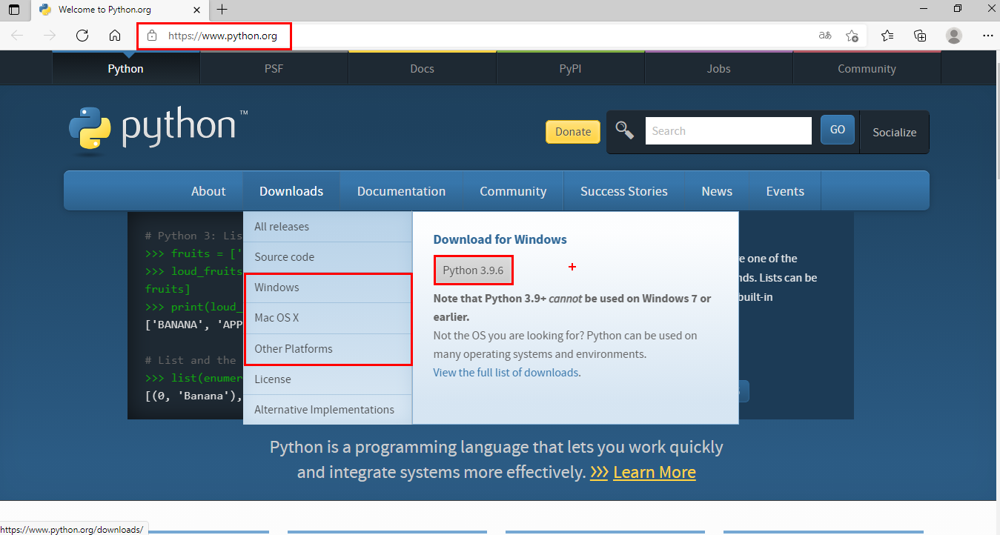
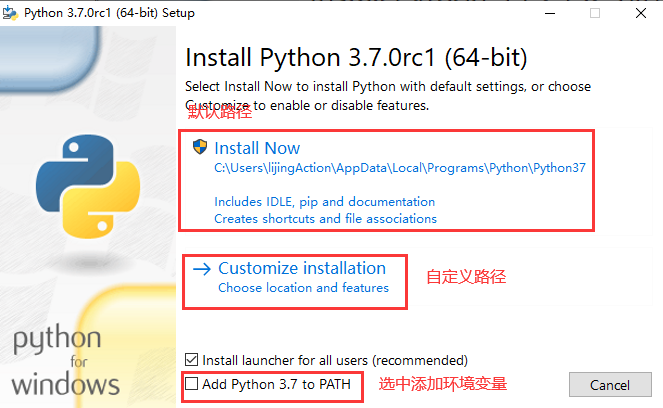
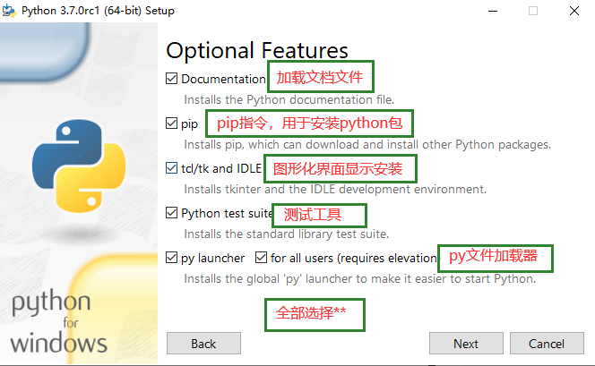
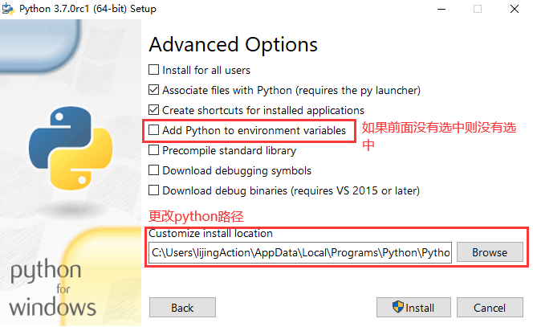
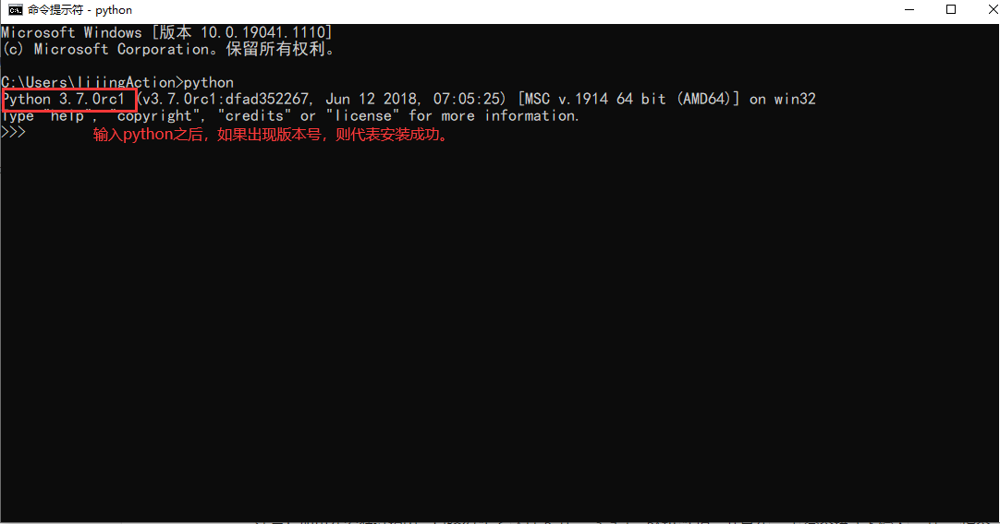
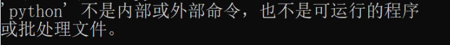
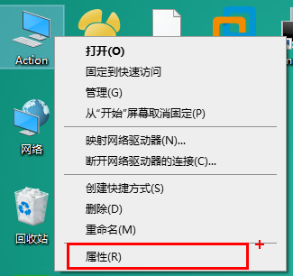
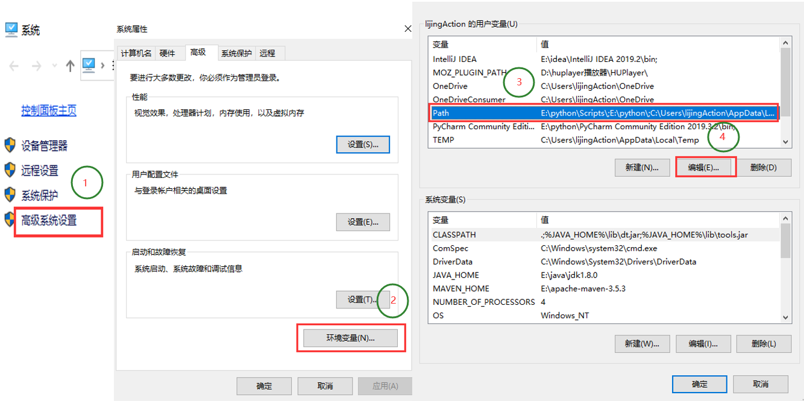
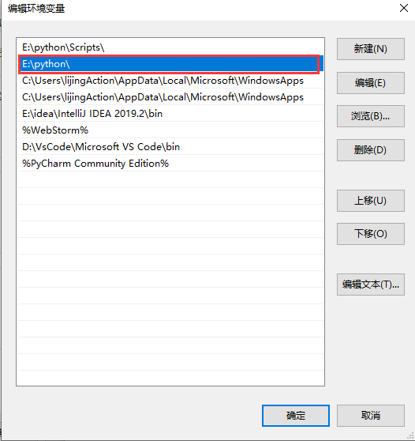
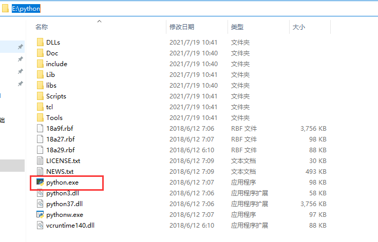

**Python环境的安装**

# 1、**下载Python**

- 访问Python官网: 

- 点击downloads按钮，在下拉框中选择系统类型(windows/Mac OS/Linux等)

- 选择下载最新版本的Python

# 2. 安装Python

- 双击下载好的Python安装包

- 勾选左下角 Add Python 3.7 to PATH 选项，然后选择 Install now 立刻安装Python.

- 默认安装

- **自定义安装**

**安装完成**

# 3. 测试是否安装成功

- 点击电脑左下角开始按钮，输入 cmd 进入到windows的命令行模式。

- 在命令行中输入Python,正确显示Python版本，即表示Python安装成功

- 如果在命令行中输入python出现如下错误

可能是因为在安装Python的过程中没有勾选 

# 4. 手动配置Python

注意：如果在安装过程中，已经勾选了 

不报错，就不需要再手动的配置Python.

- 右键 此电脑 --> 选择 属性

- 选择 高级系统设置 --> 环境变量 -->找到并且双击 Path

- 双击 Path ,在弹框里点击新建，找到Python的安装目录，把路径添加进去

- 这里新添加的路径 E:\python 是Python安装好以后， Python.exe 这个可执行文件所在的目录。

- 