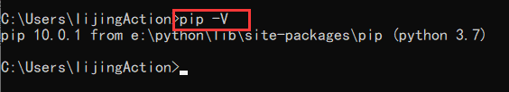
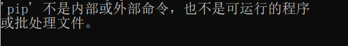
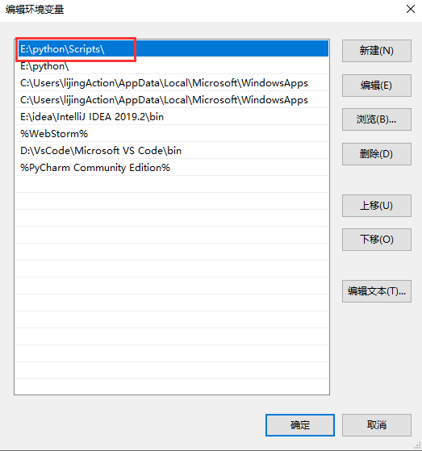
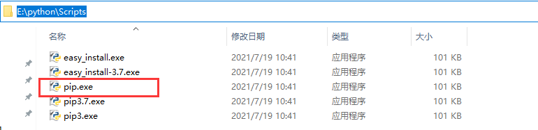

**pip的使用**

pip 是一个现代的，通用的Python包管理工具。提供了对 Python 包的查找、下载、安装、卸载的功能，便

于我们对Python的资源包进行管理。

# 1、安装

在安装Python时，会自动下载并且安装pip.

# 2. 配置

- 在windows命令行里，输入 pip -V 可以查看pip的版本。



- 如果在命令行里，运行 pip -V ,出现如下提示:



- 可能是因为在安装python的过程中未勾选 Add Python 3.7 to PATH 选项，需要手动的配置pip的环境变量。

- 右键 此电脑 --> 环境变量 -->找到并且双击 Path -->在弹窗里点击新建-->找到pip的安装目录，把路径添加进去。



- 这里新添加的路径 E:\python\Scripts 是Python安装好以后， pip.exe 这个可执行文件所在的目录。



# 3. 使用pip管理Python包

```
pip install <包名> 安装指定的包
pip uninstall <包名> 删除指定的包
pip list 显示已经安装的包
pip freeze 显示已经安装的包，并且以指定的格式显示
```

# 4. 修改pip下载源

运行pip install 命令会从网站上下载指定的python包，默认是从 [https://files.pythonhosted.org/](https://files.pythonhosted.org/) 网站上下

载。这是个国外的网站，遇到网络情况不好的时候，可能会下载失败，我们可以通过命令，修改pip现在软件时的源。

 格式:

```
pip install 包名 -i 国内源地址
示例: pip install ipython -i 
```

上下载requests(基于python的第三方web框架)

国内常用的pip下载源列表:

- 阿里云 

- 中国科技大学 

- 豆瓣(douban) 

- 清华大学 

- 中国科学技术大学 