**运行Python程序**

# 1、**终端运行**

## 1）直接在python解释器中书写代码

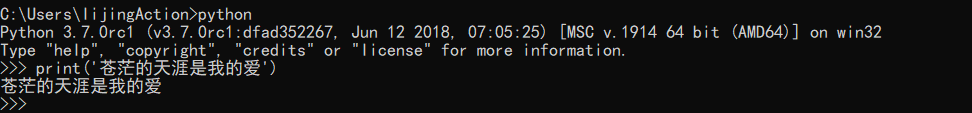

- 退出python环境

```
exit()
ctrl + z ==>enter
```

## 2) 使用ipython解释器编写代码

- 使用pip命令，可以快速的安装IPython.

```
pip install ipython
```

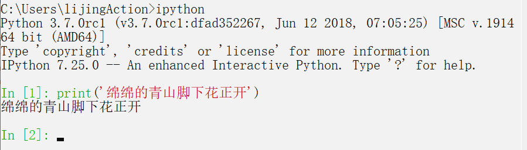

# 2. 运行python文件

使用pyt

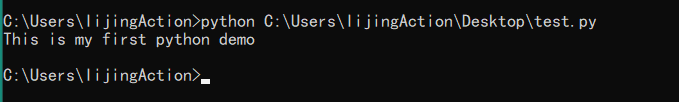

# 3. Pycharm

尽管上面介绍的方法已经能够提高我们的编码速度，但是仍然无法应对我们开发中更加复杂的要求。一般情况下，

我们都需要借助工具来辅助我们快速的搭建环境，编写代码以及运行程序。

- IDE的概念

IDE(Integrated Development Environment)又被称为集成开发环境。说白了，就是有一款图形化界面的软

件，它集成了编辑代码，编译代码，分析代码，执行代码以及调试代码等功能。在我们Python开发中，最常

用的IDE是Pycharm.

pycharm由捷克公司JetBrains开发的一款IDE,提供代码分析、图形化调试器，集成测试器、集成版本控制系统等，

主要用来编写Python代码。

下载地址:[http://www.jetbrains.com/pycharm/download](http://www.jetbrains.com/pycharm/download)

- Pycharm的安装

- 双击安装文件

- 自定义安装路径（可以不用设置

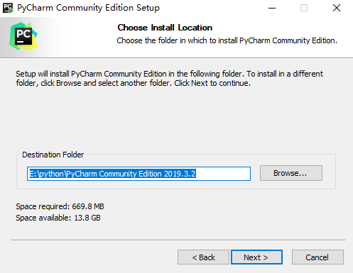

- **编辑设置（全部选中） **

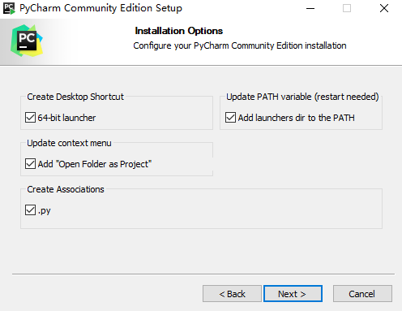

- **安装完成后双击**

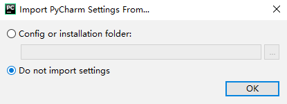

- **设置主题**

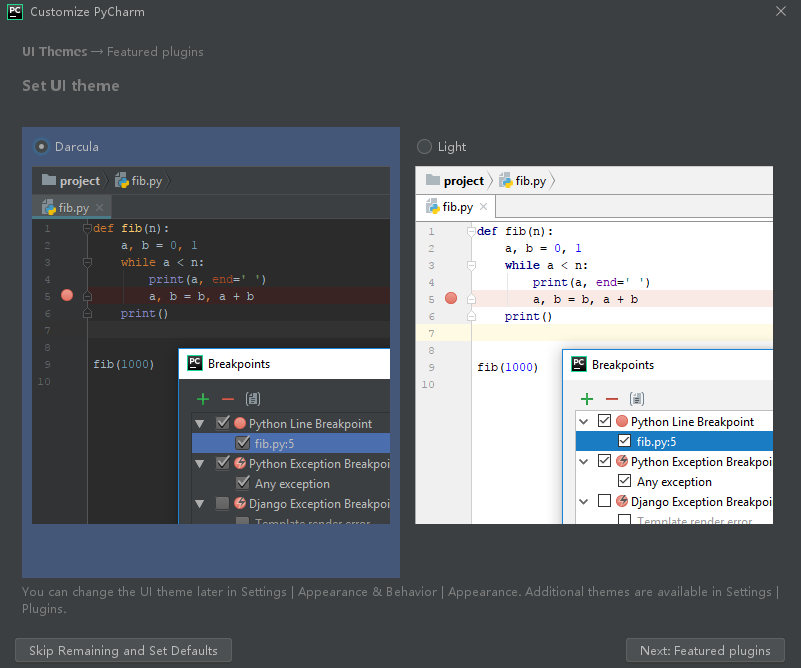

- **启动软件 **

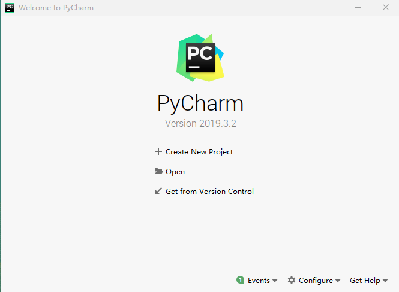

# 4. Pycharm的使用介绍

- 运行Pycharm,选择 Create New Project ,创建一个新的Python工程。

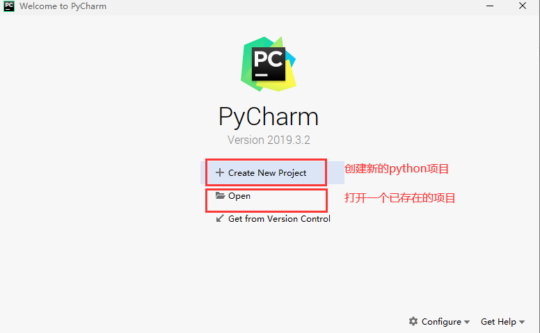

- 选择'Pure Python'创建一个新的纯Python工程项目， Location 表示该项目的保存路径， Interpreter 用来

指定Python解释器的版本。

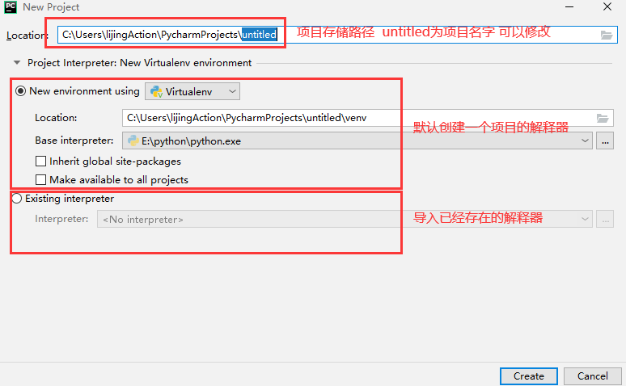

- 右击项目，选择 New ，再选择 Python File

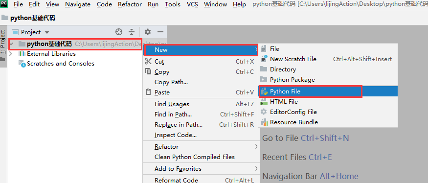

在弹出的对话框中输入的文件名 HelloPython ，点击OK，表示创建一个Python程序的文本文件，文本文件后

缀名默认.py

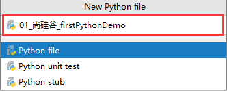

在新建的 01_尚硅谷_firstPythonDemo.py 文件里，输入以下代码，并在空白处右键选择 Run 运行，表示输出

一段 尚硅谷爬虫 字符串。

```
print('尚硅谷爬虫')
```

- 运行成功后，Pycharm Console窗口将显示我们的输出结果。

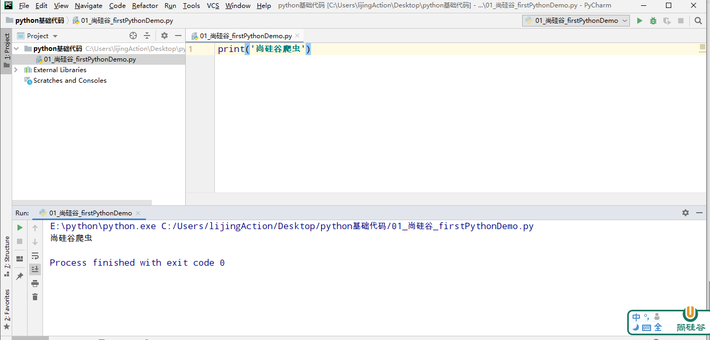

- **页面布局介绍**

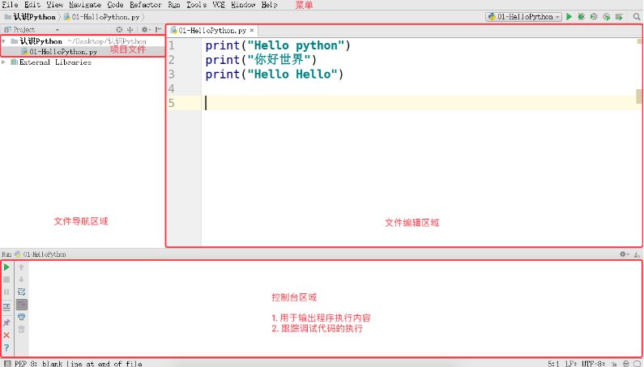

- 文件导航区域能够 浏览／定位／ 打开 项目文件

- 文件编辑区域 能够 编辑 当前打开的文件

- 控制台区域 能够：

- 输出程序执行内容

- 跟踪调试代码的执行