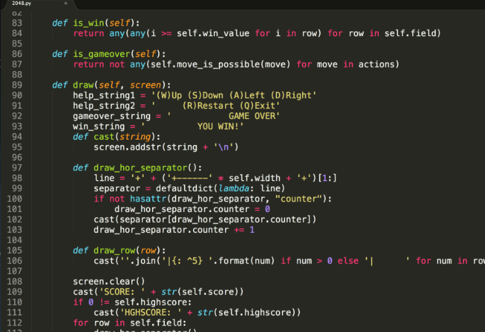
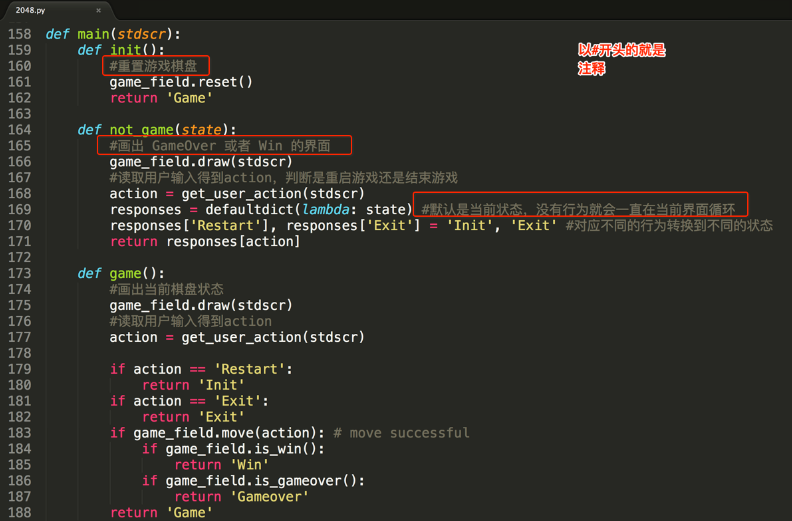

**注释**

# 1.1 注释介绍

在我们工作编码的过程中，如果一段代码的逻辑比较复杂，不是特别容易理解，可以适当的添加注释，以辅助自己

或者其他编码人员解读代码。

- 没注释的代码



- 有注释的代码



**注意：注释是给程序员看的，为了让程序员方便阅读代码，解释器会忽略注释。使用自己熟悉的语言，适当的对代**

**码进行注释说明是一种良好的编码习惯。**

# 1.2 注释的分类

在Python中支持单行注释和多行注释。

## 1）单行注释

以#开头，#右边的所有东西当做说明，而不是真正要执行的程序，起辅助说明作用。

```
# #开头右边的都是注释，解析器会忽略注释
print('hello world')  #我的作用是在控制台输出hello world
```

多行注释

以 

```
'''
                               _ooOoo_
                              o8888888o
                              88" . "88
                              (| ‐_‐ |)
                              O\  =  /O
                           ____/`‐‐‐'\____
                         .'  \\|     |//  `.
                        /  \\|||  :  |||//  \
                       /  _||||| ‐:‐ |||||‐  \
                       |   | \\\  ‐  /// |   |
                       | \_|  ''\‐‐‐/''  |   |
                       \  .‐\__  `‐`  ___/‐. /
                     ___`. .'  /‐‐.‐‐\  `. . __
                  ."" '<  `.___\_<|>_/___.'  >'"".
                 | | :  `‐ \`.;`\ _ /`;.`/ ‐ ` : | |
                 \  \ `‐.   \_ __\ /__ _/   .‐` /  /
            ======`‐.____`‐.___\_____/___.‐`____.‐'======
                               `=‐‐‐='
            ^^^^^^^^^^^^^^^^^^^^^^^^^^^^^^^^^^^^^^^^^^^^^
                       佛祖保佑        永无BUG
              佛曰:
                     写字楼里写字间，写字间里程序员；
                     程序人员写程序，又拿程序换酒钱。
                     酒醒只在网上坐，酒醉还来网下眠；
                     酒醉酒醒日复日，网上网下年复年。
                     但愿老死电脑间，不愿鞠躬老板前；
                     奔驰宝马贵者趣，公交自行程序员。
                     别人笑我忒疯癫，我笑自己命太贱；
                     不见满街漂亮妹，哪个归得程序员？
'''
```