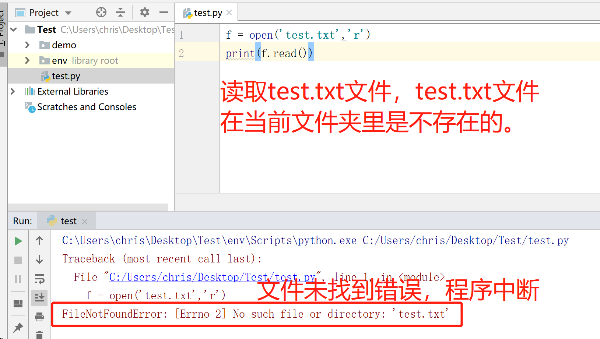

**异常**

程序在运行过程中，由于我们的编码不规范，或者其他原因一些客观原因，导致我们的程序无法继续运行，此时，

程序就会出现异常。如果我们不对异常进行处理，程序可能会由于异常直接中断掉。为了保证程序的健壮性，我们

在程序设计里提出了异常处理这个概念。

# 11.1 读取文件异常

在读取一个文件时，如果这个文件不存在，则会报出 FileNotFoundError 错误。



# 11.2 try...except语句

try...except语句可以对代码运行过程中可能出现的异常进行处理。 语法结构:

```
try:
可能会出现异常的代码块    
except 异常的类型:
出现异常以后的处理语句    
```

示例：

```
try:
    f = open('test.txt', 'r')
    print(f.read())
except FileNotFoundError:
    print('文件没有找到,请检查文件名称是否正确')
```