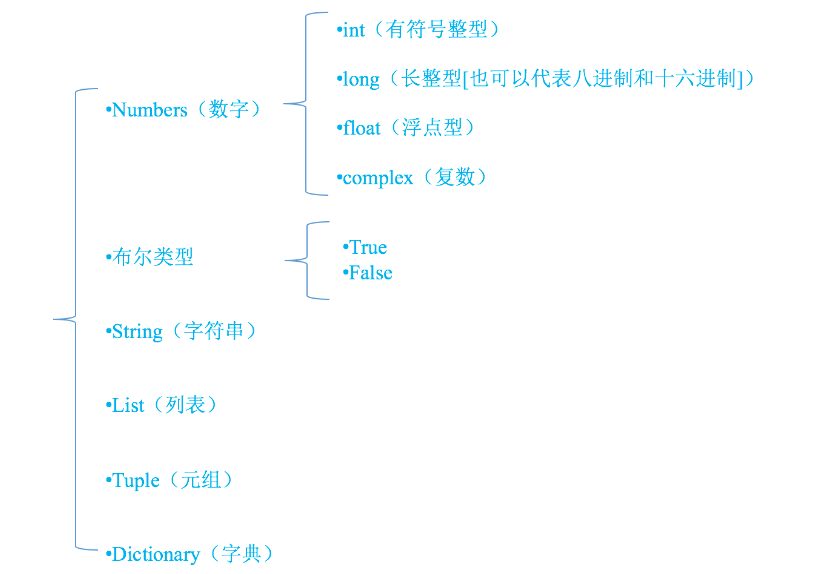
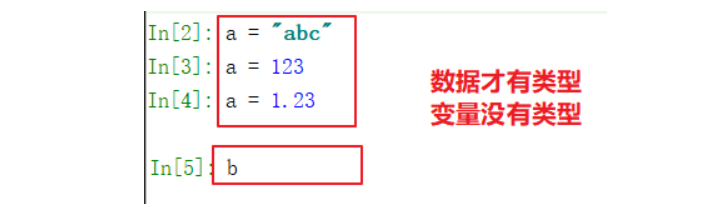
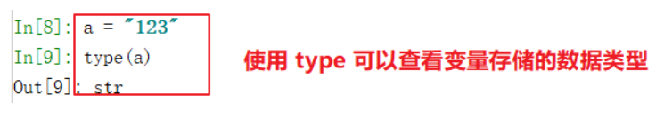

**变量以及数据类型**

# 2.1 变量的定义

思考下列代码有什么问题？

```
print("今天天气真好")
print("今天天气真好")
print("今天天气真好")
print("今天天气真好")
print("今天天气真好")
print("今天天气真好")
print("今天天气真好")
print("今天天气真好")
print("今天天气真好")
```

不使用变量打印九次 "今天天气真好",如果需要变成打印 "今天天气不好" 需要修改九行代码

对于重复使用，并且经常需要修改的数据，可以定义为变量，来提高编程效率。

定义变量的语法为: 变量名 = 变量值 。(这里的 = 作用是赋值。)

定义变量后可以使用变量名来访问变量值。

```
# 定义一个变量表示这个字符串。如果需要修改内容，只需要修改变量对应的值即可
weather = "今天天气真好"
print(weather)  # 注意，变量名不需要使用引号包裹
print(weather)
print(weather)
```

说明:

- 变量即是可以变化的量，可以随时进行修改。

- 程序就是用来处理数据的，而变量就是用来存储数据的。

# 2.2 变量的类型

程序中: 在 Python 里为了应对不同的业务需求，也把数据分为不同的类型。 如下图所示：



# 2.3 查看数据类型

- 在python中，只要定义了一个变量，而且它有数据，那么它的类型就已经确定了，不需要咱们开发者主动的

去说明它的类型，系统会自动辨别。也就是说在使用的时候 "变量没有类型，数据才有类型"。

- 比如下面的示例里，a 的类型可以根据数据来确认,但是我们没法预测变量 b 的类型。



- 如果临时想要查看一个变量存储的数据类型，可以使用 **type(变量的名字)**，来查看变量存储的数据类型。

