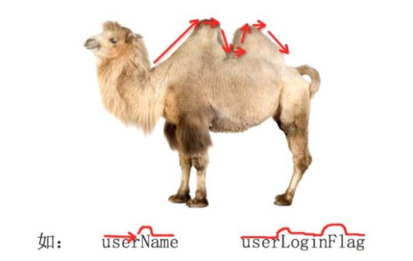

**标识符和关键字**

计算机编程语言中，标识符是用户编程时使用的名字，用于给变量、常量、函数、语句块等命名，以建立起名称与

使用之间的关系。

1. 标识符由字母、下划线和数字组成，且数字不能开头。

1. 严格区分大小写。

1. 不能使用关键字。

> **思考：下面的标识符哪些是正确的，哪些不正确为什么？**


```
fromNo12
   from#12
   my_Boolean
   my‐Boolean
   Obj2
   2ndObj
   myInt
   test1
   Mike2jack
   My_tExt
   _test
```

# 3.1 命名规范

- 标识符命名要做到顾名思义。

> 起一个有意义的名字，尽量做到看一眼就知道是什么意思(提高代码可 读性) 比如: 名字 就定义为 name ,
> 定义学生 用 student


```
a = "zhangsan"  # bad
name = "zhangsan"  # good
b = 23   # bad
age = 23 # good
```

- 遵守一定的命名规范。

- 驼峰命名法，又分为大驼峰命名法和小驼峰命名法。



- 小驼峰式命名法（lower camel case）： 第一个单词以小写字母开始；第二个单词的首字母大写，例如：myName、aDog

- 大驼峰式命名法（upper camel case）： 每一个单字的首字母都采用大写字母，例如：FirstName、LastName.

- 还有一种命名法是用下划线“_”来连接所有的单词，比如send_buf.

Python的命令规则遵循PEP8标准

# 3.2 关键字

- 关键字的概念

- 一些具有特殊功能的标识符，这就是所谓的关键字。

- 关键字，已经被python官方使用了，所以不允许开发者自己定义和关键字相同名字的标识符。

- 关键字

```
False     None    True   and      as       assert   break     class 
continue  def     del    elif     else     except   finally   for
from      global  if     import   in       is       lambda    nonlocal
not       or      pass   raise    return   try      while     with 
yield
```

关键字的学习以及使用，咱们会在后面的课程中依次一一进行学习。