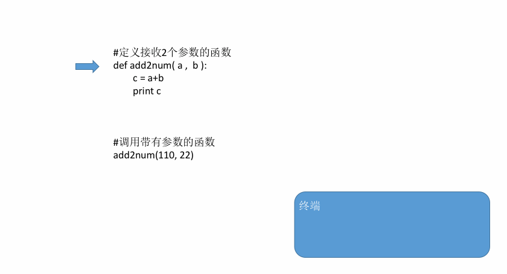
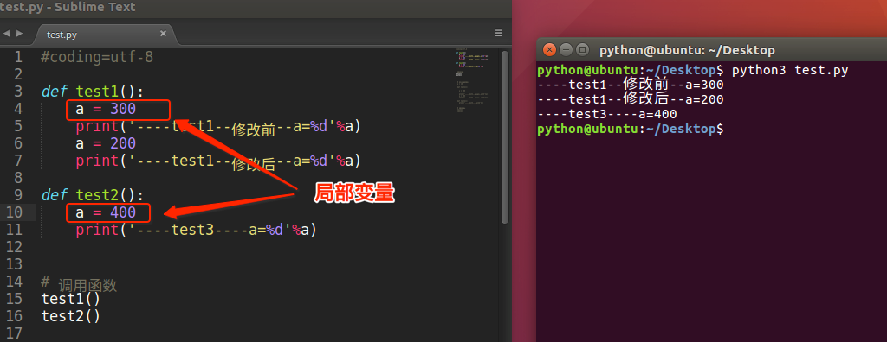

.

思考：下列代码的问题

```
print('欢迎马大哥光临红浪漫')
print('男宾2位')
print('欢迎马大哥光临红浪漫')
print('男宾2位')
print('欢迎马大哥光临红浪漫')
print('男宾2位')
print('欢迎马大哥光临红浪漫')
print('男宾2位')
```

# 9.1 定义函数

定义函数的格式如下：

```
def 函数名():
    代码
```

示例：

```
# 定义一个函数，能够完成打印信息的功能
def f1():
    print('欢迎马大哥光临红浪漫')
print('男宾2位')        
```

# 9.2 调用函数

定义了函数之后，就相当于有了一个具有某些功能的代码，想要让这些代码能够执行，需要调用它

调用函数很简单的，通过 函数名() 即可完成调用

```
# 定义完函数后，函数是不会自动执行的，需要调用它才可以
f1()
```

# 9.3 函数参数

```
def add2num():
  a = 11
  b = 22
  c = a+b
  print(c)
```

为了让一个函数更通用，即想让它计算哪两个数的和，就让它计算哪两个数的和，在定义函数的时候可以让函数接

收数据，就解决了这个问题，这就是 函数的参数

## 1）定义、调用带有参数的函数

定义一个add2num(a, b)函数，来计算任意两个数字之和:

```
def add2num(a, b):
    c = a+b
    print c
add2num(11, 22) # 调用带有参数的函数时，需要在小括号中，传递数据
```

注意点：

- 在定义函数的时候，小括号里写等待赋值的变量名

- 在调用函数的时候，小括号里写真正要进行运算的数据

调用带有参数函数的运行过程：



## 2）调用函数时参数的顺序

```
>>> def test(a,b):
...     print(a,b)
...
>>> test(1,2)  # 位置参数
1 2
>>> test(b=1,a=2)  # 关键字参数
2 1
```

# 9.4 函数返回值

- “返回值”介绍

综上所述：

- 所谓“返回值”，就是程序中函数完成一件事情后，最后给调用者的结果

## 1）带有返回值的函数

想要在函数中把结果返回给调用者，需要在函数中使用return

如下示例:

```
def add2num(a, b):
    c = a+b
    return c  # return 后可以写变量名
```

或者

```
def add2num(a, b):
    return a+b  # return 后可以写计算表达式
```

## 2）保存函数的返回值

在本小节刚开始的时候，说过的“买冰淇淋”的例子中，最后女儿给你冰淇淋时，你一定是从女儿手中接过来 对么，

程序也是如此，如果一个函数返回了一个数据，那么想要用这个数据，那么就需要保存

保存函数的返回值示例如下:

```
#定义函数
def add2num(a, b):
    return a+b
#调用函数，顺便保存函数的返回值
result = add2num(100,98)
#因为result已经保存了add2num的返回值，所以接下来就可以使用了
print(result)
```

结果:

```
198
```

# 9.5 局部变量

## 1）什么是局部变量

如下图所示:



- 局部变量，就是在函数内部定义的变量

- 其作用范围是这个函数内部，即只能在这个函数中使用，在函数的外部是不能使用的

# 9.6 全局变量

如果一个变量，既能在一个函数中使用，也能在其他的函数中使用，这样的变量就是全局变量

```
# 定义全局变量
a = 100
def test1():
    print(a)  # 虽然没有定义变量a但是依然可以获取其数据
def test2():
    print(a)  # 虽然没有定义变量a但是依然可以获取其数据
# 调用函数
test1()
test2()
```

- 在函数外边定义的变量叫做 全局变量

- 全局变量能够在所有的函数中进行访问