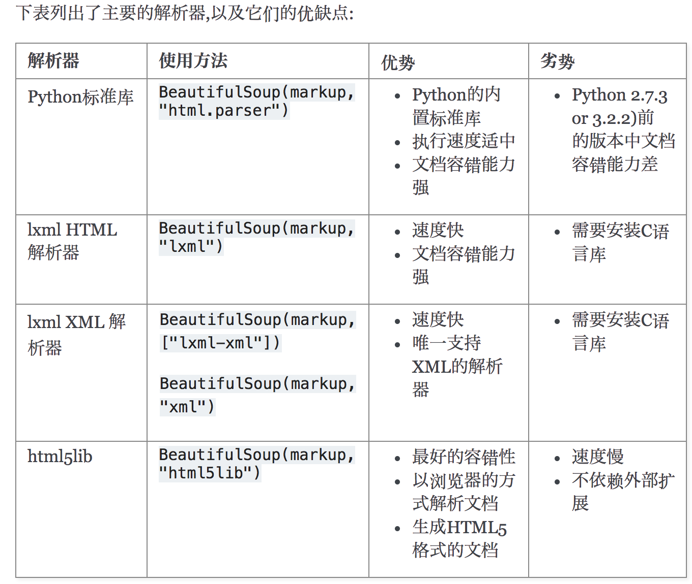

### 【1】简介

简单来说，Beautiful Soup是python的一个库，最主要的功能是从网页抓取数据。官方解释如下：

```
'''
Beautiful Soup提供一些简单的、python式的函数用来处理导航、搜索、修改分析树等功能。
它是一个工具箱，通过解析文档为用户提供需要抓取的数据，因为简单，所以不需要多少代码就可以写出一个完整的应用程序。
'''
```

Beautiful Soup 是一个可以从HTML或XML文件中提取数据的Python库.它能够通过你喜欢的转换器实现惯用的文档导航,查找,修改文档的方式.Beautiful Soup会帮你节省数小时甚至数天的工作时间.你可能在寻找 Beautiful Soup3 的文档,Beautiful Soup 3 目前已经停止开发,官网推荐在现在的项目中使用Beautiful Soup 4。

> 官方文档: 


```
# pip install bs4 安装
 
from bs4 import BeautifulSoup
```

Beautiful Soup支持Python标准库中的HTML解析器,还支持一些第三方的解析器，如果我们不安装它，则 Python 会使用 Python默认的解析器，lxml 解析器更加强大，速度更快，推荐安装。

```
pip3 install lxml
```

另一个可供选择的解析器是纯Python实现的 html5lib , html5lib的解析方式与浏览器相同,可以选择下列方法来安装html5lib:

```
pip3 install html5lib
```

解析器对比：



简单使用：

- 从一个

soup

```
from bs4 import BeautifulSoup
soup = BeautifulSoup(open("index.html"))    ##传入文件
soup = BeautifulSoup("<html>data</html>")   ##文本
```

> 构造soup对象时，可以传入解析器参数，如果不传入的话，会以最好的方式去解析


下面的一段HTML代码将作为例子被多次用到.这是 

```
html_doc = """
<html><head><title>The Dormouse's story</title></head>
<body>
<p class="title"><b>The Dormouse's story</b></p>
​
<p class="story">Once upon a time there were three little sisters; and their names were
<a href="
<a href="
<a href="
and they lived at the bottom of a well.</p>
​
<p class="story">...</p>
"""
```

使用BeautifulSoup解析这段代码,能够得到一个 

```
from bs4 import BeautifulSoup
soup = BeautifulSoup(html_doc, 'html.parser')
```

从文档中找到所有

```
for link in soup.find_all('a'):
    print(link.get('href'))
```

从文档中获取所有文字内容:

```
print(soup.get_text())
```

### 【2】四种对象

Beautiful Soup将复杂HTML文档转换成一个复杂的树形结构,每个节点都是Python对象,所有对象可以归纳为4种

tag对象，同网页中的

```python
from bs4 import BeautifulSoup
​
html_doc = """
<html><head><title>The Dormouse's story</title></head>
<body>
<p class="title"><b>The Dormouse's story</b></p>
​
<p class="story">Once upon a time there were three little sisters; and their names were
<a href="
<a href="
<a href="
and they lived at the bottom of a well.</p>
​
<p class="story">...</p>
"""
​
# 一、查找tag对象
soup = BeautifulSoup(html_doc, 'html.parser')
#soup.head返回的就是Tag对象。str(soup.head)返回的是soup对象中第一个head标签的内容，包括head标签本身。
#查找的策略为深度优先搜索
print(soup.head, type(soup.head))   
print(soup.title, type(soup.title))
print(soup.a, type(soup.a))  # 第一个a标签，如果想获取所有a标签要用到soup.find_all('a')
print(soup.p.b)
​
# 二、查找tag对象的标签名和属性
print(soup.a.name)  # a
print(soup.p.b.name)  # b
print(soup.a["href"]) #获取到a标签中的href属性
print(soup.a.attrs)   #获取待a标签中的所有属性，以字典的形式返回
​
​
'''
三、
HTML 4定义了一系列可以包含多个值的属性.在HTML5中移除了一些,却增加更多.
最常见的多值的属性是 class (一个tag可以有多个CSS的class). 
还有一些属性 rel , rev , accept-charset , headers , accesskey . 
在Beautiful Soup中多值属性的返回类型是list
'''
​
print(soup.a["class"])  # 返回列表
​
# 四、tag的属性可以被添加,删除或修改(tag的属性操作方法与字典一样)
# soup.a["class"] = ["sister c1"]
# del soup.a["id"]
# print(soup)
​
# 五、获取标签对象的文本内容
print(soup.p.string)  # p下的文本只有一个时，取到，否则为None
print(soup.p.text)  # 获取到当前标签下的所有的文本内容。
print(soup.p.strings)  # 拿到一个生成器对象, 取到p下所有的文本内容
for i in soup.p.strings:
    print(i)
  
# 如果tag包含了多个子节点,tag就无法确定 .string 方法应该调用哪个子节点的内容, .string 的输出结果是 None，如果只有一个子节点那么就输出该子节点的文本，比如下面的这种结构，soup.p.string 返回为None,但soup.p.strings就可以找到所有文本
p2 = soup.find_all("p")[1]
print(p2.string)
print(p2.strings)
for i in p2.strings:
    print(i)
# text 和 string
print(soup.p.string)
print(soup.p.text)  # 取到p下所有的文本内容,text属性更常用，并且它可以直接过滤掉注释
print(p2.text)
​
```

这种情况下，会产生Comment对象

```python
markup = "<b><!--Hey, buddy. Want to buy a used parser?--></b>"
soup = BeautifulSoup(markup,"html.parser")
comment = soup.b.string
print(comment)
print(type(comment))
```

**结果为：**

```
Hey, buddy. Want to buy a used parser?
<class 'bs4.element.Comment'>
```

我们可以看到这时候.string返回的对象不再是

### 【3】遍历文档树（导航文档树）

```python
from bs4 import BeautifulSoup
​
html_doc = """
<html><head><title>The Dormouse's story</title></head>
<body>
<p class="title"><b>The Dormouse's story</b></p>
​
<p class="story">Once upon a time there were three little sisters; and their names were
<a href="
<a href="
<a href="
and they lived at the bottom of a well.</p>
​
<p class="story">...</p>
"""
​
soup = BeautifulSoup(html_doc, 'html.parser')
​
# 1、嵌套选择
print(soup.head.title.text)
print(soup.body.a.text)
​
# 2、子节点、子孙节点
print(soup.p.contents)  # p下所有儿子节点内容，返回的是[str]
print(soup.p.children)  # 得到一个迭代器,包含p下所有子节点. 返回的是一个类似list的对象
​
for i, child in enumerate(soup.p.children, 1):
    print(i, child)
​
print(soup.p.descendants)  # 获取子孙节点,p下所有的标签都会选择出来
for i, child in enumerate(soup.p.descendants, 1):
    print(i, child)
for i, child in enumerate(soup.find_all("p")[1].descendants, 1):
    print(i, child)
​
# 3、父节点、祖先节点
print(soup.a.parent)  # 获取a标签的父节点
print(soup.a.parent.text)  # 获取a标签的父节点
print(soup.a.parents)  # 找到a标签所有的祖先节点，父亲的父亲，父亲的父亲的父亲...
​
# 4、兄弟节点
print("===")
print(soup.a.next_sibling)  # 下一个兄弟,类型：<class 'bs4.element.NavigableString'>
print(soup.a.next_sibling.next_sibling)
print(soup.a.previous_sibling.previous_sibling)
print(soup.a.previous_siblings)  # 加了s,上面的兄弟们=>生成器对象
​
```

### 【4】搜索文档树

- recursive 是否从当前位置递归往下查询，如果不递归，只会查询当前

soup

- string 这里是通过tag的内容来搜索，并且

**返回的是类容，而不是tag类型的元素**

- **kwargs

 自动拆包接受属性值，所以才会有

BeautifulSoup定义了很多搜索方法,这里着重介绍2个: find() 和 find_all() .其它方法的参数和用法类似

参数列表解读

#### （1）find_all

```python
find_all( name , attrs , recursive , string , **kwargs )
```

- name参数

```python
soup = BeautifulSoup(html_doc, 'lxml')
​
# 一、 name 四种过滤器: 字符串、正则表达式、列表、方法
# 1、字符串：即标签名
print(soup.find_all(name='a'))
​
# 2、正则表达式
​
print(soup.find_all(name=re.compile('^b')))  # 找出b开头的标签，结果有body和b标签
​
# 3、列表：如果传入列表参数,Beautiful Soup会将与列表中任一元素匹配的内容返回.下面代码找到文档中所有<a>标签和<b>标签:
print(soup.find_all(name=['a', 'b']))
​
​
# 4、方法:如果没有合适过滤器,那么还可以定义一个方法,方法只接受一个元素参数 ,如果这个方法返回 True 表示当前元素匹配并且被找到,如果不是则反回 False
def has_class_but_no_id(tag):
    return tag.has_attr('class') and tag.has_attr('id')
​
​
print(soup.find_all(name=has_class_but_no_id))
​
```

- keyword 参数

如果一个指定名字的参数不是搜索内置的参数名,搜索时会把该参数当作指定名字tag的属性来搜索,如果包含一个名字为 

```python
print(soup.find_all(href="
print(soup.find_all(href=re.compile("^http://")))
print(soup.find_all(id=True)) # 拥有id属性的tag
print(soup.find_all(href=re.compile("http://"), id='link1') # 多个属性
print(soup.find_all("a", class_="sister")) # 注意，class是Python的关键字，所以class属性用class_
print(soup.find_all("a",attrs={"href": re.compile("^http://"), "id": re.compile("^link[12]")}))      
# 通过 find_all() 方法的 attrs 参数定义一个字典参数来搜索包含特殊属性的tag:
data_soup.find_all(attrs={"data-foo": "value"})    
```

- text参数

```python
import re
​
print(soup.find_all(text="Elsie"))
# ['Elsie']
​
print(soup.find_all(text=["Tillie", "Elsie", "Lacie"]))
# ['Elsie', 'Lacie', 'Tillie']
​
# 只要包含Dormouse就可以
print(soup.find_all(text=re.compile("Dormouse")))
# ["The Dormouse's story", "The Dormouse's story"]
```

- limit参数

find_all()

```python
print(soup.find_all("a",limit=2))
```

- recursive 参数

调用tag的 

#### （2）find

```python
find( name , attrs , recursive , string , **kwargs )
```

find_all()

```python
soup.find_all('title', limit=1)
# [<title>The Dormouse's story</title>]
​
soup.find('title')
# <title>The Dormouse's story</title>
```

**唯一的区别是 **

soup.head.title

```python
soup.head.title
# <title>The Dormouse's story</title>
​
soup.find("head").find("title")
# <title>The Dormouse's story</title>
```

#### （3）其它方法

```python
#（1） find_parents() 和 find_parent()
a_string = soup.find(text="Lacie")
print(a_string)  # Lacie
​
print(a_string.find_parent())
# <a class="sister" href="
print(a_string.find_parents())
print(a_string.find_parent("p"))
'''
<p class="story">
    Once upon a time there were three little sisters; and their names were
    <a class="sister" href="
    <a class="sister" href="
    <a class="sister" href="
    and they lived at the bottom of a well.
</p>
​
'''
​
# （2）find_next_siblings() 和 find_next_sibling()
'''
这2个方法通过 .next_siblings 属性对当tag的所有后面解析的兄弟tag节点进行迭代, find_next_siblings() 方法返回所有符合条件的后面的兄弟节点, find_next_sibling() 只返回符合条件的后面的第一个tag节点.
'''
​
first_link = soup.a
​
print(first_link.find_next_sibling("a"))
# <a class="sister" href="
​
print(first_link.find_next_siblings("a"))
'''
[<a class="sister" href="
<a class="sister" href="
]
'''
# find_previous_siblings() 和 find_previous_sibling()的使用类似于find_next_sibling和find_next_siblings。
​
# （3）find_all_next() 和 find_next()
'''
这2个方法通过 .next_elements 属性对当前tag的之后的tag和字符串进行迭代, find_all_next() 方法返回所有符合条件的节点, find_next() 方法返回第一个符合条件的节点:　
'''
first_link = soup.a
print(first_link.find_all_next(string=True))
# ['Elsie', ',\n', 'Lacie', ' and\n', 'Tillie', ';\nand they lived at the bottom of a well.', '\n', '...', '\n']
print(first_link.find_next(string=True)) # Elsie
​
# find_all_previous() 和 find_previous()的使用类似于find_all_next() 和 find_next()。
```

### 【5】Css选择器

#### select

css选择器的方法为select(css_selector)目前支持的选择器如下案例，css选择器可以参考[https://www.w3school.com.cn/cssref/css_selectors.ASP](https://www.w3school.com.cn/cssref/css_selectors.ASP)

```
soup.select("title")
# [<title>The Dormouse's story</title>]
​
soup.select("p nth-of-type(3)")
# [<p class="story">...</p>]
​
soup.select("body a")
# [<a class="sister" href="
#  <a class="sister" href="
#  <a class="sister" href="
​
soup.select("html head title")
# [<title>The Dormouse's story</title>]
​
​
soup.select("head > title")
# [<title>The Dormouse's story</title>]
​
soup.select("p > a")
# [<a class="sister" href="
#  <a class="sister" href="
#  <a class="sister" href="
​
soup.select("p > a:nth-of-type(2)")
# [<a class="sister" href="
​
soup.select("p > #link1")
# [<a class="sister" href="
​
soup.select("body > a")
​
soup.select("#link1 ~ .sister")
# [<a class="sister" href="
#  <a class="sister" href="
​
soup.select("#link1 + .sister")
# [<a class="sister" href="
​
​
soup.select(".sister")
# [<a class="sister" href="
#  <a class="sister" href="
#  <a class="sister" href="
​
soup.select("[class~=sister]")
# [<a class="sister" href="
#  <a class="sister" href="
#  <a class="sister" href="
​
soup.select("#link1")
# [<a class="sister" href="
​
soup.select("a#link2")
# [<a class="sister" href="
​
​
soup.select("#link1,#link2")
# [<a class="sister" href="
#  <a class="sister" href="
​
​
soup.select('a[href]')
# [<a class="sister" href="
#  <a class="sister" href="
#  <a class="sister" href="
​
soup.select('a[href="
# [<a class="sister" href="
​
soup.select('a[href^="
# [<a class="sister" href="
#  <a class="sister" href="
#  <a class="sister" href="
​
soup.select('a[href$="tillie"]')
# [<a class="sister" href="
​
soup.select('a[href*=".com/el"]')
# [<a class="sister" href="
multilingual_markup = """
 <p lang="en">Hello</p>
 <p lang="en-us">Howdy, y'all</p>
 <p lang="en-gb">Pip-pip, old fruit</p>
 <p lang="fr">Bonjour mes amis</p>
"""
multilingual_soup = BeautifulSoup(multilingual_markup)
multilingual_soup.select('p[lang|=en]')
# [<p lang="en">Hello</p>,
#  <p lang="en-us">Howdy, y'all</p>,
#  <p lang="en-gb">Pip-pip, old fruit</p>]
```

#### select_one

**返回查找到的元素的第一个**