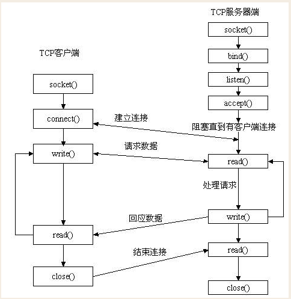
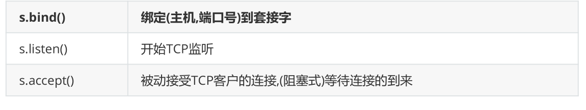
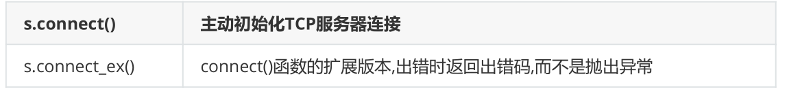
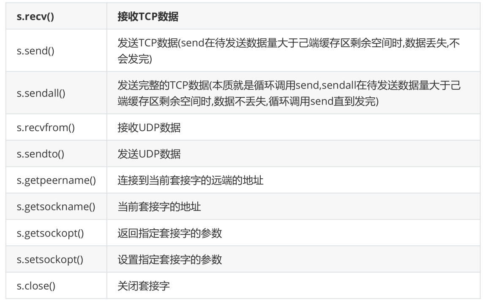
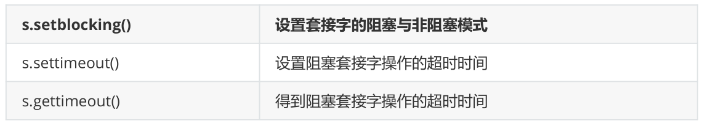
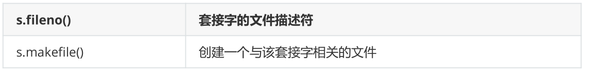
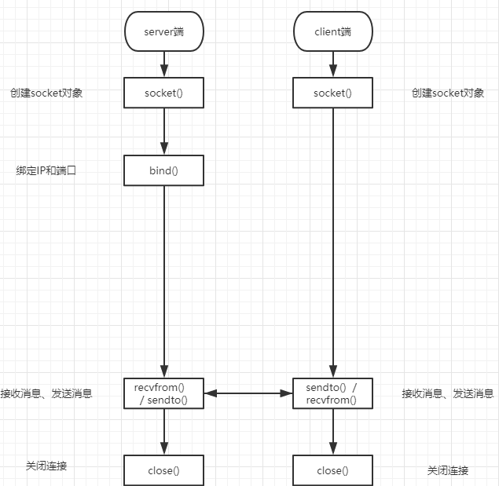

**套接字的工作流程（基于TCP和 UDP两个协议）**

# 1、TCP和UDP对比

- TCP（Transmission Control Protocol）

- 可靠的、面向连接的协议（eg:打电话）、传输效率低全双工通信（发送缓存&接收缓存）、

面向字节流。使用TCP的应用：Web浏览器；文件传输程序。

- UDP（User Datagram Protocol）

- 不可靠的、无连接的服务，传输效率高（发送前时延小），一对一、一对多、多对一、多对

多、面向报文(数据包)，尽最大努力服务，无拥塞控制。使用UDP的应用：域名系统 (DNS)；

视频流；IP语音(VoIP)。

# 2、TCP协议下的socket



服务器端先初始化Socket，然后与端口绑定(bind)，对端口进行监听(listen)，调用accept阻塞，等待客

户端连接。在这时如果有个客户端初始化一个Socket，然后连接服务器(connect)，如果连接成功，这时

客户端与服务器端的连接就建立了。客户端发送数据请求，服务器端接收请求并处理请求，然后把回应

数据发送给客户端，客户端读取数据，最后关闭连接，一次交互结束

```
import socket
# 初始化格式如下
socket.socket(socket_family,socket_type,protocal=0)
# socket_family 可以是 AF_UNIX 或 AF_INET。socket_type 可以是 SOCK_STREAM 或
 
    #SOCK_DGRAM。protocol 一般不填,默认值为 0。
# 获取tcp/ip套接字
tcpSock = socket.socket(socket.AF_INET, socket.SOCK_STREAM)
# 获取udp/ip套接字
udpSock = socket.socket(socket.AF_INET, socket.SOCK_DGRAM)
# 由于 socket 模块中有太多的属性。我们在这里破例使用了'from module import *'语句。使
用 'from socket import *',我们就把 socket 模块里的所有属性都带到我们的命名空间里了,这
样能 大幅减短我们的代码。
# 例如
tcpSock = socket(AF_INET, SOCK_STREAM)
```

## 1）服务端套接字函数



## 2）客户端套接字函数



## 3）公共用途的套接字函数



## 4）面向锁的套接字方法



## 5）面向文件的套接字的函数



## 6）第一版，单个客户端与服务端通信

### 服务端

```
import socket
phone = socket.socket(socket.AF_INET,socket.SOCK_STREAM)      # 创建一个sockert接口实例
phone.bind(('127.0.0.1',8080))              #参数是一个元组， 0 ~ 65535 1024之前系统分配好的端口 绑定电话卡
phone.listen(5)                              # 同一时刻有5个请求，但是可以有N多个链接。 开机。
conn, client_addr = phone.accept()          # 接电话 phone.accept的返回值是一个元组，(object1,str2)
，
                                            #obejct1是已经建立的连接对象,相当于是一个通道；str2是客户端的IP
#一般情况下此程序运行到这就会停止，因为进入了阻塞状态，正在等待被客户端连接。。。。。
print(conn, client_addr, sep='\n')  
from_client_data = conn.recv(1024)          # 一次接收的最大限制 bytes，recv:receive,接收；
                                            #from_client_data,就是从客户端接收到的数据
print(from_client_data.decode('utf-8'))     # .decode(),对接收到的数据使用特定的格式解码,相当于翻译
conn.send(from_client_data.upper())
conn.close()  # 挂电话
phone.close() # 关机
```

### 客户端

```
import socket
phone = socket.socket(socket.AF_INET,socket.SOCK_STREAM)  # 买电话
phone.connect(('127.0.0.1',8080))  # 与客户端建立连接， 拨号
phone.send('hello'.encode('utf-8'))
from_server_data = phone.recv(1024)
print(from_server_data)
phone.close()  # 挂电话
```

## 7）第二版，通信循环

### 服务端

```
import socket
phone = socket.socket(socket.AF_INET,socket.SOCK_STREAM)
phone.bind(('127.0.0.1',8080))
phone.listen(5)
conn,client_addr = phone.accept()
print(conn,client_addr,sep='\n')
while 1:
  try:
    from_client_data = conn.recv(1024)
    print(from_client_data.decode('utf-8'))
    conn.send(from_client_data.upper())
  except ConnectionResetError:
    break
conn.close()
phone.close()
```

### 客户端

```
import socket
phone = socket.socket(socket.AF_INET,socket.SOCK_STREAM)
phone.connect(('127.0.0.1',8080))
while 1:
  client_data = input('>>> ')
  phone.send(client_data.encode('utf-8'))
  from_server_data = phone.recv(1024)
  print(from_server_data.decode('utf-8'))
phone.close()
```

## 8）第三版， 通信，连接循环

### 服务端

```
import socket
phone = socket.socket(socket.AF_INET,socket.SOCK_STREAM)
phone.bind(('127.0.0.1',8080))
phone.listen(5)
while 1:
  conn,client_addr = phone.accept()
  print(conn,client_addr,sep='\n')
  while 1:
    try:
      from_client_data = conn.recv(1024)
      if not from_client_data:
        break
      print(from_client_data.decode('utf-8'))
      conn.send(from_client_data.upper())
    except:
      break
conn.close()
phone.close()
```

### 客户端

```
import socket
phone = socket.socket(socket.AF_INET,socket.SOCK_STREAM)
phone.connect(('127.0.0.1',8080))
while 1:
  client_data = input('>>> ')
  phone.send(client_data.encode('utf-8'))
  if client_data == 'q':break
  from_server_data = phone.recv(1024)
  print(from_server_data.decode('utf-8'))
phone.close()
```

## 9）远程执行命令的示例：

subprocess 模块部分讲解：

```
subprocess 模块允许我们启动一个新进程，并连接到它们的输入/输出/错误管道，从而获取返回值。
常用参数：
args：       #shell命令，可以是字符串或者序列类型（如：list，元组）
bufsize：    #缓冲区大小。当创建标准流的管道对象时使用，默认-1。0：不使用缓冲区1：表示行缓冲，
                #仅当universal_newlines=True时可用，也就是文本模式正数：表示缓冲区大小负数：表示使用系统默认的缓冲区大小。
stdin, stdout, stderr：    #分别表示程序的标准输入、输出、错误句柄
preexec_fn：        #只在 Unix 平台下有效，用于指定一个可执行对象（callable object），它将在子进程运行之前被调用
shell：             #如果该参数为 True，将通过操作系统的 shell 执行指定的命令。
cwd：                #用于设置子进程的当前目录。
env：                #用于指定子进程的环境变量。如果 env = None，子进程的环境变量将从父进程中继承。
```

```
import socket
import subprocess    #subprocess,子进程，此模块可以让程序创建一个子进程
phone = socket.socket(socket.AF_INET, socket.SOCK_STREAM)
phone.bind(('127.0.0.1', 8080))
phone.listen(5)
while 1:  # 循环连接客户端
  conn, client_addr = phone.accept()
  print(client_addr)
  while 1:
    try:
      cmd = conn.recv(1024)
      ret = subprocess.Popen(cmd.decode('utf-8'), shell=True,   #Popen(),开启一个子进程，cmd.decode(),是这个子进程的指令，使用shell运行;
stdout=subprocess.PIPE, stderr=subprocess.PIPE)    #PIPE，管道符，执行结果通过管道符传给stdout和stderr
      correct_msg = ret.stdout.read()    #读取子进程运行结果的标准输出
      error_msg = ret.stderr.read()      #读取子进程运行结果的错误句柄
      conn.send(correct_msg + error_msg) #返回给客户端
    except ConnectionResetError:
      break
conn.close()
phone.close()
```

### 客户端

```
import socket
phone = socket.socket(socket.AF_INET, socket.SOCK_STREAM)  # 买电话
phone.connect(('127.0.0.1', 8080))  # 与客户端建立连接， 拨号
while 1:
  cmd = input('>>>')
  phone.send(cmd.encode('utf-8'))
  from_server_data = phone.recv(1024)
  print(from_server_data.decode('gbk'))
phone.close()  # 挂电话
```

# 3、UDP协议下的socket

udp是无链接的，先启动哪一端都不会报错



服务器端先初始化Socket，然后与端口绑定(bind)，recvform接收消息，这个消息有两项，消息内容和

对方客户端的地址，然后回复消息时也要带着你收到的这个客户端的地址，发送回去，最后关闭连接，

一次交互结束

## 1）服务端

```
import socket
udp_sk = socket.socket(type=socket.SOCK_DGRAM)  #创建一个服务器的套接字
udp_sk.bind(('127.0.0.1',9000))     #绑定服务器套接字
msg,addr = udp_sk.recvfrom(1024)
print(msg)
udp_sk.sendto(b'hi',addr)         # 对话(接收与发送)
udp_sk.close()             # 关闭服务器套接字
```

## 2）客户端

```
import socket
ip_port=('127.0.0.1',9000)
udp_sk=socket.socket(type=socket.SOCK_DGRAM)
udp_sk.sendto(b'hello',ip_port)
back_msg,addr=udp_sk.recvfrom(1024)
print(back_msg.decode('utf-8'),addr)
```

## 3）类似于qq聊天的代码示例

### 服务端

```
import socket
ip_port=('127.0.0.1',8081)
udp_server_sock=socket.socket(socket.AF_INET,socket.SOCK_DGRAM)
#DGRAM:datagram 数据报文的意思，象征着UDP协议的通信方式
udp_server_sock.bind(ip_port)#你对外提供服务的端口就是这一个，所有的客户端都是通过这
个端口和你进行通信的
while True:
  qq_msg,addr=udp_server_sock.recvfrom(1024)# 阻塞状态，等待接收消息
  print('来自[%s:%s]的一条消息:\033[1;34;43m%s\033[0m' %
(addr[0],addr[1],qq_msg.decode('utf-8')))
  back_msg=input('回复消息: ').strip()
  udp_server_sock.sendto(back_msg.encode('utf-8'),addr)
```

### 客户端

```
import socket
BUFSIZE=1024
udp_client_socket=socket.socket(socket.AF_INET,socket.SOCK_DGRAM)
qq_name_dic={
  'taibai':('127.0.0.1',8081),
  'Jedan':('127.0.0.1',8081),
  'Jack':('127.0.0.1',8081),
  'John':('127.0.0.1',8081),
}
while True:
  # 选择聊天对象
  while 1:
    qq_name=input('请选择聊天对象: ').strip()
    if qq_name not in qq_name_dic:
      print('没有这个聊天对象')
      continue
    break
 
  # 聊天过程
  while True:
    msg='发给'+ qq_name + ': ' + input('请输入消息,回车发送,输入q结束和他的聊
天: ').strip()
    if msg == 'q':break
    if not msg:continue
    udp_client_socket.sendto(msg.encode('utf-8'),qq_name_dic[qq_name])#
必须带着自己的地址，这就是UDP不一样的地方，不需要建立连接，但是要带着自己的地址给服务端，否
则服务端无法判断是谁给我发的消息，并且不知道该把消息回复到什么地方，因为我们之间没有建立连
接通道
    back_msg,addr=udp_client_socket.recvfrom(BUFSIZE)# 同样也是阻塞状态，等
待接收消息
    print('来自[%s:%s]的一条消息:\033[1;34;43m%s\033[0m' %
(addr[0],addr[1],back_msg.decode('utf-8')))
udp_client_socket.close()
```

## 4）自制时间服务器

### 服务端

```
from socket import *
from time import strftime
import time
ip_port = ('127.0.0.1', 9000)
bufsize = 1024
tcp_server = socket(AF_INET, SOCK_DGRAM)
tcp_server.setsockopt(SOL_SOCKET,SO_REUSEADDR,1)
tcp_server.bind(ip_port)
while True:
  msg, addr = tcp_server.recvfrom(bufsize)
  print('===>', msg.decode('utf-8'))
  stru_time = time.localtime()  #当前的结构化时间
  if not msg:
    time_fmt = '%Y-%m-%d %X'
  else:
    time_fmt = msg.decode('utf-8')
  back_msg = strftime(time_fmt,stru_time)
  print(back_msg,type(back_msg))
  tcp_server.sendto(back_msg.encode('utf-8'), addr)
tcp_server.close()
```

### 客户端

```
from socket import *
ip_port=('127.0.0.1',9000)
bufsize=1024
tcp_client=socket(AF_INET,SOCK_DGRAM)
while True:
  msg=input('请输入时间格式(例%Y %m %d)>>: ').strip()
  tcp_client.sendto(msg.encode('utf-8'),ip_port)
  data=tcp_client.recv(bufsize)
  print('当前日期：',str(data,encoding='utf-8'))
```