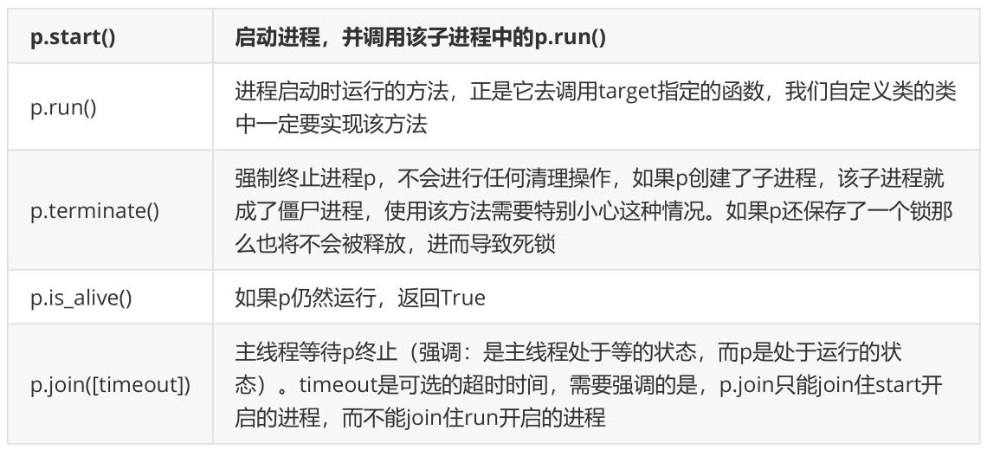
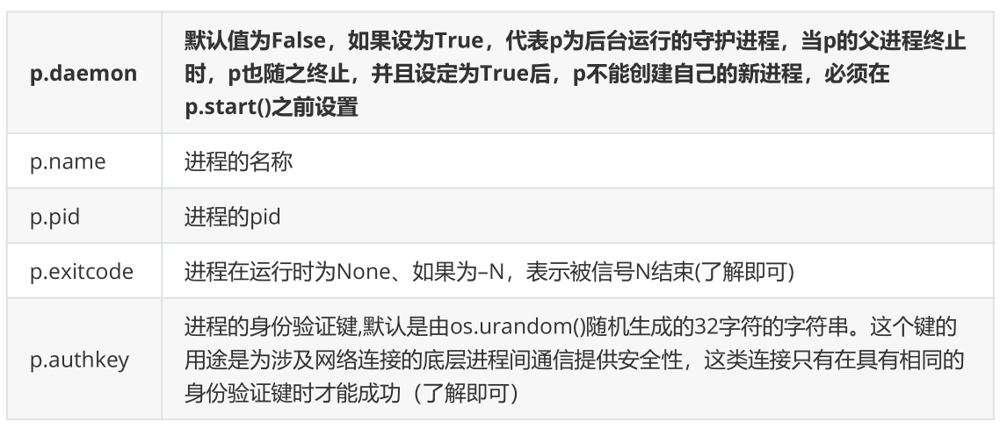

**multiprocess.process模块**

# **1、process模块介绍**

process模块是一个创建进程的模块，借助这个模块，就可以完成进程的创建。

```
Process([group [, target [, name [, args [, kwargs]]]]])，由该类实例化得到的对
象，表示一个子进程中的任务（尚未启动）
强调：
1. 需要使用关键字的方式来指定参数
2. args指定的为传给target函数的位置参数，是一个元组形式，必须有逗号
参数介绍：
1 group参数未使用，值始终为None
2 target表示调用对象，即子进程要执行的任务
3 args表示调用对象的位置参数元组
4 kwargs表示调用对象的字典
5 name为子进程的名称
```

- 方法介绍



- 属性介绍



**注意：在Windows操作系统中由于没有fork(linux操作系统中创建进程的机制)，在创建子进程的时候会**

**自动 import 启动它的这个文件，而在 import 的时候又执行了整个文件。因此如果将process()直接写在**

**文件中就会无限递归创建子进程报错。所以必须把创建子进程的部分使用 if name =='main'**

**判断保护起来，import 的时候 ，就不会递归运行了。**

# **2、使用process模块创建进程**

## 1）在一个python进程中开启子进程，start方法和并发效果。

```
import time
from multiprocessing import Process
def f(name):
  print('hello',name)
  print('子进程')
if __name__ == '__main__':
  p = Process(target=f,args=('aaron',))
  p.start()
  time.sleep(1)
  print('主程序')
```

## **2）使用join方法**

```
import time
from multiprocessing import Process
def f(name):
  print('hello',name)
  time.sleep(1)
  print('子进程')
if __name__ == '__main__':
  p = Process(target=f,args=('zhangsan',))
  p.start()
  p.join()
  print('主程序')
```

## **3）查看进程号**

```
import os
from multiprocessing import Process
def f(x):
  print('子进程id：',os.getpid(),'父进程id：',os.getppid())
  return x*x
if __name__ == '__main__':
  print('主进程id: ',os.getpid())
  p_lst = []
  for i in range(5):
    p = Process(target=f,args=(i,))
    p.start()
```

**4）进阶，多个进程同时运行（注意，子进程的执行顺序不是根据启动顺序决定的）**

```
import time
from multiprocessing import Process
def f(name):
  print('hello',name)
  time.sleep(1)
if __name__ == '__main__':
  p_lst = []
  for i in range(5):
    p = Process(target=f, args=('aaron',))
    p.start()
    p_lst.append(p)
```

## 5）多进程同时运行使用join方法

```
import time
from multiprocessing import Process
def f(name):
  print('hello',name)
  time.sleep(1)
if __name__ == '__main__':
  p_lst = []
  for i in range(5):
    p = Process(target=f, args=('aaron',))
    p.start()
    p_lst.append(p)
    p.join()
  print('主进程')
```

## 6）还是想要借助join的同时，进程之间是异步的

```
import time
from multiprocessing import Process
def f(name):
  print('hello',name)
  time.sleep(1)
if __name__ == '__main__':
  p_lst = []
  for i in range(5):
    p = Process(target=f, args=('aaron',))
    p.start()
    p_lst.append(p)
 [p.join() for p in p_lst]
  print('主进程')
```

- 以继承Process类的形式开启进程的方式

```
import os 
from multiprocessing import Process
class MyProcess(Process):
  def __init__(self,name):
    super().__init__()
    self.name=name
  def run(self):
    print(os.getpid())
    print('%s 正在和女主播聊天' %self.name)
if __name__ == '__main__':
  p1 = MyProcess('陈松')
  p2 = MyProcess('松哥')
  p3 = MyProcess('松松')
  p1.start()
  p2.start()
  p3.start()
  p1.join()
  p2.join()
  p3.join()
  print('主进程')
```

# **3、守护进程**

会随着主进程的结束而结束。

主进程创建守护进程

1. 守护进程会在主进程代码执行结束后就终止

1. 守护进程内无法再开启子进程,否则抛出异常

**注意：进程之间是互相独立的，主进程代码运行结束，守护进程随即终止**

```
import os
import time
from multiprocessing import Process
class Myprocess(Process):
  def __init__(self,person):
    super().__init__()
    self.person = person
  def run(self):
    print(os.getpid(),self.name)
    print('%s正在和女主播聊天' %self.person)
if __name__ == '__main__':
  p=Myprocess('陈松')
  p.daemon=True #一定要在p.start()前设置,设置p为守护进程,禁止p创建子进程,并且父进程
代码执行结束,p即终止运行
  p.start()
  time.sleep(10) # 在sleep时查看进程id对应的进程
  print('主')
```

```
from multiprocessing import Process
import time
def foo():
  print(123)
  time.sleep(1)
  print("end123")
def bar():
  print(456)
  time.sleep(3)
  print("end456")
if __name__ == '__main__':
  p1=Process(target=foo)
  p2=Process(target=bar)
  p1.daemon=True
  p1.start()
  p2.start()
  time.sleep(0.1)
  print("main-------")
# 打印该行则主进程代码结束,则守护进程p1应该被终止.#可能会有p1任务执行的打印信息123,因为主
进程打印main----时,p1也执行了,但是随即被终止.
```

# **4、socket聊天并发实例**

## **1）服务端**

```
from socket import *
from multiprocessing import Process
server=socket(AF_INET,SOCK_STREAM)
server.setsockopt(SOL_SOCKET,SO_REUSEADDR,1)
server.bind(('127.0.0.1',8080))
server.listen(5)
def talk(conn,client_addr):
  while True:
    try:
      msg=conn.recv(1024)
      if not msg:break
      conn.send(msg.upper())
    except Exception:
      break
if __name__ == '__main__': #windows下start进程一定要写到这下面
  while True:
    conn,client_addr=server.accept()
    print(client_addr)
    p=Process(target=talk,args=(conn,client_addr))
    p.start()
```

```
from socket import *
client=socket(AF_INET,SOCK_STREAM)
client.connect(('127.0.0.1',8080))
while True:
  msg=input('>>: ').strip()
  if not msg:continue
  client.send(msg.encode('utf-8'))
  msg=client.recv(1024)
  print(msg.decode('utf-8'))
```

# **5、多进程中的其他方法**

```
from multiprocessing import Process
import time
import random
class Myprocess(Process):
  def __init__(self,person):
    self.name=person
    super().__init__()
  def run(self):
    print('%s正在和陈松聊天' %self.name)
    time.sleep(random.randrange(1,5))
    print('%s还在和陈松聊天' %self.name)
if __name__ == '__main__':
  p1=Myprocess('陈松')
  p1.start()
  p1.terminate() # 关闭进程,不会立即关闭,所以is_alive立刻查看的结果可能还是存活
  print(p1.is_alive()) # 结果为True
  print('开始')
  print(p1.is_alive()) # 结果为False
```

```
from multiprocessing import Process
import time
import random
class Myprocess(Process):
  def __init__(self,person):
    self.name=person  # name属性是Process中的属性，标示进程的名字
    super().__init__() # 执行父类的初始化方法会覆盖name属性
    #self.name = person # 在这里设置就可以修改进程名字了
    #self.person = person #如果不想覆盖进程名，就修改属性名称就可以了
  def run(self):
    print('%s正在和女主播聊天' %self.name)
    # print('%s正在和网红脸聊天' %self.person)
    time.sleep(random.randrange(1,5))
    print('%s正在和女主播聊天' %self.name)
    # print('%s正在和网红脸聊天' %self.person)
if __name__ == '__main__':
  p1=Myprocess('陈松')
  p1.start()
  print(p1.pid)   #可以查看子进程的进程id
```