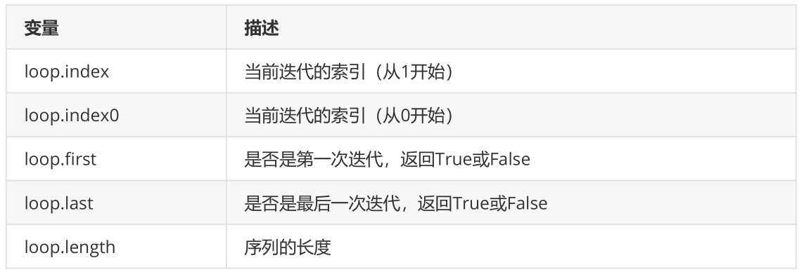
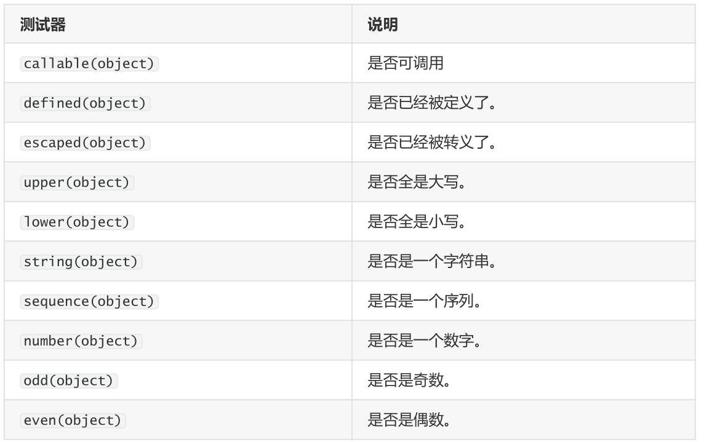

# 1、模板简介

模板是一个 web 开发必备的模块。因为我们在渲染一个网页的时候，并不是只渲染一个纯文本字符串，

而是需要渲染一个有富文本标签的页面。这时候我们就需要使用模板了。在 Flask 中，配套的模板是

Jinja2 ， Jinja2 的作者也是 Flask 的作者。这个模板非常的强大，并且执行效率高。以下对 Jinja2

做一个简单介绍！

## 1.1 Flask渲染Jinja模板：

要渲染一个模板，通过 render_template 方法即可，以下将用一个简单的例子进行讲解：

```
from flask import Flask,render_template
app = Flask(__name__)
@app.route('/about/')
def about():
  return render_template('about.html')
```

当访问 /about/ 的时候， about() 函数会在当前目录下的 templates 文件夹下寻找 about.html 模板

文件。如果想更改模板文件地址，应该在创建 app 的时候，给 Flask 传递一个关键字参数

template_folder ，指定具体的路径，再看以下例子：

```
from flask import Flask,render_template
app = Flask(__name__,template_folder=r'C:\templates')
@app.route('/about/')
def about():
  return render_template('about.html')
```

以上例子将会在C盘的 templates 文件夹中

要传递，应该怎么传呢，我们再来看一个例子：

```
from flask import Flask,render_template
app = Flask(__name__)
@app.route('/about/')
def about():
  # return render_template('about.html',user='eagle')
  return render_template('about.html',**{'user':'eagle'})
```

以上例子介绍了两种传递参数的方式，因为 render_template 需要传递的是一个关键字参数，所以第一

种方式是顺其自然的。但是当你的模板中要传递的参数过多的时候，把所有参数放在一个函数中显然不

是一个好的选择，因此我们使用字典进行包装，并且加两个 * 号，来转换成关键字参数。

# 2. Jinja2模版概述

## 2.1 概要：

先看一个简单例子：

```
<html lang="en">
<head>
   <title>My Webpage</title>
 </head>
 <body>
  <ul id="navigation">
   
     <li><a href="{{ item.href }}">{{ item.caption }}</a></li>
   
   </ul>

  {{ a_variable }}
  {{ user.name }}
  {{ user['name'] }}

  {# a comment #}
 </body>
</html>
```

以上示例有需要进行解释：

- 第12~14行的 {{ ... }} ：用来装载一个变量，模板渲染的时候，会把这个变量代表的值替换掉。

并且可以间接访问一个变量的属性或者一个字典的 key 。关于点 . 号访问和 [] 中括号访问，没有

任何区别，都可以访问属性和字典的值。

- 第7~9行的  ：用来装载一个控制语句，以上装载的是 for 循环，以后只要是要用到控制

语句的，就用  。

- 第14行的 {# ... #} ：用来装载一个注释，模板渲染的时候会忽视这中间的值。

## 2.2 属性访问规则：

1. 比如在模板中有一个变量这样使用： foo.bar ，那么在 Jinja2 中是这样进行访问的：

- 先去查找 foo 的 bar 这个属性，也即通过 getattr(foo,'bar') 。

- 如果没有，就去通过 foo.**getitem**('bar') 的方式进行查找。

- 如果以上两种方式都没有找到，返回一个 undefined 。

1. 在模板中有一个变量这样使用： foo['bar'] ，那么在 Jinja2 中是这样进行访问：

- 通过 foo.**getitem**('bar') 的方式进行查找。

- 如果没有，就通过 getattr(foo,'bar') 的方式进行查找。

- 如果以上没有找到，则返回一个 undefined 。

# 3、 Jinja2模版过滤器

过滤器是通过管道符号（ | ）进行使用的，例如： {{ name|length }} ，将返回name的长度。过滤器

相当于是一个函数，把当前的变量传入到过滤器中，然后过滤器根据自己的功能，再返回相应的值，之

后再将结果渲染到页面中。 Jinja2 中内置了许多过滤器，在这里可以看到所有的过滤器，现对一些常

用的过滤器进行讲解：

```
abs(value) ：        #返回一个数值的绝对值。 例如： -1|abs 。
default(value,default_value,boolean=false) ：        #如果当前变量没有值，则会使用参数中的值
                                                     #来代替。 name|default('xiaotuo') ——如果name不存在，则会使用 xiaotuo 来替代。
boolean=False     #默认是在只有这个变量为 undefined 的时候才会使用 default 中的值，如果想使
                  #用 python 的形式判断是否为 false ，则可以传递 boolean=true 。也可以使用 or 来替换。
escape(value)或e        #转义字符，会将 < 、 > 等符号转义成HTML中的符号。例如：
                        #content|escape 或 content|e 。
first(value) ：        #返回一个序列的第一个元素。 names|first 。
format(value,*arags,**kwargs) ：      #格式化字符串。例如以下代码
                                      #//{{ "%s" - "%s"|format('Hello',"Foo!") }}   #将输出：Helloo - Foo!       
last(value) ：    #返回一个序列的最后一个元素。示例： names|last 。
 length(value) ：    #返回一个序列或者字典的长度。示例： names|length 。
 join(value,d=u'') ：    #将一个序列用 d 这个参数的值拼接成字符串。
 safe(value) ：        #如果开启了全局转义，那么 safe 过滤器会将变量关掉转义。示例：
content_html|safe 。
int(value) ：        #将值转换为 int 类型。
float(value) ：    #将值转换为 float 类型。
lower(value) ：    #将字符串转换为小写。
upper(value) ：        #将字符串转换为小写。
replace(value,old,new) ：     #替换将 old 替换为 new 的字符串。
truncate(value,length=255,killwords=False) ：     #截取 length 长度的字符串。
striptags(value) ：        #删除字符串中所有的HTML标签，如果出现多个空格，将替换成一个空格。
trim ：                    #截取字符串前面和后面的空白字符。
string(value) ：            #将变量转换成字符串。
wordcount(s) ：            #计算一个长字符串中单词的个数。                                                                                                         
```

# 4、控制语句

所有的控制语句都是放在  中，并且有一个语句  来进行结束， Jinja 中常用的

控制语句有 if/for..in.. ，现对他们进行讲解：

1. if ：if语句和 python 中的类似，可以使用 >，<，<=，>=，==，!= 来进行判断，也可以通过 and，

or，not，() 来进行逻辑合并操作，以下看例子：

```

Kenny is sick.

You killed Kenny! You bastard!!!

Kenny looks okay --- so far

```

1. for...in... ： for 循环可以遍历任何一个序列包括列表、字典、元组。并且可以进行反向遍

历，以下将用几个例子进行解释：

普通的遍历：

```
<ul>

<li>{{ user.username|e }}</li>

</ul>
```

- 遍历字典：

```
<dl>

<dt>{{ key|e }}</dt>
<dd>{{ value|e }}</dd>

</dl>
```

- 如果序列中没有值的时候，进入 else ：

```
<ul>

<li>{{ user.username|e }}</li>

<li><em>no users found</em></li>

</ul>
```

并且 Jinja 中的 for 循环还包含以下变量，可以用来获取当前的遍历状态：



**另外，不可以使用 continue 和 break 表达式来控制循环的执行。**

# 5、测试器

测试器主要用来判断一个值是否满足某种类型，并且这种类型一般通过普通的 if 判断是有很大的挑战

的。语法是： if...is... ，先来简单的看个例子：

```

 value of variable: {{ escaped }}

 variable is not escaped

```

以上判断 variable 这个变量是否已经被转义了， Jinja 中内置了许多的测试器，看以下列表：



# 6、宏和import语句

## 6.1 宏：

模板中的宏跟python中的函数类似，可以传递参数，但是不能有返回值，可以将一些经常用到的代码片

段放到宏中，然后把一些不固定的值抽取出来当成一个变量，以下将用一个例子来进行解释：

```

<input type="{{ type }}" name="{{ name }}" value="{{ value|e }}">

```

以上例子可以抽取出了一个input标签，指定了一些默认参数。那么我们以后创建 input 标签的时候，

可以通过他快速的创建：

```
<p>{{ input('username') }}</p>
<p>{{ input('password', type='password') }}</p>
```

## 6.2 import语句：

在真实的开发中，会将一些常用的宏单独放在一个文件中，在需要使用的时候，再从这个文件中进行导

入。 import 语句的用法跟 python 中的 import 类似，可以直接 import...as... ，也可以

from...import... 或者 from...import...as... ，假设现在有一个文件，叫做 forms.html ，里面

有两个宏分别为 input 和 textarea ，如下：

```

 <input type="{{ type }}" value="{{ value|e }}" name="{{ name }}">


 <textarea name="{{ name }}" rows="{{ rows }}" cols="{{ cols
  }}">{{ value|e }}</textarea>

```

## 6.3 导入宏的例子：

1. import...as... 形式：

```

<dl>
<dt>Username</dt>
<dd>{{ forms.input('username') }}</dd>
<dt>Password</dt>
<dd>{{ forms.input('password', type='password') }}</dd>
</dl>
<p>{{ forms.textarea('comment') }}</p>
```

1. from...import...as.../from...import... 形式：

```

<dl>
<dt>Username</dt>
<dd>{{ input_field('username') }}</dd>
<dt>Password</dt>
<dd>{{ input_field('password', type='password') }}</dd>
</dl>
<p>{{ textarea('comment') }}</p>
```

另外需要注意的是，导入模板并不会把当前上下文中的变量添加到被导入的模板中，如果你想要导入一

个需要访问当前上下文变量的宏，有两种可能的方法:

- 显式地传入请求或请求对象的属性作为宏的参数。

- 与上下文一起（with context）导入宏。

与上下文中一起（with context）导入的方式如下

```
 
```

# 7、include和set语句

## 7.1 include语句：

include 语句可以把一个模板引入到另外一个模板中，类似于把一个模板的代码copy到另外一个模板的

指定位置，看以下例子：

```

主体内容

```

7.2 赋值（set）语句：

有时候我们想在在模板中添加变量，这时候赋值语句（set）就派上用场了，先看以下例子：

```

```

那么以后就可以使用 name 来代替 eagle 这个值了，同时，也可以给他赋值为列表和元组：

```
 
```

赋值语句创建的变量在其之后都是有效的，如果不想让一个变量污染全局环境，可以使用 with 语句来

创建一个内部的作用域，将 set 语句放在其中，这样创建的变量只在 with 代码块中才有效，看以下示

例：

```

  
  {{ foo }}      foo is 42 here

```

也可以在 with 的后面直接添加变量，比如以上的写法可以修改成这样：

```

  {{ foo }}

```

这两种方式都是等价的，一旦超出 with 代码块，就不能再使用 foo 这个变量了。

# 8、模版继承

Flask 中的模板可以继承，通过继承可以把模板中许多重复出现的元素抽取出来，放在父模板中，并且

父模板通过定义 block 给子模板开一个口，子模板根据需要，再实现这个 block ，假设现在有一个

base.html 这个父模板，代码如下：

```
<!DOCTYPE html>
<html lang="en">
<head>
  <link rel="stylesheet" href="base.css" />
  <title></title>
 
</head>
<body>
  <div id="body"></div>
  <div id="footer">
   
    &copy; Copyright 2008 by <a href="http://domain.invalid/">you</a>
   
  </div>
</body>
</html>
```

以上父模板中，抽取了所有模板都需要用到的元素 html 、 body 等，并且对于一些所有模板都要用到的

样式文件 style.css 也进行了抽取，同时对于一些子模板需要重写的地方，比如 title 、 head 、

body 都定义成了 block ，然后子模板可以根据自己的需要，再具体的实现。以下再来看子模板的代

码：

```

首页

  {{ super() }}
 <style type="text/css">
   .detail{
       color: red;
   }
 </style>


 <h1>这里是首页</h1>
 <p class="detail">
  首页的内容
 </p>
 
```

首先第一行就定义了子模板继承的父模板，并且可以看到子模板实现了 title 这个 block ，并填充了自

己的内容，再看 head 这个 block ，里面调用了 super() 这个函数，这个函数的目的是执行父模板中的

代码，把父模板中的内容添加到子模板中，如果没有这一句，则父模板中处在 head 这个 block 中的代

码将会被子模板中的代码给覆盖掉。

另外，模板中不能出现重名的 block ，如果一个地方需要用到另外一个 block 中的内容，可以使用

self.blockname 的方式进行引用，比如以下示例：

```
<title>
 
   这是标题
 
</title>
<h1>{{ self.title() }}</h1>
```

以上示例中 h1 标签重用了 title 这个 block 中的内容，子模板实现了 title 这个 block ， h1 标签也

能拥有这个值。

另外，在子模板中，所有的文本标签和代码都要添加到从父模板中继承的 block 中。否则，这些文本和

标签将不会被渲染。

# 9. 转义

转义的概念是，在模板渲染字符串的时候，字符串有可能包括一些非常危险的字符比如 < 、 > 等，这些

字符会破坏掉原来 HTML 标签的结构，更严重的可能会发生 XSS 跨域脚本攻击，因此如果碰到 < 、 > 这

些字符的时候，应该转义成 HTML 能正确表示这些字符的写法，比如 > 在 HTML 中应该用 < 来表示等。

但是 Flask 中默认没有开启全局自动转义，针对那些以 .html 、 .htm 、 .xml 和 .xhtml 结尾的文件，

如果采用 render_template 函数进行渲染的，则会开启自动转义。并且当用

render_template_string 函数的时候，会将所有的字符串进行转义后再渲染。而对于 Jinja2 默认没

有开启全局自动转义，作者有自己的原因：

1. 渲染到模板中的字符串并不是所有都是危险的，大部分还是没有问题的，如果开启自动转义，那么

将会带来大量的不必要的开销。

1. Jinja2 很难获取当前的字符串是否已经被转义过了，因此如果开启自动转义，将对一些已经被转

义过的字符串发生二次转义，在渲染后会破坏原来的字符串。

在没有开启自动转义的模式下（比如以 .conf 结尾的文件），对于一些不信任的字符串，可以通过 {{

content_html|e }} 或者是 {{ content_html|escape }} 的方式进行转义。在开启了自动转义的模式

下，如果想关闭自动转义，可以通过 {{ content_html|safe }} 的方式关闭自动转义。而

... 可以将一段代码块放在中间，来关闭或开启自

动转义，例如以下代码关闭了自动转义：

```

<p>autoescaping is disabled here
<p>{{ will_not_be_escaped }}

```

# 10、数据类型和运算符

## 10.1 数据类型：

Jinja 支持许多数据类型，包括：字符串、整型、浮点型、列表、元组、字典、True/False。

## 10.2 运算符：

```python
+:        #号运算符：可以完成数字相加，字符串相加，列表相加。但是并不推荐使用 + 运算符来操作字符
- :       #号运算符：只能针对两个数字相减。
*:        #号运算符：乘号运算符，并且可以对字符进行相乘。
in         #操作符：跟python中的 in 一样使用，比如 {{1 in [1,2,3]}} 返回 true 。
~         #号运算符：拼接多个字符串，比如 {{"Hello" ~ "World"}} 将返回 HelloWorld 。
```

# 11. 静态文件的配置

Web 应用中会出现大量的静态文件来使得网页更加生动美观。类似于 CSS 样式文件、 JavaScript 脚本

文件、图片文件、字体文件等静态资源。在 Jinja 中加载静态文件非常简单，只需要通过 url_for 全局

函数就可以实现，看以下代码：

```
<link href="{{ url_for('static',filename='about.css') }}"> 
```

url_for 函数默认会在项目根目录下的 static 文件夹中寻找 about.css 文件，如果找到了，会生成一

个相对于项目根目录下的 /static/about.css 路径。当然我们也可以把静态文件不放在 static 文件夹

中，此时就需要具体指定了，看以下代码：

```
app = Flask(__name__,static_folder='C:\static') 
```

那么访问静态文件的时候，将会到 /static 这个文件夹下寻找。