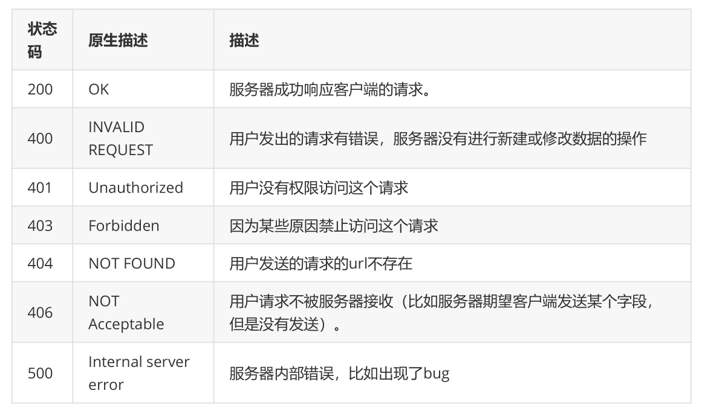

# 1、Restful API规范

restful api 是用于在前端与后台进行通信的一套规范。使用这个规范可以让前后端开发变得更加轻

松。以下将讨论这套规范的一些设计细节。

## 1.1 协议：

采用 http 或者 https 协议。

## 1.2 数据传输格式：

数据之间传输的格式应该都使用 json ，而不使用 xml 。

## 1.3 url链接：

url链接中，不能有动词，只能有名词。并且对于一些名词，如果出现复数，那么应该在后面加 s 。

比如：获取文章列表，应该使用 articles ，而不应该使用 get_article

## 1.4 HTTP请求的方法：

```
GET ：        从服务器上获取资源。
POST ：        在服务器上新创建一个资源。
PUT ：        在服务器上更新资源。（客户端提供所有改变后的数据）
PATCH ：    在服务器上更新资源。（客户端只提供需要改变的属性）
DELETE ：    从服务器上删除资源。
```

示例如下：

```
GET /users/ ：        获取所有用户。
POST /user/ ：        新建一个用户。
GET /user/id/ ：        根据id获取一个用户。
PUT /user/id/ ：        更新某个id的用户的信息（需要提供用户的所有信息）。
PATCH /user/id/ ：    更新某个id的用户信息（只需要提供需要改变的信息）。
DELETE /user/id/ ：    删除一个用户。
```

## 1.5 状态码：



# 2、Flask-Restful插件

## 2.1 介绍：

Flask-Restful 是一个专门用来写 restful api 的一个插件。使用他可以快速的集成 restful api 功

能。在 app 的后台以及纯 api 的后台中，这个插件可以帮助我们节省很多时间。当然，如果在普通的网

站中，这个插件就显得有些鸡肋了，因为在普通的网页开发中，是需要去渲染HTML代码的，而 Flask-

Restful 在每个请求中都是返回 json 格式的数据。

## 2.2 安装：

Flask-Restful 需要在 Flask 0.8 以上的版本，在 Python2.6 或者 Python3.3 上运行。通过 pip

install flask-restful 即可安装。

## 2.3 定义Restful的视图：

如果使用 Flask-Restful ，那么定义视图函数的时候，就要继承自 flask_restful.Resource 类，然

后再根据当前请求的 method 来定义相应的方法。比如期望客户端是使用 get 方法发送过来的请求，那

么就定义一个 get 方法。类似于 MethodView 。示例代码如下：

```
from flask import Flask,render_template,url_for
from flask_restful import Api,Resource
app = Flask(__name__)
# 用Api来绑定app
api = Api(app)
class IndexView(Resource):
  def get(self):
    return {"username":"zhiliao"}
api.add_resource(IndexView,'/',endpoint='index')
```

注意事项：

1. endpoint 是用来给 url_for 反转 url 的时候指定的。如果不写 endpoint ，那么将会使用视图的

名字的小写来作为 endpoint 。

2. add_resource 的第二个参数是访问这个视图函数的 url ，这个 url 可以跟之前的 route 一样，

可以传递参数。并且还有一点不同的是，这个方法可以传递多个 url 来指定这个视图函数。

## 2.4 参数解析：

Flask-Restful 插件提供了类似 WTForms 来验证提交的数据是否合法的包，叫做 reqparse 。以下是基本用法：

```
parser = reqparse.RequestParser()
parser.add_argument('username',type=str,help='请输入用户名')
args = parser.parse_args()
```

add_argument 可以指定这个字段的名字，这个字段的数据类型等。以下将对这个方法的一些参数做详

细讲解：

```
default ：    默认值，如果这个参数没有值，那么将使用这个参数指定的值。
required ：    是否必须。默认为False，如果设置为 True ，那么这个参数就必须提交上来。
type ：    这个参数的数据类型，如果指定，那么将使用指定的数据类型来强制转换提交上来的值。
choices ：    选项。提交上来的值只有满足这个选项中的值才符合验证通过，否则验证不通过。
help ：    错误信息。如果验证失败后，将会使用这个参数指定的值作为错误信息。
trim ：    是否要去掉前后的空格。
```

其中的 type ，可以使用 python 自带的一些数据类型，也可以使用 flask_restful.inputs 下的一些

特定的数据类型来强制转换。比如一些常用的：

```
url ：    会判断这个参数的值是否是一个url，如果不是，那么就会抛出异常。
regex ：    正则表达式。
date ：    将这个字符串转换为 datetime.date 数据类型。如果转换不成功，则会抛出一个异常。
```

## 2.5 输出字段：

对于一个视图函数，你可以指定好一些字段用于返回。以后可以使用ORM模型或者自定义的模型的时

候，他会自动的获取模型中的相应的字段，生成 json 数据，然后再返回给客户端。这其中需要导入

flask_restful.marshal_with 装饰器。并且需要写一个字典，来指示需要返回的字段，以及该字段的

数据类型。示例代码如下：

```
class ProfileView(Resource):
  resource_fields = {
    'username': fields.String,
    'age': fields.Integer,
    'school': fields.String
 }
  @marshal_with(resource_fields)
  def get(self,user_id):
    user = User.query.get(user_id)
    return user
```

在 get 方法中，返回 user 的时候， flask_restful 会自动的读取 user 模型上的 username 以及 age

还有 school 属性。组装成一个 json 格式的字符串返回给客户端。

### 2.5.1 重命名属性：

很多时候你面向公众的字段名称是不同于内部的属性名。使用 attribute可以配置这种映射。比如现在想

要返回 user.school 中的值，但是在返回给外面的时候，想以 education 返回回去，那么可以这样写：

```
resource_fields = {
  'education': fields.String(attribute='school')
}
```

### 2.5.2 默认值：

在返回一些字段的时候，有时候可能没有值，那么这时候可以在指定 fields 的时候给定一个默认值，

示例代码如下：

```
resource_fields = {
  'age': fields.Integer(default=18)
}
```

### 2.5.3 复杂结构：

有时候想要在返回的数据格式中，形成比较复杂的结构。那么可以使用一些特殊的字段来实现。比如要

在一个字段中放置一个列表，那么可以使用 fields.List ，比如在一个字段下面又是一个字典，那么可

以使用 fields.Nested 。以下将讲解下复杂结构的用法：

```
class ProfileView(Resource):
  resource_fields = {
    'username': fields.String,
    'age': fields.Integer,
    'school': fields.String,
    'tags': fields.List(fields.String),
    'more': fields.Nested({
      'signature': fields.String
   })
 }
```