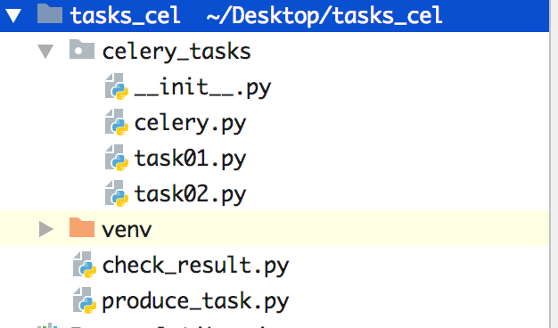

** **



** **

**celery.py:**[](javascript:void(0);)

```python
**from celery import Celery**
**cel = Celery('celery_demo',**
**             broker='redis://127.0.0.1:6379/1',**
**             backend='redis://127.0.0.1:6379/2',**
**             # 包含以下两个任务文件，去相应的py文件中找任务，对多个任务做分类**
**             include=['celery_tasks.task01',**
**                      'celery_tasks.task02'**
**                      ])**
**# 时区**
**cel.conf.timezone = 'Asia/Shanghai'**
**# 是否使用UTC**
**cel.conf.enable_utc = False**
```

[](javascript:void(0);)

**task01.py,task02.py:**[](javascript:void(0);)

```python
**#task01**
**import time**
**from celery_tasks.celery import cel**
**@cel.task**
**def send_email(res):**
**    time.sleep(5)**
**    return "完成向%s发送邮件任务"%res**
**#task02**
**import time**
**from celery_tasks.celery import cel**
**@cel.task**
**def send_msg(name):**
**    time.sleep(5)**
**    return "完成向%s发送短信任务"%name**
```

[](javascript:void(0);)


**produce_task.py:**[](javascript:void(0);)


```python
**from celery_tasks.task01 import send_email**
**from celery_tasks.task02 import send_msg**
**# 立即告知celery去执行test_celery任务，并传入一个参数**
**result = send_email.delay('yuan')**
**print(result.id)**
**result = send_msg.delay('yuan')**
**print(result.id)**
```

[](javascript:void(0);)

**check_result.py:**[](javascript:void(0);)

```python
**from celery.result import AsyncResult**
**from celery_tasks.celery import cel**
**async_result = AsyncResult(id="562834c6-e4be-46d2-908a-b102adbbf390", app=cel)**
**if async_result.successful():**
**    result = async_result.get()**
**    print(result)**
**    # result.forget() # 将结果删除,执行完成，结果不会自动删除**
**    # async.revoke(terminate=True)  # 无论现在是什么时候，都要终止**
**    # async.revoke(terminate=False) # 如果任务还没有开始执行呢，那么就可以终止。**
**elif async_result.failed():**
**    print('执行失败')**
**elif async_result.status == 'PENDING':**
**    print('任务等待中被执行')**
**elif async_result.status == 'RETRY':**
**    print('任务异常后正在重试')**
**elif async_result.status == 'STARTED':**
**    print('任务已经开始被执行')**
```

[](javascript:void(0);)

**开启work：celery worker -A celery_task -l info -P eventlet，添加任务（执行produce_task.py)，检查任务执行结果（执行check_result.py）**

**eventlet的版本为0.29.1**