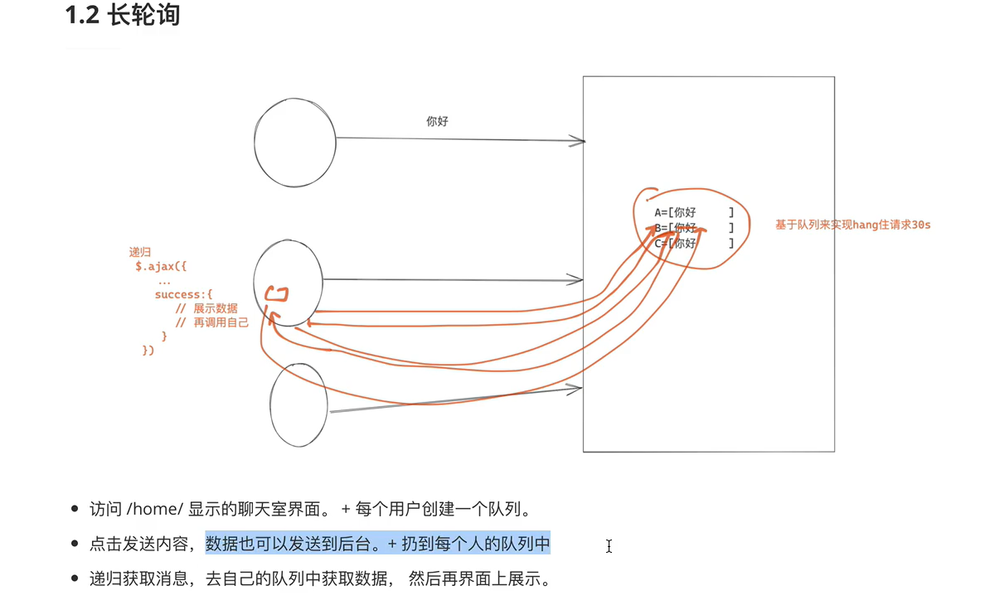

**基于http长轮询的聊天系统**



# 1、HTML

```
<!DOCTYPE html>
<html lang="en">
<head>
    <meta charset="UTF-8">
    <title>Title</title>
    <script src="https://cdn.bootcdn.net/ajax/libs/jquery/3.6.0/jquery.js"></script>
    <style>
        .message{
            height: 600px;
            border: 1px solid #dddddd ;
            width: 100%;
        }
    </style>
</head>
<body>
    <div class="message">
    </div>
    <input type="text" placeholder="请输入" id="txt">
    <input type="button" value="发送" onclick="sendMessage();">
</body>
<script>
    function sendMessage() {
        var text=$("#txt").val();
        $.ajax({
            url:"",
            type:"post",
            data:{
                text:text
            },
            success:function(res){
                console.log("发送请求成功",res);
            }
        })
    }
    function getMessage(){
        $.ajax({
            url:"",
            type:"get",
            dataType:"JSON",
            data:{
                uid:"{{ uid }}",
            },
            success:function(res){
                //超时，没有数据
                //有数据，展示信息数据
                if(res.status){
                    var tag=$("<div>");
                    tag.text(res.data);
                    $(".message").append(tag);
                }
                getMessage();    #递归再次调用，但是在js中，底层并不是真的基于递归的原理做的，所以相当于额外又调用了一次，不是真正的递归。
            }
        });
    }
    $(function(){            #刷新浏览器时，调用
        getMessage();
    })
</script>
</html>
```

# 2、url

```
from django.contrib import admin
from django.urls import path
from app01 import  views
urlpatterns = [
    path('admin/', admin.site.urls),
    path("home/",views.home),
    path("send/message",views.MsgView.as_view(),name="msg_get_post")
]
```

# 3、views

```
from django.shortcuts import render,HttpResponse
from django.http import  JsonResponse
from django.views import  View
import  queue
import json
# Create your views here.
USER_QUEUE={}        
def home(request):
    uid=request.GET.get("uid")
    USER_QUEUE[uid]=queue.Queue()
    return  render(request,"home.html",locals())
class MsgView(View):
    def get(self,request):
        uid=request.GET.get("uid")
        print(f"获取{uid}的数据")
        q=USER_QUEUE.get(uid)
        res={
            "status":True,
            "data":None
        }
        try:
            msg=q.get(timeout=10)
            res["data"]=msg
        except queue.Empty as e:
            res["status"]=False
        return  JsonResponse(res)
    def post(self,request):
        text=request.POST.get("text")
        print(text)
        for uid,q in USER_QUEUE.items():
            q.put(text)
        return HttpResponse("ok")
```