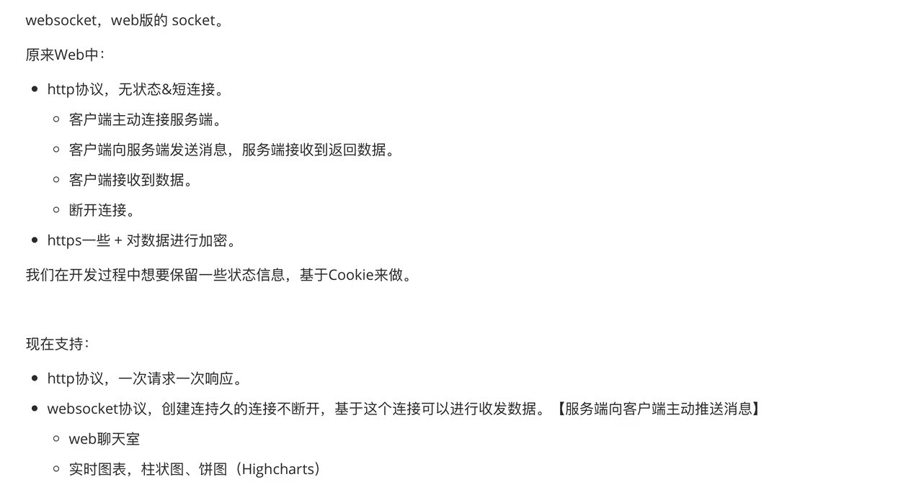

# 1、什么是WebSocket

- WebSocket是HTML5规范中新增的协议，它建立在TCP上，通过HTTP的方式进行握手，可以实现双向通信。与HTTP相比，WebSocket具有实时性高、开销小、通信高效等特点，能够满足类似在线聊天室、网络游戏等实时Web应用的需求。

- WebSocket对象提供了API来创建和管理WebSocket连接到服务器，以及在连接上发送和接收数据。使用WebSocket()构造函数来构建WebSocket。此外，WebSocket也支持在Web Workers中使用。

- WebSocket是一种网络通信协议，它使得客户端和服务器之间可以进行持续性、双向的通信，从而实现了实时Web应用。WebSocket的设计目的是在Web浏览器和服务器之间建立低延迟和高效率的通信管道，不仅可以节省带宽资源，同时也可以减轻服务器负载并降低网络延迟。

- WebSocket最初在HTML5规范中被作为基于TCP的Socket API的占位符引入。随着对该技术的讨论和改进，WebSocket于2008年正式成为一项标准，并得到广泛应用。



# 2、WebSocket 原理

**WebSocket是基于TCP协议的双向通信协议，在客户端和服务器之间建立一个持久性连接。与HTTP相比，WebSocket有以下几个特点：**

1. 能够实现客户端与服务器的双向通信，即服务器可以主动向客户端发送数据。

1. 通信开销小，因为与HTTP不同，WebSocket建立连接之后，双方通讯时不用在每个数据包里都加上HTTP头。

1. 实时性好，因为连接建立后可以保持一段时间，不用每次都重新发起连接请求。

1. 对服务器压力小，因为当服务器与某个客户端建立连接之后，它并不需要为该连接维护状态，也不需要多个线程来处理多个连接。

## **2.1 WebSocket工作原理的简单概述如下：**

1. 客户端发送一个HTTP请求给服务器，请求中包含包含一个Upgrade: WebSocket 头，表示请求升级为WebSocket协议，同时还要在请求头中指定一些其他的参数，例如Sec-WebSocket-Key等。

1. 服务器收到请求后，如果支持WebSocket协议，则会向客户端发送一个HTTP 101状态码，并在响应头里包含一些参数，例如Sec-WebSocket-Accept等，以确保协议升级过程正确无误。

1. 客户端在收到101状态码后，就认为连接已经建立成功了，并开始直接发送WebSocket报文。

1. WebSocket报文采用二进制流的方式进行传输，客户端和服务端可以互相发送消息并接收消息，实现双向通信。

>     **    在此过程中，需要注意的是，WebSocket协议有一个初始握手阶段，该阶段是基于HTTP的，只会发生一次；一旦握手成功，双方就以二进制数据的形式进行通信。当然，在连接建立之后，任何一方都可以关闭连接。同时，为避免网络中的错误，WebSocket还包括了一些连接管理机制，例如心跳检测等。**


## 2.2 WebSocket的握手原理如下:

握手(验证)，客户端发送一个消息，后端接收到消息再做一些特殊处理并返回。服务端支持websocket协议。

- 客户端向服务端发送：

```python
GET /chatsocket HTTP/1.1
Host:127.0.0.1:8002
Connection:Upgrade
Pragma:no-cache
Cache-Control:no-cache
Upgrade:websocket
Origin:http://localhost:63342
Sec-WebSocket-Version:13
Sec-WebSocket-Key:mnwFxiolctXFN/DeMt1Amg==
Sec-WebSocket-Extensions:permessage-deflate;client max window bits
.....
```

- 服务端接收

```python
mnwFxiOlctXFN/DeMt1Amg==与magic string进行拼接。
magic string :258EAFA5-E914-47DA-95CA-C5ABODC85B11"
v1 "mnwFxiolctXFN/DeMt1Amg=="+258EAFA5-E914-47DA-95CA-C5ABODC85B11"
v2 hmac1(v1)
v3 base64(v2) 
```

```python
HTTP/1.1 101 Switching Protocols
Upgrade:websocket
Connection:Upgrade
Sec-WebSocket-Accept:密文
```