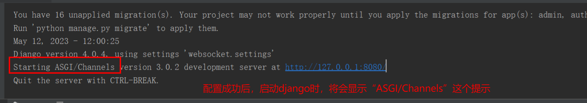

# 1、配置channels

- 下载安装channels（**下载3版本，4版本会出错**）

```shell
pip3 install channels -i https://pypi.doubanio.com/simple/
```

- 创建处理websocket 的业务逻辑，在app01 中再创建一个文件叫consumers(当然也可以自定义为其他的)

```python
# _*_ coding : utf-8 _*_
# @Time : 2023/5/11 22:43
# @Author : HackWu
# @File : consumers
# @Project : websocket
from  channels.generic.websocket import WebsocketConsumer
from channels.exceptions import StopConsumer
class ChatConsumer(WebsocketConsumer):
    def websocket_connect(self, message):
        #有客户端来向后端发送WebSocket连接的请求时，自动触发
        #self，表示的是连接对象本身。每连接一个websocket，就会产生一个self对象，每次都是不一样的，
        # 就像django中的request对象一样。
        print("有连接来了")
        self.accept()   #表示允许与客户端连接
    def websocket_receive(self, message):
        #浏览器基于WebSocket向后端发送数据，自动触接收消息
        print(message)          #message是一个字典。包含了“type,text” 两个key.
            #type  表示连接的类型
            #text   就是接收到的字符数据。
        self.send("不要回复")
        # self.close()              #表示服务端断开连接
    def websocket_disconnect(self, message):
        #客户端与服务端断开连接时，自动触发
        #客户端与服务端断开连接时，自动触发，除非之前已经有对象提前抛出了“StopConsumer” 异常，那么就不会再次执行此操作。
        print("客户端出错，即将断开连接")
        raise  StopConsumer()
```

- 再settings.py 的同级目录下创建routing.py（为WebSocket配置专属路由）

```python
from django.urls import re_path
from app01 import consumers
websocket_urlpatterns = [
    re_path(r'ws/(?P<group>\w+)/$', consumers.ChatConsumer.as_asgi()),
]
```

- 修改asgi.py文件（让django自动识别WebSocket请求和http请求，并转发到不同的路由配置上）

```python
import os
from django.core.asgi import get_asgi_application
from channels.routing import ProtocolTypeRouter, URLRouter
from . import routing
os.environ.setdefault('DJANGO_SETTINGS_MODULE', 'websocket.settings')
# application = get_asgi_application()        #原来的默认配置，默认走django的路由
application = ProtocolTypeRouter({
    "http": get_asgi_application(),            #如果是http请求，走django的路由
    "websocket": URLRouter(routing.websocket_urlpatterns),    #如果是WebSocket请求，走WebSocket的路由，这里也就是routing
})
```

- 配置settings.py （使刚才的所有配置生效）

```python
#注册channels
INSTALLED_APPS = [
    'django.contrib.admin',
    'django.contrib.auth',
    'django.contrib.contenttypes',
    'django.contrib.sessions',
    'django.contrib.messages',
    'django.contrib.staticfiles',
    'app01.apps.App01Config',
    'channels',          #注册channels
]
ASGI_APPLICATION="websocket.asgi.application"        #添加这一行
#websocket   就是项目的名称
```



- 如果没有显示，可能是channels的版本不对。

# html

```
<!DOCTYPE html>
<html lang="en">
<head>
    <meta charset="UTF-8">
    <title>Title</title>
    <script src="https://cdn.bootcdn.net/ajax/libs/jquery/3.6.0/jquery.js"></script>
    <style>
        .message{
            height: 600px;
            border: 1px solid #dddddd ;
            width: 100%;
        }
    </style>
</head>
<body>
    <div class="message">
    </div>
    <input type="text" placeholder="请输入" id="txt">
    <input type="button" value="发送" onclick="sendMessage();">
</body>
<script>
   var ws=new WebSocket("ws://localhost:8080/ws/");
    ws.onopen=function (ev) {           //建立连接时触发
        console.log("成功建立了连接");
    };
    ws.onmessage=function (ev) {        //收到消息时触发
        console.log("接收到了消息",ev);     //ev 是一个对象，其中的“data”属性，封装了接收到的字符数据。
        console.log(ev.data);
    };
   ws.onerror=function (ev) {
       console.log("连接出错了");
       ws.close()       //主动关闭连接
   } ;
   ws.onclose=function (ev) {
        console.log("连接关闭");
   };
   function sendMessage() {
       var data=$("#txt").val();
       ws.send(data);
       $("#txt").val("");
   }
</script>
</html>
```