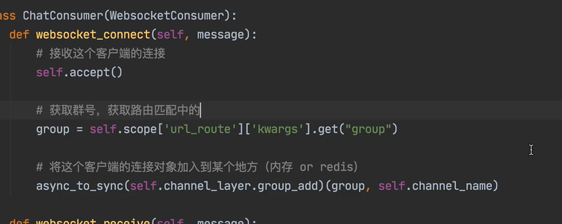

# 基于内存的channel layer

```
CHANNEL_LAYERS = {
    "default": {
        "BACKEND": "channels.layers.InMemoryChannelLayer",
    }
}
```

# 业务处理

```python
from channels.generic.websocket import WebsocketConsumer
from asgiref.sync import async_to_sync


class ChatConsumer(WebsocketConsumer):

    def websocket_connect(self):
        async_to_sync(self.channel_layer.group_add)('x1', self.channel_name)
        self.accept()

    def websocket_receive(self, text_data=None, bytes_data=None):
        async_to_sync(self.channel_layer.group_send)('x1', {
            'type': 'xxx.ooo',
            'message': text_data
        })

    def xxx_ooo(self, event):
        message = event['message']
        self.send(message)

    def websocket_disconnect(self, code):
        async_to_sync(self.channel_layer.group_discard)('x1', self.channel_name)

```

# 基于redis的channel layer

```
pip3 install channels-redis
```

- 配置

```python
#任意选一种配置即可
CHANNEL_LAYERS = {
    "default": {
        "BACKEND": "channels_redis.core.RedisChannelLayer",
        "CONFIG": {
            "hosts": [('10.211.55.25', 6379)]
        },
    },
}
CHANNEL_LAYERS = {
    'default': {
    'BACKEND': 'channels_redis.core.RedisChannelLayer',
    'CONFIG': {"hosts": ["redis://10.211.55.25:6379/1"],},
    },
}
 
CHANNEL_LAYERS = {
    'default': {
    'BACKEND': 'channels_redis.core.RedisChannelLayer',
    'CONFIG': {"hosts": [('10.211.55.25', 6379)],},},
}
 
CHANNEL_LAYERS = {
    "default": {
        "BACKEND": "channels_redis.core.RedisChannelLayer",
        "CONFIG": {
            "hosts": ["redis://:password@10.211.55.25:6379/0"],
            "symmetric_encryption_keys": [SECRET_KEY],
        },
    },
}
```

# 实例

- 此示例中，所有的群聊的组名称都是一样的。

- 但如果想通过不同的url，进入不同的组，可以使用

- **group=self.scope["url_route"]["kwargs"].get("group")**

- 这个方法，可以获取到channel中url，有名分组中的group的值，然后就可以将group的值作为组名传入了，比如：

-  **async_to_sync(self.channel_layer.group_add)(group,self.channel_name)**

- 这个group，就是一个动态的值，而不再是固定的了。

- channel的路由：

- **re_path(r'^ws/(?P<group>\d+)', consumers.ChatConsumer.as_asgi()),**

- **这样就可以实现不同的组，消息不互通了。**

## html

```html
<!DOCTYPE html>
<html lang="en">
<head>
    <meta charset="UTF-8">
    <title>Title</title>
    <script src="https://cdn.bootcdn.net/ajax/libs/jquery/3.6.0/jquery.js"></script>
    <style>
        .message{
            height: 600px;
            border: 1px solid #dddddd ;
            width: 100%;
        }
    </style>
</head>
<body>
    <div class="message">
    </div>
    <input type="text" placeholder="请输入" id="txt">
    <input type="button" value="发送" onclick="sendMessage();">
</body>
<script>
   var ws=new WebSocket("ws://localhost:8080/ws/");
    ws.onopen=function (ev) {           //建立连接时触发
        console.log("成功建立了连接");
    };
    ws.onmessage=function (ev) {        //收到消息时触发
        {#console.log("接收到了消息",ev);     //ev 是一个对象，其中的“data”属性，封装了接收到的字符数据。#}
        {#console.log(ev.data);#}
        var tag=$("<div>").text(ev.data);
        $(".message").append(tag);
    };
   ws.onerror=function (ev) {
       console.log("连接出错了");
       ws.close()       //主动关闭连接
   } ;
   ws.onclose=function (ev) {
        console.log("连接关闭");
   };
   function sendMessage() {
       var data=$("#txt").val();
       ws.send(data);
       $("#txt").val("");
   }
   
</script>
</html>
```

## consumer

```python
# _*_ coding : utf-8 _*_
# @Time : 2023/5/11 22:43
# @Author : HackWu
# @File : consumers
# @Project : websocket
from  channels.generic.websocket import WebsocketConsumer
from channels.exceptions import StopConsumer
from asgiref.sync import async_to_sync
class ChatConsumer(WebsocketConsumer):
    def websocket_connect(self, message):
        #有客户端来向后端发送WebSocket连接的请求时，自动触发
        #self，表示的是连接对象本身。每连接一个websocket，就会产生一个self对象，每次都是不一样的，
        async_to_sync(self.channel_layer.group_add)("group_chat1",self.channel_name)
        #将self对象，添加到群聊“group_chat1”中
        print("有连接来了")
        self.accept()   #表示允许与客户端连接
    def websocket_receive(self, message):
        #浏览器基于WebSocket向后端发送数据，自动触接收消息
        print(message)          #message是一个字典。包含了“type,text” 两个key.
            #type  表示连接的类型
            #text   就是接收到的字符数据。
        async_to_sync(self.channel_layer.group_send)("group_chat1",{
            "type":"handler",
            "message":message.get("text"),
        })
        #将接收到的消息发送到群聊“group_chat1”中。
        #但是如何发送，需要自己定义，属性type 的值"handler" 实际上就是一个方法名，是自定义的，需要在里面自己定义如何发送
        #message 就是要发送的数据
        
        # self.close()              #表示服务端断开连接
    def handler(self,event):
        message=event.get("message")
        self.send(message)
        #这里的self，代表的不再是一个websocket请求对象了，而是一个channel layer的相关对象。
    def websocket_disconnect(self, message):
        #客户端与服务端断开连接时，自动触发
        #客户端与服务端断开连接时，自动触发，除非之前已经有对象提前抛出了“StopConsumer” 异常，那么就不会再次执行此操作。
        print("客户端出错，即将断开连接")
        async_to_sync(self.channel_layer.group_discard)('group_chat1', self.channel_name)
        #将这个self对象，从群聊“group_chat1”中踢出。
        raise  StopConsumer()
```