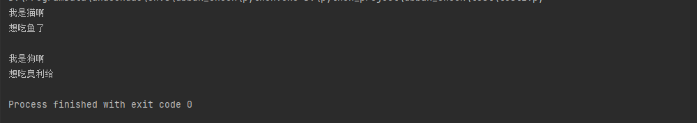

```
#coding=utf-8
class Animal:
    def speak(self):
        raise  NotImplementedError
class Food:
    def food(self):
        raise  NotImplementedError
class Dog(Animal):
    def speak(self):
        print "我是狗啊"
class Cat(Animal):
    def speak(self):
        print "我是猫啊"
class DogFood(Food):
    def food(self):
        print "想吃奥利给"
class CatFood(Food):
    def food(self):
        print "想吃鱼了"
class Shop:
    def buyAnimal(self):
        raise  NotImplementedError
    def buyFood(self):
        raise NotImplementedError
        
#狗店这类的工厂
class DogShop(Shop):
    def buyAnimal(self):
        return Dog()
    def buyFood(self):
        return DogFood()
        
#猫店这类的工厂
class CatShop(Shop):
    def buyAnimal(self):
        return Cat()
    def buyFood(self):
        return CatFood()
#超级工厂，返回不同的工厂实例
class CreateShop:
    def __init__(self):
        self.shops={
            "catShop":CatShop,
            "dogShop":DogShop,
        }
    def getShop(self,shop_type):
        if shop_type in self.shops:
            return self.shops.get(shop_type)()
        else:
            raise Exception("不支持这种商店")
if __name__ == '__main__':
    shop_provide=CreateShop()
    cat_shop=shop_provide.getShop("catShop")
    cat=cat_shop.buyAnimal()
    food=cat_shop.buyFood()
    cat.speak()
    food.food()
    print
    dog_shop=shop_provide.getShop("dogShop")
    dog=dog_shop.buyAnimal()
    food=dog_shop.buyFood()
    dog.speak()
    food.food()
```

- 运行

