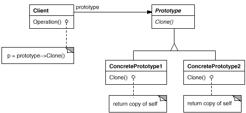

**意图：**

用原型实例指定创建对象的种类，并且通过拷贝这些原型创建新的对象。

**适用性：**

当要实例化的类是在运行时刻指定时，例如，通过动态装载；或者为了避免创建一个与产品类层次平行的工厂类层次时；或者当一个类的实例只能有几个不同状态组合中的一种时。建立相应数目的原型并克隆它们可能比每次用合适的状态手工实例化该类更方便一些。



# 1、原型模式（原生版）

```python
# coding=utf-8
# @Author:wyp
# @FileName:test2.py
# @DateTime:2023/9/25 17:30
import copy
class Prototype:
    def __init__(self):
        self._objects = {}
    def register_object(self, name, obj):
        """Register an object"""
        self._objects[name] = obj
    def unregister_object(self, name):
        """Unregister an object"""
        del self._objects[name]
    def clone(self, name, **attr):
        """Clone a registered object and update inner attributes dictionary"""
        obj = copy.deepcopy(self._objects.get(name))
        obj.__dict__.update(attr)
        return obj
def main():
    class A:
        def __str__(self):
            return "I am A"
    a = A()
    prototype = Prototype()
    prototype.register_object('a', a)
    b = prototype.clone('a', a=1, b=2, c=3)
    print(a)
    print(b.a, b.b, b.c)
if __name__ == '__main__':
    main()
```

# 2、原型模式（原型链详解版)

```python
# coding=utf-8
# @Author:wyp
# @FileName:test3.py
# @DateTime:2023/9/25 17:58
import copy
class Prototype:
    getattr_fun = None
    
    def __init__(self):
        self._objects = {}
    def register_object(self, name, obj):
        """Register an object"""
        """
          如果想实现实例对象可以自动访问原型对象的属性，就需要配置__getattr__特殊方法，
          而且是需要给原型对象配置，因为实例对象实质上是由原型对象深拷贝过来的。所以给原型对象配置，实例对象就也拥有了。
          但是需要考虑两种情况：
             -原型对象上没配置__getattr__方法，这是我们直接添加即可。
             —原型对象上配置了__getattr__方法，我们需要将原型对象的__getattr__进行保存，然后在新的__getattr__方法中进行调用。
        """
        if hasattr(obj.__class__, "__getattr__"):
            Prototype.getattr_fun = getattr(obj.__class__, "__getattr__")
            setattr(obj.__class__, "__getattr__", self.has_getattr)
        else:
            setattr(obj.__class__, "__getattr__", self.has_no_getattr)
        setattr(obj, "__prototype__", True)
        self._objects[name] = obj
    def unregister_object(self, name):
        """Unregister an object"""
        del self._objects[name]
    def clone(self, name, **attr):
        """Clone a registered object and update inner attributes dictionary"""
        obj = copy.deepcopy(self._objects.get(name))
        # 标注不是原型实例对象，False表示不是
        obj.__dict__.update(attr)
        setattr(obj, "__prototype__", False)
        setattr(obj, "__proto__", self._objects.get(name))
        return obj
    # 为什么两个不使用if语句进行合并，如果进行合并了，那么之后的原型模式产生的对象，都会多一次判断。
    @staticmethod
    def has_no_getattr(self, item):
        if item == "__prototype__":
            setattr(self, item, True)
        if self.__prototype__ == False:
            return getattr(self.__proto__, item)
        parent_class = self.__class__.__bases__[0]
        return getattr(parent_class, item)
    @staticmethod
    def has_getattr(self, item):
        if item == "__prototype__":
            setattr(self, item, True)
        if self.__prototype__ == False:
            return getattr(self.__proto__, item)
        return Prototype.getattr_fun(self, item)
class A:
    c = 5
    def __getattr__(self, item):
        if item == "f":
            print(item)
            return "没有这个属性啊"
        return super().__getattr__(item)
def main():
    a = A()
    prototype = Prototype()
    # 如果对某一类对象，需要使用原型的方式创建对象。那么需要将这个类的实例对象在Prototype中进行注册。
    prototype.register_object('a', a)
    """
     然后在实际创建对象时，需要输入此对象的原型对象名称，以及需要更新或者添加的属性。
       如果使用类继承的话，我们一般使用的是重写这些属性。
       -但是使用继承，实例对象可以使用super()方法，访问到父类，甚至更改父类的属性。
       -但是原生的原型模式，获取到新的实例对象之后，就无法和原型对象建立关联了。可以看成是一个完全独立的，实例对象,因为原型模式使用的是深拷贝。
    
    如果参考js中的，创建对象的方式。
        -在js中所有的构造函数(相当于类对象)都有一个原型对象，可以请个.prototype属性获取到原型对象。
        -所有的实例对象对象，也可以获取到原型对象，通过.__proto__属性可以获取到原型对象。
        -并且如果访问的属性，在实例对象上没有的话，就回到原型对象上去寻找。
    所以如果想用python实现类似的效果，改如何实现呢？
        -参考以上代码。
    """
    # b = prototype.clone('a', a=1, b=2, c=3)
    b = prototype.clone('a', a=1, b=2)
    b.__proto__.x = 5
    print(b.x)
    print(b.f)
    c = prototype.clone("a")
    print(c.x)  # c也可以拿到x,因为是从原型对象上拿到的。
if __name__ == '__main__':
    main()
###
>>
5
f
没有这个属性啊
5
```

# 3、**原型模式，示例(原型链纯净版)**

```python
# coding=utf-8
# @Author:wyp
# @FileName:test3.py
# @DateTime:2023/9/25 17:58
import copy
class Prototype:
    getattr_fun = None
    
    def __init__(self):
        self._objects = {}
    def register_object(self, name, obj):
        """Register an object"""
        if hasattr(obj.__class__, "__getattr__"):
            Prototype.getattr_fun = getattr(obj.__class__, "__getattr__")
            setattr(obj.__class__, "__getattr__", self.has_getattr)
        else:
            setattr(obj.__class__, "__getattr__", self.has_no_getattr)
        setattr(obj, "__prototype__", True)
        self._objects[name] = obj
    def unregister_object(self, name):
        """Unregister an object"""
        del self._objects[name]
    def clone(self, name, **attr):
        """Clone a registered object and update inner attributes dictionary"""
        obj = copy.deepcopy(self._objects.get(name))
        obj.__dict__.update(attr)
        setattr(obj, "__prototype__", False)
        setattr(obj, "__proto__", self._objects.get(name))
        return obj
    @staticmethod
    def has_no_getattr(self, item):
        if item == "__prototype__":
            setattr(self, item, True)
        if self.__prototype__ == False:
            return getattr(self.__proto__, item)
        parent_class = self.__class__.__bases__[0]
        return getattr(parent_class, item)
    @staticmethod
    def has_getattr(self, item):
        if item == "__prototype__":
            setattr(self, item, True)
        if self.__prototype__ == False:
            return getattr(self.__proto__, item)
        return Prototype.getattr_fun(self, item)
class A:
    c = 5
    def __getattr__(self, item):
        if item == "f":
            print(item)
            return "没有这个属性啊"
        return super().__getattr__(item)
def main():
    a = A()
    prototype = Prototype()
    prototype.register_object('a', a)
    b = prototype.clone('a', a=1, b=2)
    b.__proto__.x = 5
    print(b.x)
    print(b.f)
    c = prototype.clone("a")
    print(c.x)  
if __name__ == '__main__':
    main()
```