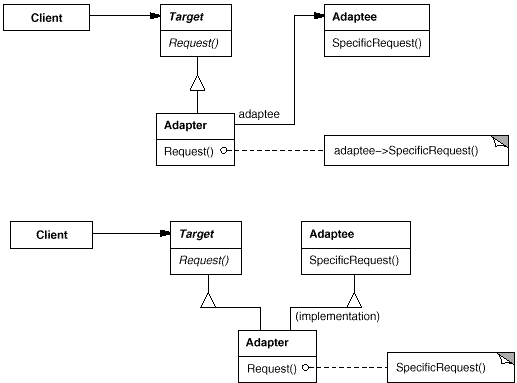

**意图：**

 将一个类的接口转换成客户希望的另外一个接口。Adapter 模式使得原本由于接口不兼容而不能一起工作的那些类可以一起工作。 

**适用性：**

 你想使用一个已经存在的类，而它的接口不符合你的需求。

你想创建一个可以复用的类，该类可以与其他不相关的类或不可预见的类（即那些接口可能不一定兼容的类）协同工作。

（仅适用于对象Adapter ）你想使用一些已经存在的子类，但是不可能对每一个都进行子类化以匹配它们的接口。对象适配器可以适配它的父类接口。



# 代码示例

```python
# coding=utf-8
# @Author:wyp
# @FileName:test3.py
# @DateTime:2023/9/25 17:58
class Dog(object):
    def __init__(self):
        self.name = "Dog"
    def bark(self):
        return "woof!"
class Cat(object):
    def __init__(self):
        self.name = "Cat"
    def meow(self):
        return "meow!"
class Human(object):
    def __init__(self):
        self.name = "Human"
    def speak(self):
        return "'hello'"
class Car(object):
    def __init__(self):
        self.name = "Car"
    def make_noise(self, octane_level):
        return "vroom%s" % ("!" * octane_level)
class Adapter(object):
    """
    Adapts an object by replacing methods.
    Usage:
    dog = Dog
    dog = Adapter(dog, dict(make_noise=dog.bark))
    """
    def __init__(self, obj, adapted_methods):
        """We set the adapted methods in the object's dict"""
        self.obj = obj
        self.__dict__.update(adapted_methods)
    def __getattr__(self, attr):
        """All non-adapted calls are passed to the object"""
        return getattr(self.obj, attr)
def main():
    objects = []
    dog = Dog()
    objects.append(Adapter(dog, dict(make_noise=dog.bark)))
    cat = Cat()
    objects.append(Adapter(cat, dict(make_noise=cat.meow)))
    human = Human()
    objects.append(Adapter(human, dict(make_noise=human.speak)))
    car = Car()
    car_noise = lambda: car.make_noise(3)
    objects.append(Adapter(car, dict(make_noise=car_noise)))
    for obj in objects:
        print( "A", obj.name, "goes", obj.make_noise())
    print("####################")
    dog=Adapter(dog,dict(make_noise=dog.bark))    #在dog实例对象的外面套了一个壳子，此过程并没有重复实例Dog类。
    print(dog.make_noise())
if __name__ == "__main__":
    main()
    
##
>>
A Dog goes woof!
A Cat goes meow!
A Human goes 'hello'
A Car goes vroom!!!
####################
woof!
```