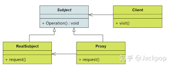

# **代理模式**


提到

之所以开始便讲解网络代理，是因为代理模式和网络代理有着很多相似的特点，而我们日常中接触更多的是网络代理，这样类比一下能够有助于大家的理解。

在

**代理模式的作用**

一个概念的产生，自然有它的价值存在，代理模式也是这样，简而言之，概括代理模式的作用如下：

> 当我们访问一个实体考虑到安全等因素不方便时，代理可以为这个实体提供一个替代者，来控制它的访问权限和访问内容。


通俗的来讲，代理模式就如同一个"过滤器"，它

举个例子，我们访问一个具备敏感数据时，需要提供一个验证信息，比如，用户名、密码，代理模式完成的是更具访问者提供的用户名和密码来判断是否允许它进一步调用实体的功能。

**代理模式的适用场景**

> **远程代理**：为一个对象的地址空间提供局部代表。
> **虚拟代理**：根据需要来创建开销较大的对象。
> **保护代理**：用于对象应该具有不同访问权限的场景，控制对原始对象的访问。
> **智能指引**：取代简单的指针，它在访问对象时执行一些附加操作。-- 引自《设计模式：可复用面向对象软件的基础》


## **Python代理模式**



代理模式在Java、C++中使用较多，可以用于虚拟代理和远程代理。由于Python这门语言相对简单，在企业中也常用于算法模块的验证，在一些大型系统很少会采用Python这门语言，因此，在软件设计模式方面考虑相对较少。但是，我认为，养成一个良好的软件设计思维，对日常开发和维护也具有非常多的好处，能够让开发效率更高，能够让代码可靠性更高，能够让后期维护成本更低。

在开发代码实现Python代理模式之前，我们首先来设定一个应用场景，这样才能够更加体现它的价值，同时让各位更加容易理解。

**场景设定**

假如，我们现在想了解一个班级的情况，主要包括两点：人数和学习成绩。

当我们想要了解这个班级的人数时，这个数据不敏感，不涉及隐私，因此可以直接访问。但是，当我们想查询特定某个学生成绩时，这样就涉及隐私信息，需要提供对应学生的姓名(user_name)，访问的密码(password)。

**需求分析**

针对这个场景，我们可以先分析一下，访问者就如同上述图中的客户端(Client)，获取班级人数、成绩这些实际的功能是由实体对象实现，也就是图中的RealSubject。Client与RealSubject之间不能直接通信，它们只能通过中间的代理(Proxy)进行通信。而Proxy主要的职责就相当于一个控制开关，如果Client要访问班级人数，Proxy会检查这项数据所需要的权限，然后发现班级人数是非敏感数据可以直接访问，那么它会调用实体对象中的方法，返回结果。如果Client要访问某个学生的成绩，Proxy会检查这项数据是敏感数据，需要提供用户名和密码，如果Client提供的正确，则允许访问，否则拒绝访问。

**编程实践**

第一步，我们自定义一个异常处理类，当我们要访问的用户不在班级成绩列表时，则抛出异常，

```python
class NotFindError(Exception):
    def __init__(self, msg):
        self.msg = msg
```

第二步，实现实体类，实体类实现了具体的功能，针对这个场景就两个方法：获取班级人数、获取指定学生的成绩，

```python
class RealSubject(object):
    def __init__(self):
        self.score = {
            "张三": 90,
            "李四": 59,
            "王二": 61
        }
​
    def num_students(self):
        num = len(self.score.keys())
        print("The number of students is {num}".format(num=num))
​
    def get_score(self, user_name):
        _score = self.score.get(user_name)
        print("The score of {user} is {score}".format(user=user_name,
                                                      score=_score))
```

第三步，实现代理(Proxy)，它通过对应功能的访问权限来确定是

> 注意：在这个示例中，我把密码直接写在初始化方法中，实际的项目是不允许这样的，不能把密码写在代码中，另外也不能使用明文密码，需要使用加密工具对明文密码进行加密。


```python
class Proxy(object):
    def __init__(self):
        self.default_passwd = "9l0skjlsa"
        self.real_subject = RealSubject()
​
    def num_students(self):
        self.real_subject.num_students()
​
    def get_score(self, user_name):
        print("You are visiting {} score ...".format(user_name))
        passwd = input("Please input password : ")
        if passwd == self.default_passwd:
            if user_name in self.real_subject.score.keys():
                return self.real_subject.get_score(user_name)
            else:
                raise NotFindError("The student you are visiting not found.")
        else:
            raise ValueError("The password you provided is wrong!")
```

然后就是实现Client来调用对应的功能，为了测试上述代理的功能，使用3个测试样例，

1. 密码错误，用户名正确；

1. 密码正确，用户名错误；

1. 密码正确，用户名正确；

**密码错误，用户名正确**

```python
def client():
    proxy = Proxy()
    proxy.get_score("张三")
    
client()
​
# shell
You are visiting 张三 score ...
Please input password : kdksla
    
# 输出
ValueError: The password you provided is wrong!
```

**密码正确，用户名错误**

```python
def client():
    proxy = Proxy()
    proxy.get_score("李三")
    
client()
​
# shell
You are visiting 张三 score ...
Please input password : 9l0skjlsa
​
# 输出
NotFindError: The student you are visiting not found.
```

**密码正确，用户名正确**

```python
def client():
    proxy = Proxy()
    proxy.get_score("李四")
    
client()
​
# shell
You are visiting 张三 score ...
Please input password : 9l0skjlsa
​
# 输出
The score of 李四 is 59
```

本讲完整代码如下，

```python
class NotFindError(Exception):
    def __init__(self, msg):
        self.msg = msg
​
​
class RealSubject(object):
    def __init__(self):
        self.score = {
            "张三": 90,
            "李四": 59,
            "王二": 61
        }
​
    def num_students(self):
        num = len(self.score.keys())
        print("The number of students is {num}".format(num=num))
​
    def get_score(self, user_name):
        _score = self.score.get(user_name)
        print("The score of {user} is {score}".format(user=user_name,
                                                      score=_score))
​
​
class Proxy(object):
    def __init__(self):
        self.default_passwd = "9l0skjlsa"
        self.real_subject = RealSubject()
​
    def num_students(self):
        self.real_subject.num_students()
​
    def get_score(self, user_name):
        print("You are visiting {} score ...".format(user_name))
        passwd = input("Please input password : ")
        if passwd == self.default_passwd:
            if user_name in self.real_subject.score.keys():
                return self.real_subject.get_score(user_name)
            else:
                raise NotFindError("The student you are visiting not found.")
        else:
            raise ValueError("The password you provided is wrong!")
​
​
def client():
    proxy = Proxy()
    proxy.get_score("张三")
​
client()
```

# 2、模拟Js中windows.Proxy() 函数

- 对不同的实体对象，自动生成数据代理对象，而无需手动编写。

```python
# coding=utf-8
# @Author:wyp
# @FileName:test2.py
# @DateTime:2023/9/25 17:30
class People:
    def __init__(self, name, age):
        self.name = name
        self.age = age
    def get_full_name(self):
        print("全名：", self.name, self.age)
def getter(obj, item):
    def inner(self):
        print(f"获取属性: {item}")
        return getattr(obj, item)
    return inner
def setter(obj, item):
    def inner(self, value):
        print(f"设置了属性： {item}")
        setattr(obj, item, value)
    return inner
def deleter(obj, item):
    def inner(self):
        print(f"删除了属性： {item}")
        delattr(obj, item)
    return inner
def __getattr__(obj):
    def inner(self, item):
        print(f"去实体上寻找：{item}")
        return getattr(obj, item)
    return inner
class Proxy:
    def __new__(cls, obj, *args, **kwargs):
        functions = {
            "__getattr__": __getattr__(obj)  #
        }
        # 使用property对象，动态添加数据劫持，并生成代理
        for key in obj.__dict__:
            func = property(getter(obj, key))
            func = func.setter(setter(obj, key))
            func = func.deleter(deleter(obj, key))
            functions[key] = func
        # 动态生成类
        ProxyObj = type(f"Proxy{obj.__class__.__name__}", (object,), functions)
        instance = ProxyObj()
        return instance
people = People("张三", 20)
people_2 = People("王五", 19)
p = Proxy(people)
p2 = Proxy(people_2)
#
p2.name = "麻二"
p.name = "lisi"
#
print(p.name)
#
print(people.__dict__)
print(people_2.__dict__)
p.get_full_name()
#
>>
设置了属性： name
设置了属性： name
获取属性: name
lisi
{'name': 'lisi', 'age': 20}
{'name': '麻二', 'age': 19}
去实体上寻找：get_full_name
全名： lisi 20
```