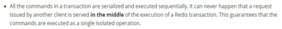
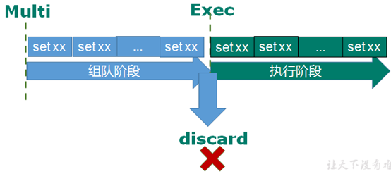
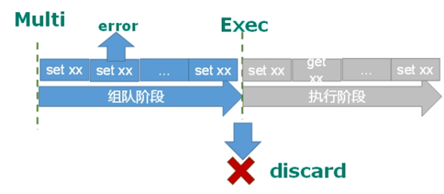
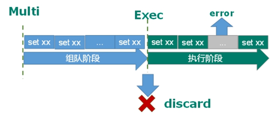
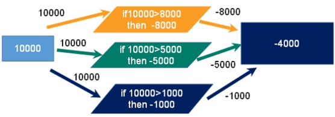
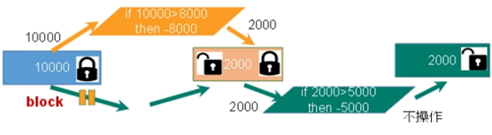
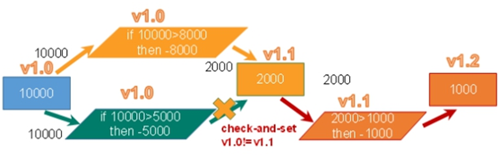
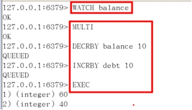

**事务**

Redis事务是一个单独的隔离操作：事务中的所有命令都会序列化、按顺序地执行。事务在执行的过程中，不会被其他客户端发送来的命令请求所打断。

**Redis事务的主要作用就是**

从输入Multi命令开始，输入的命令都会依次进入命令队列中，但不会执行，直到输入

组队的过程中可以通过

**案例：**

|   | 
| -- |
|   | 
|   | 

组队中某个命令出现了报告错误，执行时整个的所有队列都会被取消。

如果执行阶段某个命令报出了错误，则只有报错的命令不会被执行，而其他的命令都会执行，不会回滚。

想想一个场景：有很多人有你的账户,同时去参加双十一抢购

一个请求想给金额减8000

一个请求想给金额减5000

一个请求想给金额减1000

**悲观锁(Pessimistic Lock)**

**乐观锁(Optimistic Lock)**

在执行

取消 

如果在执行 

[http://doc.redisfans.com/transaction/exec.html](http://doc.redisfans.com/transaction/exec.html)

- n  事务中的所有命令都会序列化、按顺序地执行。事务在执行的过程中，不会被其他客户端发送来的命令请求所打断。 

- Ø  没有隔离级别的概念 

- n  队列中的命令没有提交之前都不会实际被执行，因为事务提交前任何指令都不会被实际执行

- Ø  不保证原子性 

- n  事务中如果有一条命令执行失败，其后的命令仍然会被执行，没有回滚 