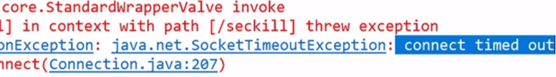

**事务**


使用工具ab模拟测试

CentOS6 默认安装

CentOS7需要手动安装

```
**yum install httpd-tools**
```

```
（1） 进入cd  /run/media/root/CentOS 7 x86_64/Packages（路径跟centos6不同）
（2） 顺序安装
apr-1.4.8-3.el7.x86_64.rpm
apr-util-1.5.2-6.el7.x86_64.rpm
httpd-tools-2.4.6-67.el7.centos.x86_64.rpm  
```

### **1.2.3.1. ****通过****ab****测试**

vimpostfile 模拟表单提交参数,以&符号结尾;存放当前目录。

内容：

```
ab -n 2000 -c 200 -k -p ~/postfile -Tapplication/x-www-form-urlencoded   
```

**1.2.3.2.**

|   |   | 


| //增加乐观锁 |   | 


```
ab -n 2000 -c 200 -k -p postfile -T'application/x-www-form-urlencoded' 
```


增加

```
**ab -n 2000 -c 100 -r -p postfile -T'application/x-www-form-urlencoded' **
```

```
ab -n 2000 -c 100 -p postfile -T'application/x-www-form-urlencoded' 
```

已经秒光，可是还有库存。原因，就是




节省每次连接redis服务带来的消耗，把连接好的实例反复利用。

通过参数管理连接的行为

代码见项目中

- 链接池参数

- MaxTotal：控制一个pool可分配多少个jedis实例，通过pool.getResource()来获取；如果赋值为-1，则表示不限制；

如果

- maxIdle：控制一个pool最多有多少个状态为idle(空闲)的jedis实例；

- MaxWaitMillis：表示当borrow一个jedis实例时，最大的等待毫秒数，如果超过等待时间，则直接抛JedisConnectionException；

- testOnBorrow：获得一个jedis实例的时候是否检查连接可用性（ping()）；如果为true，则得到的jedis实例均是可用的；


Lua 是一个小巧的脚本语言，Lua脚本可以很容易的被

很多应用程序、游戏使用LUA作为自己的嵌入式脚本语言，以此来实现可配置性、可扩展性。

这其中包括魔兽争霸地图、魔兽世界、博德之门、愤怒的小鸟等众多游戏插件或外挂。

[https://www.w3cschool.cn/lua/](https://www.w3cschool.cn/lua/)

将复杂的或者多步的redis操作，写为一个脚本，一次提交给

LUA脚本是类似

但是注意redis的

利用lua脚本淘汰用户，解决超卖问题。

redis 2.6版本以后，通过


老师点10次，正常秒杀

同学

使用工具ab模拟并发测试，会出现超卖情况。查看库存会出现

| local userid=KEYS[1];  | 
