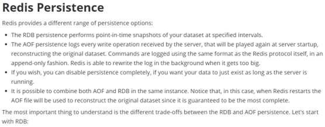
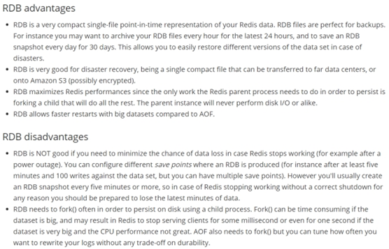
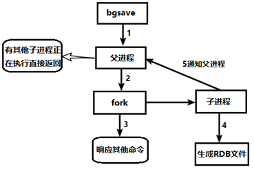
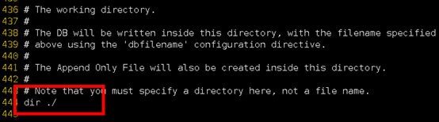
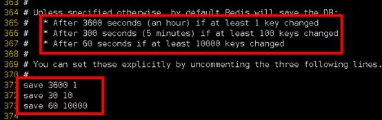

**持久化之**

官网介绍：[http://www.redis.io](http://www.redis.io)

Redis 提供了

- RDB（Redis DataBase）

- AOF（Append Of File）

在指定的

Redis会单独创建（

- Fork的作用是复制一个与当前进程一样的进程。新进程的所有数据（变量、环境变量、程序计数器等） 数值都和原进程一致，但是是一个全新的进程，并作为原进程的子进程

- 在Linux程序中，fork()会产生一个和父进程完全相同的子进程，但子进程在此后多会exec系统调用，出于效率考虑，Linux中引入了“**写时复制技术**”

- **一般情况父进程和子进程会共用同一段物理内存**，只有进程空间的各段的内容要发生变化时，才会将父进程的内容复制一份给子进程。

在redis.conf中配置文件名称，默认为

rdb文件的保存路径，也可以修改。默认为

dir "/myredis/"

### **1.2.8.1. ****配置文件中默认的快照配置**

### **1.2.8.2. ****命令****save VS bgsave**

save ：

**bgsave：**

可以通过lastsave 命令获取最后一次成功执行快照的时间

**1.2.8.3.**

执行flushall命令，也会产生

**1.2.8.4.**

**1.2.8.5.**

格式：save 秒钟 写操作次数

RDB是整个内存的压缩过的

**默认是1分钟内改了**

禁用

不设置save指令

**1.2.8.6.**

当Redis无法写入磁盘的话，直接关掉

**1.2.8.7.**

对于存储到磁盘中的快照，可以设置是否进行压缩存储。如果是的话，redis会采用

如果你不想消耗CPU来进行压缩的话，可以设置为关闭此功能。推荐yes.

**1.2.8.8.**

在存储快照后，还可以让redis使用

但是这样做会增加大约

推荐yes.

**1.2.8.9.**

先通过config getdir  查询

将*.rdb的文件拷贝到别的地方

rdb的恢复

u

u

u

l

l

l

l

l

l

l

动态停止RDB：