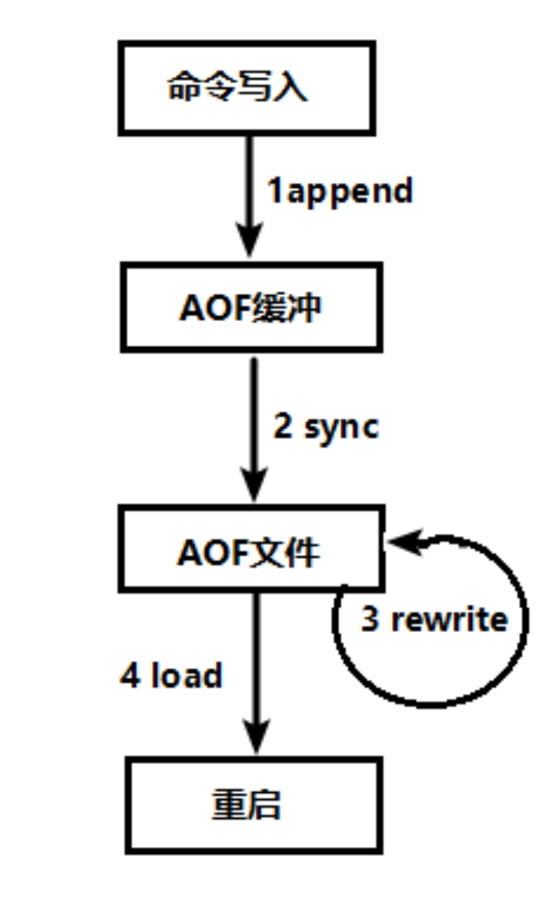
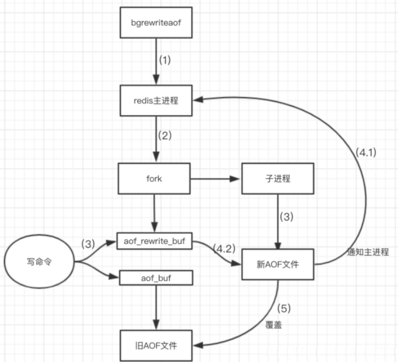
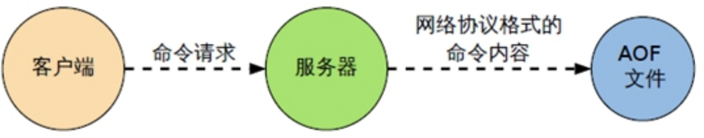
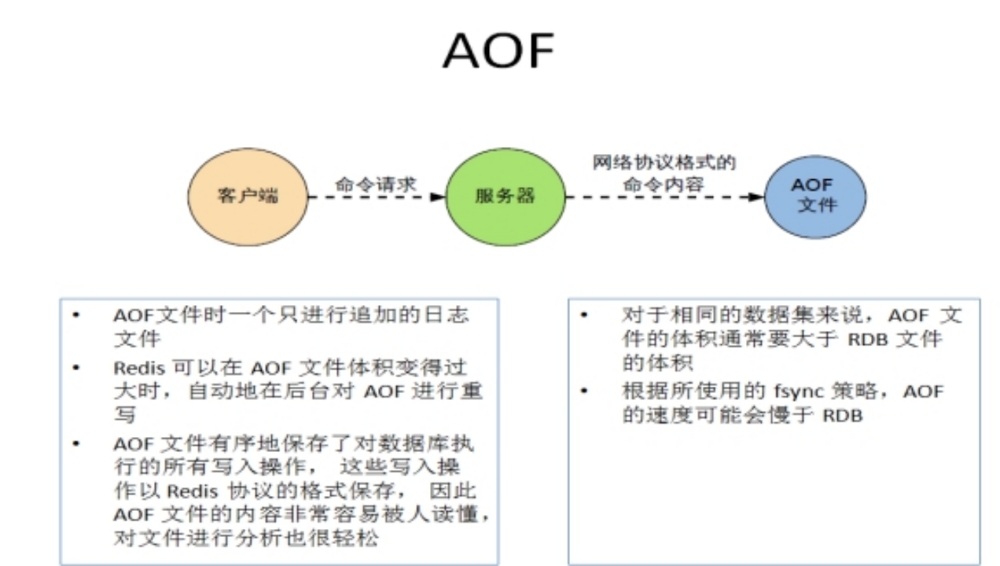
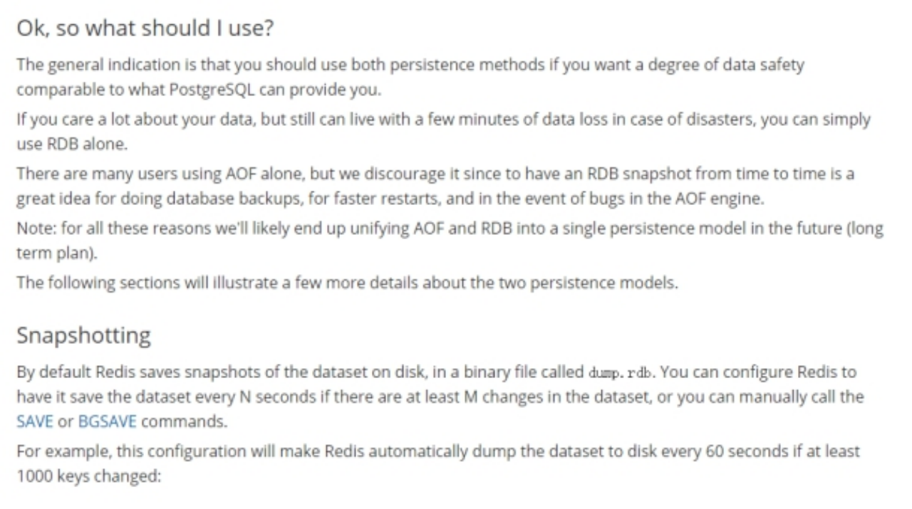

**Redis持久化之AOF**

**AOF（Append Only File）**

**是什么**

以

**AOF持久化流程**

（1）客户端的请求写命令会被append追加到AOF缓冲区内；

（2）AOF缓冲区根据AOF持久化策略[always,everysec,no]将操作sync同步到磁盘的AOF文件中；

（3）AOF文件大小超过重写策略或手动重写时，会对AOF文件

（4）Redis服务重启时，会重新load加载AOF文件中的写操作达到数据恢复的目的；

**AOF默认不开启**

可以在redis.conf中配置文件名称，默认为 

AOF文件的保存路径，同RDB的路径一致。

**AOF和RDB同时开启，redis听谁的？**

AOF和RDB同时开启，系统默认取AOF的数据（数据不会存在丢失）

**AOF启动/修复/恢复**

l AOF的备份机制和性能虽然和RDB不同, 但是备份和恢复的操作同RDB一样，都是拷贝备份文件，需要恢复时再拷贝到Redis工作目录下，启动系统即加载。

l 正常恢复

n 修改默认的appendonly no，改为yes

n 将有数据的aof文件复制一份保存到对应目录(查看目录：config get dir)

n 恢复：重启redis然后重新加载

l 异常恢复

n 修改默认的appendonly no，改为yes

n 如遇到

n 备份被写坏的AOF文件

n 恢复：重启redis，然后重新加载

**AOF同步频率设置**

appendfsync always

始终同步，每次Redis的写入都会立刻记入日志；

appendfsync 

每秒同步，每秒记入日志一次，如果宕机，本秒的数据可能丢失。

appendfsync no

redis不主动进行同步，把

**Rewrite压缩**

1是什么：

AOF采用文件追加方式，文件会越来越大为避免出现此种情况，新增了重写机制, 当AOF文件的大小超过所设定的阈值时，Redis就会启动AOF文件的内容压缩， 只保留可以恢复数据的最小指令集.可以使用命令bgrewriteaof

2重写原理，如何实现重写

AOF文件持续增长而过大时，会fork出一条新进程来将文件重写(也是先写临时文件最后再rename)，

no-appendfsync-on-rewrite：

如果 no-appendfsync-on-rewrite=yes ,不写入a

	如果 no-appendfsync-on-rewrite=no,  还是会把数据往磁盘里刷，但是遇到重写操作，可能会发生阻塞。（数据安全，但是性能降低）

触发机制，何时重写

Redis会记录上次重写时的AOF大小，默认配置是当AOF文件大小是上次rewrite后大小的一倍且文件大于64M时触发

重写虽然可以节约大量磁盘空间，减少恢复时间。但是每次重写还是有一定的负担的，因此设定Redis要满足一定条件才会进行重写。 

a

auto-aof-rewrite-min-size：设置重写的基准值，最小文件64MB。达到这个值开始重写。

例如：文件达到70MB开始重写，降到50MB，下次什么时候开始重写？100MB

系统载入时或者上次重写完毕时，Redis会记录此时AOF大小，设为base_size,

如果Redis的

3、重写流程

（1）bgrewriteaof触发重写，判断是否当前有bgsave或bgrewriteaof在运行，如果有，则等待该命令结束后再继续执行。

（2）主进程fork出子进程执行重写操作，保证主进程不会阻塞。

（3）子进程遍历redis内存中数据到临时文件，客户端的写请求同时写入aof_buf缓冲区和aof_rewrite_buf重写缓冲区保证原AOF文件完整以及新AOF文件生成期间的新的数据修改动作不会丢失。

（4）1).子进程写完新的AOF文件后，向主进程发信号，父进程更新统计信息。2).主进程把aof_rewrite_buf中的数据写入到新的AOF文件。

（5）使用新的AOF文件覆盖旧的AOF文件，完成AOF重写。

**优势**

n 备份机制更稳健，丢失数据概率更低。

n 可读的日志文本，通过操作AOF稳健，可以处理误操作。

**劣势**

n 比起RDB占用更多的磁盘空间。

n 恢复备份速度要慢。

n 每次读写都同步的话，有一定的性能压力。

n 存在个别Bug，造成恢复不能。

**  小总结**

**总结(Which one)**

**用哪个好**

官方推荐两个都启用。

如果对数据不敏感，可以选单独用RDB。

不建议单独用 AOF，因为可能会出现Bug。

如果只是做纯内存缓存，可以都不用。

**官网建议**

l RDB持久化方式能够在指定的时间间隔能对你的数据进行快照存储

l AOF持久化方式记录每次对服务器写的操作,当服务器重启的时候会重新执行这些命令来恢复原始的数据,AOF命令以redis协议追加保存每次写的操作到文件末尾. 

l Redis还能对AOF文件进行后台重写,使得AOF文件的体积不至于过大

l 只做缓存：如果你只希望你的数据在服务器运行的时候存在,你也可以不使用任何持久化方式.

l 同时开启两种持久化方式

l 在这种情况下,当redis重启的时候会优先载入AOF文件来恢复原始的数据, 因为在通常情况下AOF文件保存的数据集要比RDB文件保存的数据集要完整.

l RDB的数据不实时，同时使用两者时服务器重启也只会找AOF文件。那要不要只使用AOF呢？ 

l 建议不要

l 性能建议

| 因为RDB文件只用作后备用途，建议只在 | 
