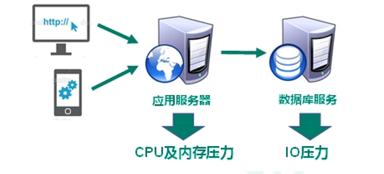
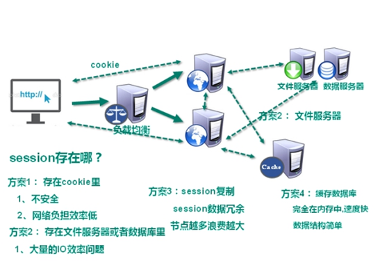
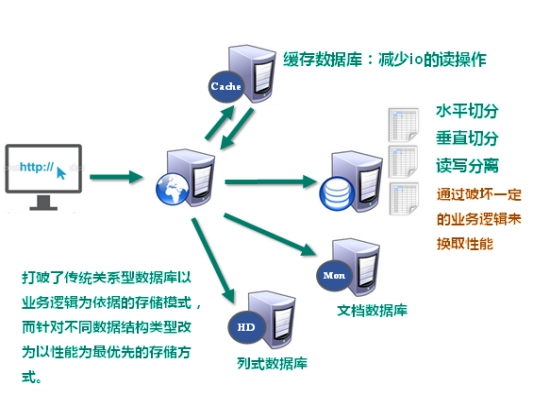
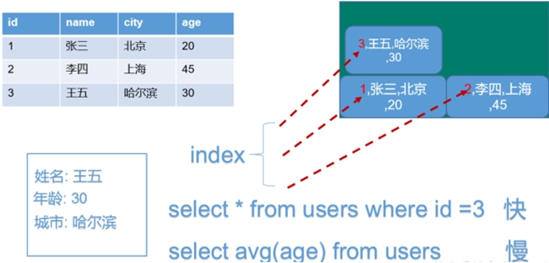
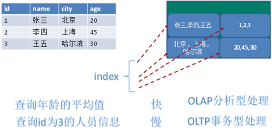
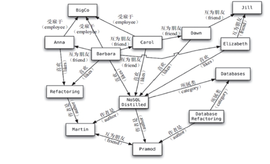
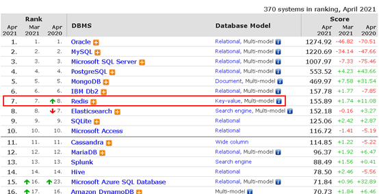

数据库简介

技术的分类

1、解决功能性的问题：Java、Jsp、RDBMS、Tomcat、HTML、Linux、JDBC、SVN

2、解决扩展性的问题：Struts、Spring、SpringMVC、Hibernate、Mybatis

3、解决性能的问题：

Web1.0的时代，数据访问量很有限，用一夫当关的高性能的

随着Web2.0的时代的到来，用户访问量大幅度提升，同时产生了大量的用户数据。加上后来的智能移动设备的普及，所有的互联网平台都面临了巨大的性能挑战。

NoSQL(NoSQL = 

NoSQL 不依赖业务逻辑方式存储，而以简单的

- l  不遵循SQL标准。

- l  不支持ACID。

- l  远超于SQL的性能。

- l  对数据高并发的读写

- l  海量数据的读写

- l  对数据高可扩展性的

- l  需要事务支持

- l  基于sql的结构化查询存储，处理复杂的关系,需要即席查询。

l

|   | ü | 

|   | ü | 

|   | ü | 

### **1.3.2.1. ****Hbase**

HBase是

HBase的目标就是处理数据量

### **1.3.2.2. ****Cassandra[kəˈsændrə]**

Apache Cassandra是一款免费的开源

| 计算机存储单位 计算机存储单位一般用 | 

主要应用：社会关系，公共交通网络，地图及网络拓谱(n*(n-1)/2)

[**http://db-engines.com/en/ranking**](http://db-engines.com/en/ranking)

