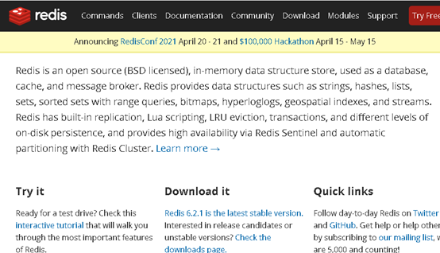
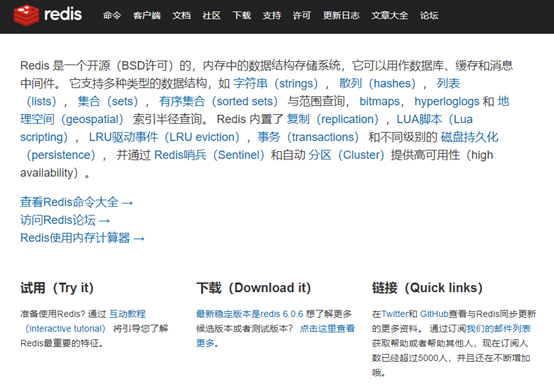
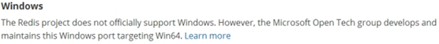
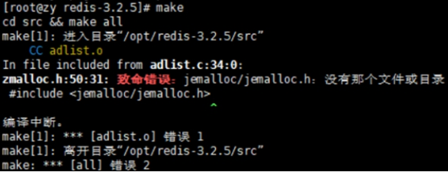
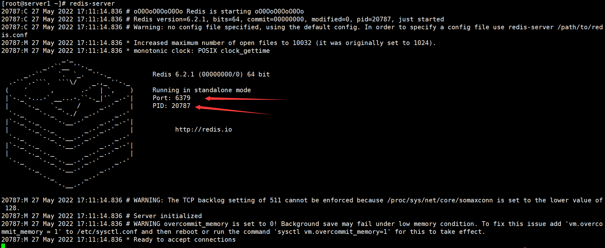
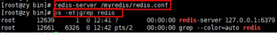
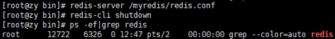
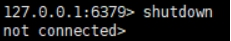

**概述安装**

Ø

Ø

Ø

Ø

Ø

Ø

Ø

Ø

Ø


| Redis官方网站 | Redis中文官方网站 | 
| -- | -- |
|  |  | 






Ø

Ø



### **1.2.2.1.        ****准备工作：下载安装最新版的gcc编译器**

- 安装C 语言的编译环境

```
**yum ****ins****tall centos-release-scl scl-utils-build**
**yum install -y devtoolset-8-toolchain**
**scl enable devtoolset-8 bash**
```

- **测试 gcc版本 **

```
**gcc --version**        #如果显示没有gcc命令，就下载gcc
yum install gcc -y
```

### **1.2.2.2.        ****下载redis-6.2.1.tar.gz放/opt目录**

使用xshell 先下载lrzsz,然后直接拖文件到xshell当中即可

```
yum install -y lrzsz
```

### **1.2.2.3.        ****解压命令：tar -zxvf redis-6.2.1.tar.gz**

```
[root@server1 redis-6.2.1]# tar -zxvf redis-6.2.1.tar.gz  
```

### **1.2.2.4.        ****解压完成后进入目录：cd redis-6.2.1**

### **1.2.2.5.        ****在redis-6.2.1目录下再次执行make命令（只是编译好）**

```
[root@server1 redis-6.2.1]# make
```

### **1.2.2.6.        ****如果没有准备好C语言编译环境，make 会报错—Jemalloc/jemalloc.h：没有那个文件**



### **1.2.2.7.        ****解决方案：运行make distclean**

### **1.2.2.8.        ****在redis-6.2.1目录下再次执行make命令（只是编译好）**

### **1.2.2.9.        ****跳过make test 继续执行: make install**

```
[root@server1 redis-6.2.1]# make install
```

查看默认安装目录：

```
[root@server1 redis-6.2.1]# ll /usr/local/bin/
总用量 18844
-rwxr-xr-x 1 root root 4833424 5月  27 16:59 redis-benchmark
lrwxrwxrwx 1 root root      12 5月  27 16:59 redis-check-aof -> redis-server
lrwxrwxrwx 1 root root      12 5月  27 16:59 redis-check-rdb -> redis-server
-rwxr-xr-x 1 root root 5003472 5月  27 16:59 redis-cli
lrwxrwxrwx 1 root root      12 5月  27 16:59 redis-sentinel -> redis-server
-rwxr-xr-x 1 root root 9450304 5月  27 16:59 redis-server
```

```
redis-benchmark:    性能测试工具，可以在自己本子运行，看看自己本子性能如何
redis-check-aof：   修复有问题的AOF文件，rdb和aof后面讲
redis-check-dump：  修复有问题的dump.rdb文件
redis-sentinel：    Redis集群使用
redis-server：      Redis服务器启动命令
redis-cli：         客户端，操作入口
```

- 前台启动，命令行窗口不能关闭，否则服务器停止

- Ctrl+C 关闭服务

```
[root@server1 ~]# redis-server 
```

- 图中：

- Port 表示端口号：

- PID ：进程号



### **1.2.5.1. ****备份****redis.conf**

拷贝一份redis.conf到其他目录

```
cp /opt/redis-3.2.5/redis.conf /myredis
```

### **1.2.5.2. ****后台启动设置****daemonize no****改成****yes**

修改redis.conf(128行

```
daemonize  yes
```

### **1.2.5.3. ****Redis****启动**

```
redis-server/myredis/redis.conf
```



### **1.2.5.4. ****用客户端访问：****redis-cli**

```
[root@server1 ~]# redis-cli         #自动连接本地redis服务
127.0.0.1:6379> 
```

### **1.2.5.5. ****多个端口可以：****redis-cli -p6379**

### **1.2.5.6. ****测试验证：**** ping**

```
[root@server1 ~]# redis-cli 
127.0.0.1:6379> ping
PONG
```

### **1.2.5.7. ****Redis****关闭**

- 单实例关闭：**redis-cli shutdown**



- 也可以进入终端后再关闭：**shutdown**



多实例关闭，指定端口关闭：

| 端口 | 默认 | 


Redis是单线程+多路IO复用技术

多路复用是指使用一个线程来检查多个文件描述符（Socket）的就绪状态，比如调用

串行   vs   多线程+锁（

（与


  