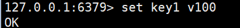
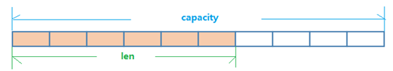
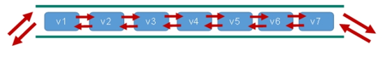
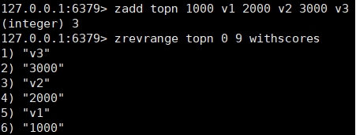
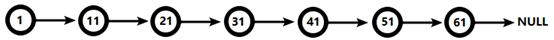
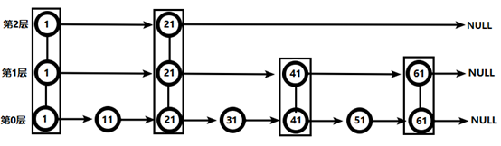

哪里去获得redis常见数据类型操作命令[http://www.redis.cn/commands.html](http://www.redis.cn/commands.html)

- key操作

```
keys *            查看当前库所有key    (匹配：keys*1)
exists key        判断某个key是否存在
type key         查看你的key是什么类型
del key           删除指定的key数据
unlink key       根据value选择非阻塞删除
                仅将keys从keyspace元数据中删除，真正的删除会在后续异步操作。
expire key 10       10秒钟：为给定的key设置过期时间
ttl key         查看还有多少秒过期，-1表示永不过期，-2表示已过期
```

- 库操作

```
select        命令切换数据库
dbsize        查看当前数据库的key的数量
flushdb        清空当前库，慎用
flushall        通杀全部库，有16个库，慎用
```

- String是Redis最基本的类型，你可以理解成与Memcached一模一样的类型，一个key对应一个value。

- String类型是二进制安全的。意味着Redis的string可以包含任何数据。比如jpg图片或者序列化的对象。

- String类型是Redis最基本的数据类型，一个Redis中字符串value最多可以是512M

```
set  <key> <value>添加键值对
```



```
*NX：当数据库中key不存在时，可以将key-value添加数据库
*XX：当数据库中key存在时，可以将key-value添加数据库，与NX参数互斥
*EX：key的超时秒数
*PX：key的超时毫秒数，与EX互斥
```

```
get  <key>            #查询对应键值
append <key><value>    #将给定的<value> 追加到原值的末尾
strlen <key>           #获得值的长度
setnx <key><value>    #只有在 key 不存在时    设置 key的值
```

```
incr <key>
    将 key 中储存的数字值增1
    只能对数字值操作，如果为空，新增值为1 ，会返回当前值大小
decr <key>
    将 key 中储存的数字值减1
    只能对数字值操作，如果为空，新增值为-1
    
incrby / decrby  <key> <步长>  #将 key 中储存的数字值增减。自定义步长。会返回当前值大小
```

| 原子性 | 


```
mset <key1><value1><key2><value2>  ..... 
    同时设置一个或多个key-value对  
mget <key1><key2><key3> .....
    同时获取一个或多个value  
msetnx<key1><value1><key2><value2>  ..... 
    同时设置一个或多个key-value 对，当且仅当所有给定 key 都不存在。
```

**原子性，有一个失败则都失败**

```
getrange <key><起始位置><结束位置>
    获得值的范围，类似java中的substring，**前包，后包**
setrange <key><起始位置><value>
    用<value>  覆写<key>所储存的字符串值，从<起始位置>开始(**索引从0开始**)。相当于插入操作
```

```
**setex  <key><过期时间****><value>**
    设置键值的同时，设置过期时间，单位秒。
getset <key><value>
    以新换旧，设置了新值同时获得旧值。
```

String的数据结构为简单动态字符串(Simple Dynamic String,缩写SDS)。是可以修改的字符串，内部结构实现上类似于Java的ArrayList，采用预分配冗余空间的方式来减少



如图中所示，内部为当前字符串实际分配的空间

单键多值

Redis 列表是简单的字符串列表，按照插入顺序排序。你可以添加一个元素到列表的头部（左边）或者尾部（右边）。

它的底层实际是个



```
lpush/rpush <key><value1><value2><value3> ....     从左边/右边插入一个或多个值。
lpop/rpop <key>从左边/右边吐出一个值。值在键在，值光键亡。
rpoplpush <key1><key2>    从<key1>列表右边吐出一个值，插到<key2>列表左边。
lrange <key><start><stop>
    按照索引下标获得元素(从左到右)
lrange mylist 0 -1   0左边第一个，-1右边第一个，（0-1表示获取所有）
lindex <key><index>按照索引下标获得元素(从左到右)
llen <key>    获得列表长度 
linsert <key>  before/after <value><newvalue>    在<value>的前面/后面插入<newvalue>插入值
lrem <key><n><value>        从左边删除n个value(从左到右)
lset<key><index><value>    将列表key下标为index的值替换成value
```

List

首先在列表元素较少的情况下会使用一块连续的内存存储，这个结构是

它将所有的元素紧挨着一起存储，分配的是一块连续的内存。

当数据量比较多的时候才会改成

因为普通的链表需要的附加指针空间太大，会比较浪费空间。比如这个列表里存的只是


Redis

Redis set对外提供的功能与

Redis的

一个算法，随着数据的增加，执行时间的长短，如果是O(1)，数据增加，查找数据的时间不变

```
sadd<key><value1><value2> ..... 
                将一个或多个 member 元素加入到集合 key 中，已经存在的 member元素将被忽略
smembers <key>    获取该集合的所有值。
sismember <key><value>    判断集合<key>是否为含有该<value>值，有1，没有0
scard<key>    返回该集合的元素个数。
srem<key><value1><value2> ....     删除集合中的某个元素。
spop <key>    **随机从该集合中吐出一个值。**
srandmember <key><n>    随机从该集合中取出n个值。不会从集合中删除 。
smove<source><destination>value    把集合中一个值从一个集合移动到另一个集合
sinter <key1><key2>    返回两个集合的交集元素。
sunion <key1><key2>    返回两个集合的并集元素。
sdiff <key1><key2>    返回两个集合的**差集**元素(key1中的，不包含key2中的)
```

- Set数据结构是dict字典，字典是用哈希表实现的。

- Java中HashSet的内部实现使用的是HashMap，只不过所有的value都指向同一个对象。Redis的set结构也是一样，它的内部也使用hash结构，所有的value都指向同一个内部值。

Redis hash 是一个键值对集合。

Redis hash是一个

类似Java里面的

用户ID为查找的

主要有以下2种存储方式：

|   |   | 


|   | 


```
hset<key><field><value>给<key>集合中的  <field>键赋值<value>
hget<key1><field>从<key1>集合<field>取出 value 
hmset<key1><field1><value1><field2><value2>... 批量设置hash的值
hexists<key1><field>查看哈希表 key 中，给定域 field 是否存在。 
hkeys<key>列出该hash集合的所有field
hvals<key>列出该hash集合的所有value
hincrby<key><field><increment>为哈希表 key 中的域 field 的值加上增量 1   -1
hsetnx<key><field><value>将哈希表 key 中的域 field 的值设置为 value ，当且仅当域field 不存在 .
```

Hash

Redis有序集合

不同之处是有序集合的每个成员都关联了一个

因为元素是有序的, 所以你也可以很快的根据评分（

访问有序集合的中间元素也是非常快的,因此你能够使用有序集合作为一个没有重复成员的智能列表。

```
zadd <key><score1><value1>  <score2><value2>…
    将一个或多个 member 元素及其 score 值加入到有序集 key当中。
**zrange<key><start><stop> [WITHSCORES]   **
    返回有序集 key 中，下标在<start><stop>之间的元素
     带WITHSCORES，可以让分数一起和值返回到结果集。
zrangebyscore key min max[withscores] [limit offset count]
    返回有序集 key 中，所有 score 值介于 min和 max 之间(包括等于 min或 max )的成员。有序集成员按 score 值递增(从小到大)次序排列。 
zrevrangebyscore  key max  min [withscores] [limit offsetcount]               
同上，改为从大到小排列。 
zincrby<key><increment><value>     为元素的score加上增量
zrem <key><value>删除该集合下，指定值的元素
zcount <key><min><max>统计该集合，分数区间内的元素个数 
zrank <key><value>返回该值在集合中的排名，从0开始。
```

案例：如何利用zset实现一个文章访问量的排行榜？



SortedSet(zset)

zset

（

（

### 1、简介

    

### 2、实例

    

（1）



要查找值为

（2）



从第

21

在第

在第

从此可以看出跳跃表比有序链表效率要高