**配置文件介绍**

自定义目录：/myredis/redis.conf

配置大小单位,开头定义了一些基本的度量单位，只支持

大小写不敏感

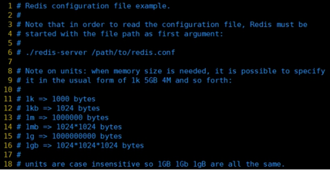

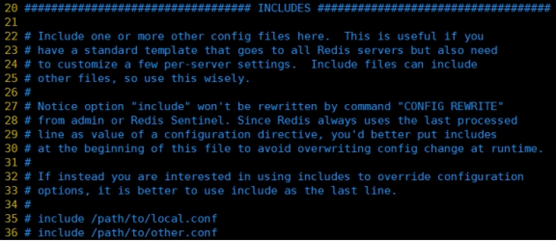

类似jsp中的

默认情况bind=127.0.0.1只能接受本机的访问请求

不写的情况下，无限制接受任何ip地址的访问

生产环境肯定要写你应用服务器的地址；

如果开启了protected-mode，那么在没有设定

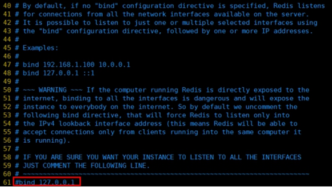

保存配置，停止服务，重启启动查看进程，不再是本机访问了。

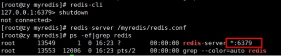

将本机访问保护模式设置no

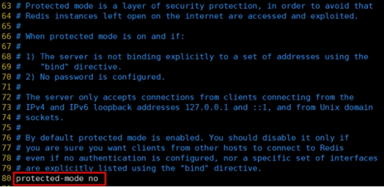

端口号，默认 6379

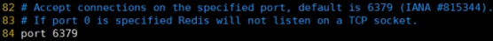

设置tcp的

在高并发环境下你需要一个高backlog值来避免慢客户端连接问题。

注意

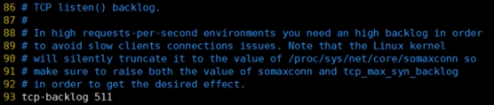

一个空闲的客户端维持多少秒会关闭，0表示关闭该功能。即

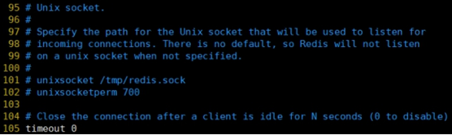

对访问客户端的一种

单位为秒，如果设置为0，则不会进行

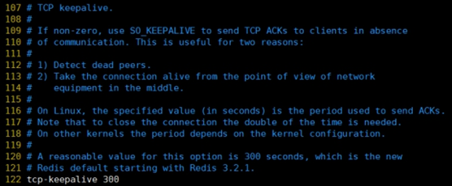

是否为后台进程，设置为yes

守护进程，后台启动

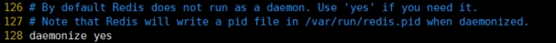

存放pid文件的位置，每个实例会产生一个不同的

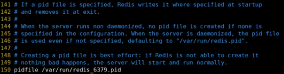

指定日志记录级别，Redis总共支持四个级别：

四个级别根据使用阶段来选择，生产环境选择notice 或者

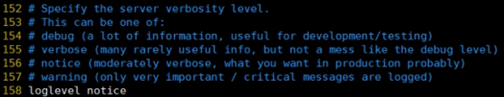

日志文件名称

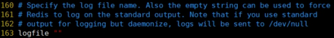

设定库的数量 默认16，

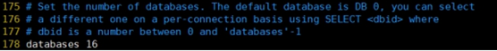

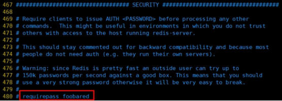

访问密码的查看、设置和取消

在命令中设置密码，只是临时的。重启

永久设置，需要再配置文件中进行设置。

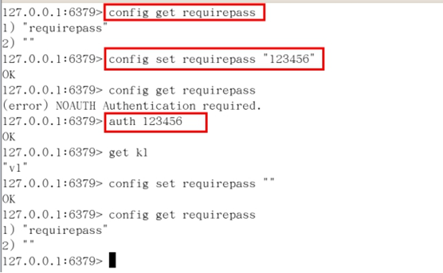

Ø

Ø

Ø

number of clients reached”以作回应。

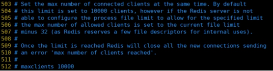

Ø

Ø

Ø

Ø

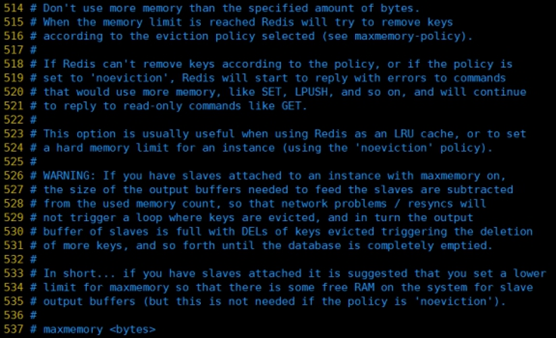

Ø

Ø

Ø

Ø

Ø

Ø

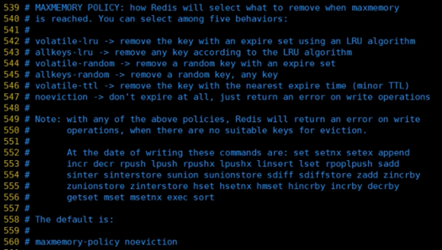

Ø

Ø

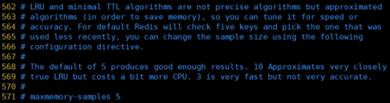