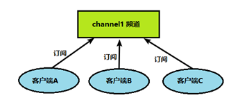
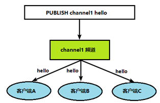
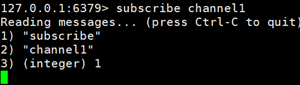
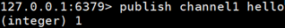
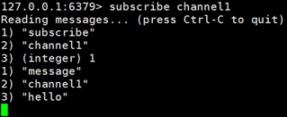

**的发布和订阅**

Redis 发布订阅 (pub/sub) 是一种消息通信模式：发送者 (pub) 发送消息，订阅者 (sub) 接收消息。

Redis 客户端可以订阅任意数量的频道。

1、客户端可以订阅频道如下图



2、当给这个频道发布消息后，消息就会发送给订阅的客户端



## 1、 打开一个客户端订阅channel1

```
SUBSCRIBE channel1
```



## 2、打开另一个客户端，给channel1发布消息hello

```
publish channel1 hello
```



返回的

3



注：发布的消息没有持久化，如果在订阅的客户端收不到