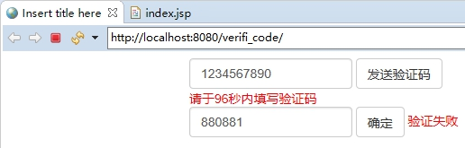

**测试**

| < | 

禁用Linux的防火墙：

**systemctl stop/disablefirewalld.service   **

redis.conf中注释掉

| package com.atguigu.jedis; | 

| jedis. | 

| jedis. | 

| List<String> list = jedis. | 

| jedis.sadd("orders",  "order01"); | 

| jedis. | 

| jedis. | 

要求：

1、输入手机号，点击发送后随机生成

2、输入验证码，点击验证，返回成功或失败

3、每个手机号每天只能输入

