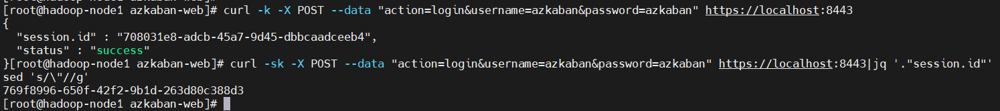

# 一、Azkaban API概述

> 通常，企业里一般不用使用web UI去设置或者执行任务，只是单纯的在页面上查看任务或者排查问题，更多的是通过Azkaban API去提交执行任务计划。Azkaban提供了一些常用的API操作，可以通过curl或其他HTTP请求客户端访问。但是API调用都需要首先进行适当的身份验证。官方文档：


Azkaban 基本部分包括环境部署可以参考我之前的文章：[大数据Hadoop之——任务调度器Azkaban（Azkaban环境部署）](https://www.cnblogs.com/liugp/p/16273966.html)

# 二、Azkaban API具体使用

目前在这个版本的大多数api中，它不检查请求头。但是最好还是加上请求头。请求头如下：

```bash
Content-Type:     application/x-www-form-urlencoded
X-Requested-With: XMLHttpRequest
```

## 1）Authenticate（登录认证）

> 这个API帮助验证用户并提供会话保持，会返回session.id，默认情况下，会话超时时间为24小时(一天)。请求格式如下：


```bash
Method: POST
Request URL: /?action=login
Parameter Location: Request body
```

请求参数如下：

| 参数 | 描述 | 
| -- | -- |
| action=login | 固定参数 | 
| 用户名 | Azkaban 登录用户名 | 
| 密码 | Azkaban 登录密码 | 
| 【示例】 |   | 


```
curl -k -X POST --data "action=login&username=hackwu&password=123" https://localhost:8443
## 提取session.id，注意每次请求返回的session.id都不一样
$ curl -sk -X POST --data "action=login&username=azkaban&password=azkaban" https://localhost:8443|jq '."session.id"'|sed 's/\"//g'
```



设置.session.id的两种方式

- 简单地作为请求参数添加

- 通过cookie设置:

azkaban.browser.session.id

下面两个HTTP请求是等价的:

```bash
#【温馨提示】执行下面两个api是必须得提前创建了`project：HelloWorld`和`flow：helloworld`
# a) Provide session.id parameter directly
$ curl -k --get --data "session.id=b2528ee7-0189-46d3-9a68-e03ea00ad480&ajax=fetchflowgraph&project=HelloWorld&flow=helloworld" 
# b) Provide azkaban.browser.session.id cookie
$ curl -k --get -b "azkaban.browser.session.id=b2528ee7-0189-46d3-9a68-e03ea00ad480" --data "ajax=fetchflowgraph&project=HelloWorld&flow=helloworld" 
```


## 2）Fetch user Projects（获取项目列表）

请求格式如下：

```bash
Method: GET
Request URL: /index?ajax=fetchuserprojects
Parameter Location: Request Query
```

请求参数如下：

| 参数 | 描述 | 
| -- | -- |
| session.id | 用户的session.id | 
| ajax=fetchuserprojects | 固定参数 | 
| user (可选) | 要列出项目的用户名。默认情况下，获取登录用户的项目列表。 | 


【示例】

```bash
# --get等价于-G，-X GET，默认就是GET请求，下面三个请求等价
curl -k --get http://localhost:8081/index \
--data "ajax=fetchuserprojects&user=hackwu&session.id=348a0a92-0b85-45ca-a8d0-7ac975889b72"
 $ curl -k -X GET -G https://localhost:8443/index
--data "ajax=fetchuserprojects&user=azkaban&session.id=b2528ee7-0189-46d3-9a68-e03ea00ad480"
# user默认就是session.id对应的用户
$ curl -k -G  https://localhost:8443/index
--data "ajax=fetchuserprojects&session.id=b2528ee7-0189-46d3-9a68-e03ea00ad480"
```


## 3）Create a Project（创建一个项目）

请求格式如下：

```bash
Method: POST
Request URL: /manager?action=create
Parameter Location: Request Query
```

请求参数如下：

| 参数 | 描述 | 
| -- | -- |
| session.id | 用户的session.id | 
| action=create | 固定参数 | 
| name | 项目名称 | 
| description | 项目描述 | 


【示例】

```
$ curl -k -X POST --data "session.id=b2528ee7-0189-46d3-9a68-e03ea00ad480&name=test001&description=create a azkaban project" https://localhost:8443/manager?action=create
```


## 4）Delete a Project（删除一个项目）

请求格式如下：

```bash
Method: GET
Request URL: /manager?delete=true
Parameter Location: Request Query
```

请求参数如下：

| 参数 | 描述 | 
| -- | -- |
| session.id | 用户的session.id | 
| delete=true | 表示删除项目操作的固定参数 | 
| project | 要删除的项目名称 | 


【示例】

```
$ curl -k --get --data "session.id=b2528ee7-0189-46d3-9a68-e03ea00ad480&delete=true&project=test001" https://localhost:8443/manager
```


## 5）Upload a Project Zip（上传项目zip文件）

请求格式如下：

```bash
Method: POST
Content-Type: multipart/mixed
Request URL: /manager?ajax=upload
Parameter Location: Request Body
```

请求参数如下：

| 参数 | 描述 | 
| -- | -- |
| session.id | 用户的session.id | 
| ajax=upload | 固定参数 | 
| project | 要上传的项目名称 | 
| file | 项目压缩文件。类型应该设置为 | 


# 先创建项目

```
$ curl -k -X POST --data "session.id=b2528ee7-0189-46d3-9a68-e03ea00ad480&name=test001&description=create a azkaban project" https://localhost:8443/manager?action=create
# 准备好zip文件，长传项目zip文件
$ curl -k -i -X POST --form 'session.id=b2528ee7-0189-46d3-9a68-e03ea00ad480' \
--form 'ajax=upload' --form 'file=@projects/test001.zip;type=application/zip' \
--form 'project=test001' https://localhost:8443/manager
```


## 6）Fetch Flows of a Project（获取项目的所有工作流flowId）

请求格式如下：

```bash
Method: GET
Request URL: /manager?ajax=fetchprojectflows
Parameter Location: Request Query String
```

请求参数如下：

| 参数 | 描述 | 
| -- | -- |
| session.id | 用户的session.id | 
| ajax=fetchprojectflows | 固定参数 | 
| project | 要获取工作流对应的项目名称 | 


【示例】

```bash
$ curl -k --get --data "session.id=b2528ee7-0189-46d3-9a68-e03ea00ad480&ajax=fetchprojectflows&project=test001" 
```


## 7）Fetch Jobs of a Flow（获取一个工作流的详情）

请求格式如下：

```bash
Method: GET
Request URL: /manager?ajax=fetchflowgraph
Parameter Location: Request Query String
```

请求参数如下：

```bash
Method: GET
Request URL: /manager?ajax=fetchflowgraph
Parameter Location: Request Query String
```

请求参数如下：

| 参数 | 描述 | 
| -- | -- |
| session.id | 用户的session.id | 
| ajax=fetchflowgraph | 固定参数 | 
| project | 要获取的项目名称 | 
| flow | 要获取的项目的工作流id，上一个接口获取的flowId | 
| 【示例】 |   | 


```shell
# 获取flowId
$ curl -k --get --data "session.id=b2528ee7-0189-46d3-9a68-e03ea00ad480&ajax=fetchprojectflows&project=test001" https://localhost:8443/manager
# 获取工作流的具体信息
$ curl -k --get --data "session.id=b2528ee7-0189-46d3-9a68-e03ea00ad480&ajax=fetchflowgraph&project=test001&flow=test001" https://localhost:8443/manager
```


## 8）Fetch Executions of a Flow（获取工作流的执行列表）

请求格式如下：

```bash
Method: GET
Request URL: /manager?ajax=fetchFlowExecutions
Parameter Location: Request Query String
```

请求参数如下：

| 参数 | 描述 | 
| -- | -- |
| session.id | 用户的session.id | 
| ajax=fetchFlowExecutions | 固定参数 | 
| project | 项目名称 | 
| flow | flowId | 
| start | 返回列表的起始位置 | 
| length | 返回列表的最大长度。例如，如果起始位置是2，长度是10，那么返回的列表将包括执行索引:[2,3,4,5,6,7,8,9,10,11] | 


【示例】

这里设置每分钟调度一次


其实获取的就是下图的列表信息


获取最新执行的3条记录，请求示例如下：

```shell
$ curl -k --get --data "session.id=b2528ee7-0189-46d3-9a68-e03ea00ad480&ajax=fetchFlowExecutions&project=test001&flow=test001&start=0&length=3" https://localhost:8443/manager
```


## 9）Fetch Running Executions of a Flow（获取正在执行的工作流）

请求格式如下：

```bash
Method: GET
Request URL: /executor?ajax=getRunning
Parameter Location: Request Query String
```

请求参数如下：

| 参数 | 描述 | 
| -- | -- |
| session.id | 用户的session.id | 
| ajax=getRunning | 固定参数 | 
| project | 项目名称 | 
| flow | flowId | 


【示例】

```shell
$ curl -k --data "session.id=b2528ee7-0189-46d3-9a68-e03ea00ad480&ajax=getRunning&project=test001&flow=test001" https://localhost:8443/executor
```


## 10）Execute a Flow（立即执行工作流）

请求格式如下：

```bash
Method: POST
Request URL: /executor?ajax=executeFlow
Parameter Location: Request Query String
```

请求参数如下：

| 参数 | 描述 | 
| -- | -- |
| session.id | 用户的session.id | 
| ajax=executeFlow | 固定参数 | 
| project | 项目名称 | 
| flow | flowId | 


【示例】

```bash
$ curl -k -X POST --data "session.id=b2528ee7-0189-46d3-9a68-e03ea00ad480&ajax=executeFlow&project=test001&flow=test001" 
```


## 11）Cancel a Flow Execution（取消工作流执行）

请求格式如下：

```bash
Method: GET
Request URL: /executor?ajax=cancelFlow
Parameter Location: Request Query String
```

请求参数如下：

| 参数 | 描述 | 
| -- | -- |
| session.id | 用户的session.id | 
| ajax=cancelFlow | 固定参数 | 
| execid | Execution id | 
| 【示例】 |   | 


```bash
$ curl -k --data "session.id=b2528ee7-0189-46d3-9a68-e03ea00ad480&ajax=cancelFlow&execid=78" 
```


## 12）Flexible scheduling using Cron（定时调度工作流【重点】）

> 这个API调用通过一个cron Expression调度一个流。Cron是一个已经被广泛使用了很长一段时间的UNIX工具，我们使用Quartz库来解析Cron表达式。所有的cron时间表都遵循azkaban web服务器中定义的时区(时区ID由java.util.TimeZone.getDefault(). getid()获得)


请求格式如下：

```bash
Method: POST
Request URL: /schedule?ajax=scheduleCronFlow
Parameter Location: Request Query String
```

请求参数如下：

| 参数 | 描述 | 
| -- | -- |
| session.id | 用户的session.id | 
| ajax=scheduleCronFlow | 固定参数 | 
| projectName | 工程名称 | 
| flow | flowId | 
| cronExpression | CRON表达式是由6或7个用空格分隔的字段组成的字符串，表示一组时间，跟linux系统上的crontab一样。在Azkaban ，我们 | 


【示例】

- ? 

25 8 * * * *

- # 

### 定时任务表达式解释0 23/30 5,7-10 ? * 6#3 2023

# 0：表示0秒，固定的

# 23/30：23分之后每半个小时执行一次，当然还得更加后面表达式而定

# 5,7-10：5,7，8,9，10这四个整点，每半个小时执行一次

# ?：占位符，根据其它时间而定

# *：每月

# 6#3：表示周，该月的第三个星期五，如果当月没有，则到下个月

# 2023：可选，默认是每年

### 重复执行是修改覆盖

```
$ curl -k -d ajax=scheduleCronFlow \
 -d projectName=test001 \
  -d flow=test001 \
   --data-urlencode cronExpression="0 23/30 5,7-10 ? * 6#3 2023" \
   -b "azkaban.browser.session.id=b2528ee7-0189-46d3-9a68-e03ea00ad480" \
    https://localhost:8443/schedule
```


通过下图可能更好的理解cron表示式


重复执行修改


## 13）Fetch a Schedule（获取调度任务）

请求格式如下：

```bash
Method: GET
Request URL: /schedule?ajax=fetchSchedule
Parameter Location: Request Query String
```

请求参数如下：

| 参数 | 描述 | 
| -- | -- |
| session.id | 用户的session.id | 
| ajax=fetchSchedule | 固定参数 | 
| projectId | 项目的id | 
| flowId | flowId | 


```shell
# 获取projectId 和 flowId 
$ curl -k --get --data "session.id=b2528ee7-0189-46d3-9a68-e03ea00ad480&ajax=fetchprojectflows&project=test001" https://localhost:8443/manager
# Fetch a Schedule
$ curl -k --get --data "session.id=b2528ee7-0189-46d3-9a68-e03ea00ad480&ajax=fetchSchedule&projectId=19&flowId=test001" https://localhost:8443/scheule
```


## 14）Unschedule a Flow（取消工作流的定时任务）

请求格式如下：

```bash
Method: POST
Request URL: /schedule?action=removeSched
Parameter Location: Request Query String
```

请求参数如下：

| 参数 | 描述 | 
| -- | -- |
| session.id | 用户的session.id | 
| action=removeSched | 固定参数 | 
| scheduleId | 调度任务id | 


【示例】

```bash
$ curl -k 
```


## 15）Fetch Logs of a Project（获取项目日志）

请求格式如下：

```bash
Method: GET
Request URL: /manager?ajax=fetchProjectLogs
Parameter Location: Request Query String
```

请求参数如下：

| 参数 | 描述 | 
| -- | -- |
| session.id | 用户的session.id | 
| ajax=fetchProjectLogs | 固定参数 | 
| project | 项目名称 | 


【示例】

```bash
$ curl -k --get --data "session.id=b2528ee7-0189-46d3-9a68-e03ea00ad480&ajax=fetchProjectLogs&project=test001" 
```


## 16）Fetch Execution Job Logs（获取执行任务日志）

请求格式如下：

```bash
Method: GET
Request URL: /executor?ajax=fetchExecJobLogs
Parameter Location: Request Query String
```

请求参数如下：

| 参数 | 描述 | 
| -- | -- |
| session.id | 用户的session.id | 
| ajax=fetchExecJobLogs | 固定参数 | 
| execid | execid | 
| jobId | jobId，其实就是flow文件里的job name | 
| offset | 日志数据的偏移量 | 
| length | 日志数据的长度。例如，如果偏移量设置为10，长度为1000，则返回的日志将从第10个字符开始，长度为1000(如果剩余的日志长度小于1000，则小于1000) | 


【示例】

```bash
# 获取job id也就是job name
$ curl -k --data "session.id=b2528ee7-0189-46d3-9a68-e03ea00ad480&ajax=fetchexecflow&execid=105" 
# 获取日志
$ curl -k --data "session.id=b2528ee7-0189-46d3-9a68-e03ea00ad480&ajax=fetchExecJobLogs&execid=105&jobId=jobA&offset=0&length=100" 
```


## 17）设置SLA报警

请求格式如下：

```bash
Method: POST
Request URL: /schedule?ajax=setSla
Parameter Location: Request Query String
```

```bash
$ curl -k -d "ajax=setSla&scheduleId=9&slaEmails=a@example.com;b@example.com&settings[0]=aaa,SUCCESS,5:00,true,false&settings[1]=bbb,SUCCESS,10:00,false,true" -b "azkaban.browser.session.id=b2528ee7-0189-46d3-9a68-e03ea00ad480" 
```


这个API在企业里用的不多，在web UI上操作更方便直观 ，稍微了解就行。

## 18）Fetch a SLA

这个API也是用的不多，在web UI上查看更方便，了解即可。

请求格式如下：

```bash
Method: GET
Request URL: /schedule?ajax=slaInfo
Parameter Location: Request Query String
```

【示例】

```bash
$ curl -k --get --data "session.id=b2528ee7-0189-46d3-9a68-e03ea00ad480&ajax=slaInfo&scheduleId=9" 
```


> 【温馨提示】这里为了方便都是通过curl方式去测试，其实在公司环境中，更多的可能是用python、或者java等高级语言去调用Azkaban API。这里只是列出了常见的API接口，尤其是上面第12个接口Flexible scheduling using Cron用的是最多的。更多Azkaban API接口使用，请查看官方文档。
