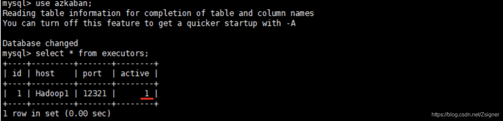

# 1、lssue :  No active executors found

```
ERROR [StdOutErrRedirect] [Azkaban] azkaban.executor.ExecutorManagerException: No active executors found
```

- **Answer**

 

**没有找到活动的executors，需在MySQL数据库里设置端口为12321的executors表的active为1**

```
update azkaban.executors set active=1;
```

