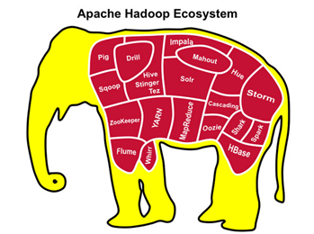

# 1、大数据介绍

1. 为什么使用大数据技术？

- 数据量越来越大

- 数据分析的实时性越来越强

- 数据结果的应用越来越广泛

1. 大数据的定义

- 大数据是收集、整理、处理大容量数据集，并从中获得结果的技术总称。

# 2、大数据应用领域

1. 广告

- 广告投放

- 广告策略

1.  电信

- 深度包检测

- 流失分析

- 网络质量

1. 金融

- 风险识别

- 预测

1. 能源生物

- 基因组分析

- 地质分析

1. 安全

- 入侵检测

- 图像识别

1. 社交游戏

- 流失分析

- 社交推荐

- 使用分析

1. 电商零售

- 推荐系统

- 交易分析

# 3、大数据技术处理框架有哪些？

## 3.1 什么是大数据处理框架？

处理框架和处理引擎负责对数据系统中的数据进行计算。

虽然“引擎”和“框架”之间的区别没有什么权威的定义，但大部分时候可以将前者定义为实际负责处理数据操作的组件，后者则可定义为承担类似作用的一系列组件。

## 3.2 大数据处理框架有哪些？

- 仅批处理框架

用于批量处理大数据集的处理框架，可对整个数据集进行操作。

例如：Apache Hadoop，一种以MapReduce作为默认处理引擎批处理框架。

- 仅流处理框架

用于对随时进入系统的数据进行计算，是一种“无数据边界”的操作方式。

例如：

- Apache Storm

- Apache Samza

- 混合处理框架

一些大数据处理框架可同时处理批处理和流处理工作负载。

例如：

- Apache Spark

- Apache Flink

- 总结：

- 处理框架 一组组件

- 处理引擎 具体对数据操作的工具

- 框架分类

- 仅批处理框架 apache hadoop 、MapReduce

- 仅流处理框架 apache storm 、apache samza

- 混合处理框架 apache spark 、apache flink

# 4、hadoop生态圈

## 4.1Hadoop历史

雏形开始于2002年的Apache的Nutch，Nutch是一个开源Java 实现的搜索引擎。它提供了我们运行自己的搜索引擎所需的全部工具。包括全文搜索和Web爬虫。

随后在2003年Google发表了一篇技术学术论文谷歌文件系统（GFS）。GFS也就是google File System，google公司为了存储海量搜索数据而设计的专用文件系统。

2004年Nutch创始人Doug Cutting基于Google的GFS论文实现了分布式文件存储系统名为NDFS。

2004年Google又发表了一篇技术学术论文MapReduce。MapReduce是一种编程模型，用于大规模数据集（大于1TB）的并行分析运算。

2005年Doug Cutting又基于MapReduce，在Nutch搜索引擎实现了该功能。

2006年，Yahoo雇用了Doug Cutting，Doug Cutting将NDFS和MapReduce升级命名为Hadoop，Yahoo开建了一个独立的团队给Goug Cutting专门研究发展Hadoop。

> **Google和Yahoo对Hadoop的贡献功不可没。**

## 4.2 项目定义

- Apache™Hadoop®项目用于可靠，可扩展的分布式计算的开源软件。

- Apache Hadoop是一个大数据处理框架，允许使用简单的编程模型跨计算机集群分布式处理大型数据集。

- Apache Hadoop可以从单个服务器扩展到数千台计算机

- Apache Hadoop集群中每台计算机都提供本地计算和存储。

- Apache Hadoop集群不是依靠硬件来提供高可用性，而是设计了用于检测和处理应用程序层的故障，从而在计算机集群之上提供高可用性服务。

- 总结：

- 开源软件

- 大数据处理架构

- 单台服务可以，数千台服务器

- 每台服务器都存自己的数据及运算自己的数据

- 把硬件故障认为常态，通过软件把控故障

## 4.3 核心项目

- Hadoop分布式文件系统（HDFS™）：一种分布式文件系统，可提供对应用程序数据的高吞吐量访问。

- Hadoop YARN：作业调度和集群资源管理的框架。

- Hadoop MapReduce：基于YARN的系统，用于并行处理大型数据集。

- Hadoop Common：支持其他Hadoop模块的常用实用程序。

- Hadoop Ozone： Hadoop集群所提供的对象存储。

## 4.4 相关项目

Apache的其他Hadoop相关项目包括：

- Ambari™

- 基于Web的工具，用于配置，管理和监控Apache Hadoop集群，包括对Hadoop HDFS，HadoopMapReduce，Hive，HCatalog，HBase，ZooKeeper，Oozie，Pig和Sqoop的支持。

- Ambari还提供了一个用于查看集群运行状况的仪表板，例如热图，以及可视化查看MapReduce，Pig和Hive应用程序的功能，以及以用户友好的方式诊断其性能特征的功能。

- Avro™

- 数据序列化系统。

- Cassandra™

- 可扩展的多主数据库，没有单点故障。

- Chukwa™

- 用于管理大型分布式系统的数据收集系统。

- HBase™

- 可扩展的分布式数据库，支持大型表的结构化数据存储。

- Hive™

- 一种数据仓库基础架构，提供数据汇总和即时查询。

- Mahout™

- 可扩展的机器学习和数据挖掘库。

- Pig™

- 用于并行计算的高级数据流语言和执行框架。

- Spark™：	

- 用于Hadoop数据的快速通用计算引擎。Spark提供了一种简单而富有表现力的编程模型，支持广泛的应用程序，包括ETL，机器学习，流处理和图形计算。

- Tez™

- 基于Hadoop YARN构建的通用数据流编程框架，它提供了一个功能强大且灵活的引擎，可以执行任意DAG任务来处理批量和交互式用例的数据。Tez正在被Hadoop生态系统中的Hive™，Pig™和其他框架以及其他商业软件（例如ETL工具）采用，以取代Hadoop™MapReduce作为底层执行引擎。

- ZooKeeper™

- 用于分布式应用程序的高性能协调服务。

- 

- 总结：

- 核心项目 hdfs mapreduce yarn

- 相关项目 ambari hbase hive spark zookeeper