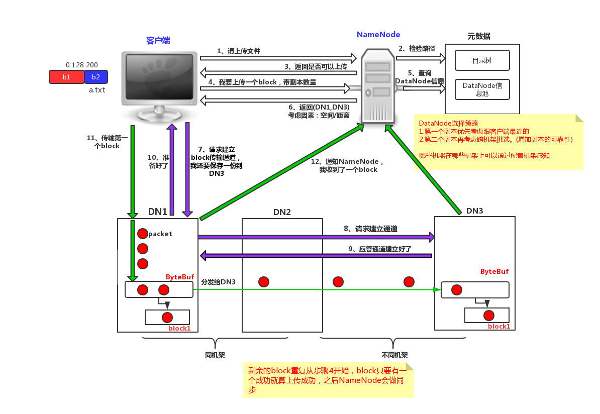
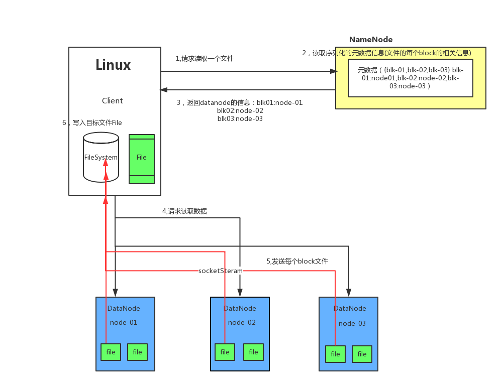

- 学习目标

- 能够掌握HDFS功能

- 能够掌握HDFS特点

- 能够了解HDFS中Block大小

- 能够掌握HDFS中NameNode作用

- 能够掌握HDFS中DataNode作用

- 能够绘制HDFS写数据流程图

- 能够绘制HDFS读数据流程图

- Hadoop的基础核心就是HDFS和MapReduce，

- Hadoop旗下有很多经典子项目，比如HBase、Hive等，这些都是基于HDFS和MapReduce发展出来的。要想了解Hadoop，就必须知道HDFS和MapReduce是什么。

# 1、hadoop文件系统定义

- HDFS（Hadoop Distributed File System，Hadoop分布式文件系统）

- 它是一个高度容错性的系统

- 它适合部署在廉价的机器上

- 它能提供高吞吐量的数据访问

- 它适合那些有着超大数据集（large data set）的应用程序

> **超大数据集指的是：海量数据分析、机器学习等**

# 2、hadoop文件系统特点

- 支持大数据文件

- 非常适合上TB级别的大文件或者一堆大数据文件的存储，如果文件只有几个G甚至更小就没啥意思了。

- 支持文件分块存储

- HDFS会将一个完整的大文件平均分块存储到不同计算节点上，它的意义在于读取文件时可以同时从多个计算节点上读取不同区块的文件，多主机读取比单主机读取效率要高得多。

- 支持一次写入，多次读取，顺序读取（流式数据访问）

- 这种模式跟传统文件不同，它不支持动态改变文件内容，而是要求让文件一次写入就不做变化，要变化也只能在文件末添加内容。

- 支持廉价硬件

- HDFS可以部署在普通PC机上，这种机制能够让给一些公司用几十台廉价的计算机就可以撑起一个大数据集群。

- 支持硬件故障

- HDFS认为所有计算机都可能会出问题，为了防止某个主机失效读取不到该主机的块文件，它将同一个文件块副本分配到其它某几个主机上，如果其中一台主机失效，可以迅速找另一块副本取文件。

> **总结：**
> **   支持大文件**
> **   分块**
> **   廉价设备**
> **   支持硬件故障**

# 3、hadoop分布式文件系统关键词

- Block

- 最基本的存储单位；将文件进行分块处理，通常是128M/块，例如：256M文件会被分为2个Block。

- Hadoop 1.x版本，Block默认大小为64M；Hadoop 2.x，Block默认大小为128M。

- Hadoop集群架构(主从架构)

- NameNode(主节点)

- 用于保存整个文件系统的目录信息、文件信息及分块信息，这是由唯一一台主机专门保存，当然这台主机如果出错，NameNode就失效了。

- 接收用户的操作请求

- 维护文件系统的目录结构

- 管理文件和Block之间的映射管理

- 管理 block 和 DataNode 之间的映射

- 在Hadoop2.*开始支持activity-standy模式,如果主NameNode失效，启动备用主机运行NameNode。

- DataNode(从节点)

- 分布在廉价的计算机上，用于存储Block块文件。

- 文件被分成块存储到 DataNode 的磁盘上

- 每个Block(块)可以设置多副本

> **总结：**
> **    block 文件块 128M/块**
> **    namenode 目录 文件 分块 接收用户访问 文件与block block与datanode**
> **    datanode 存block 副本存储**

# 4、hdfs写数据流程

> **总结：**
> **   客户端向namenode发起请求**
> **   客户端向dn发起建立连接请求**
> **   客户端向dn存储数据**

# 5、hdfs读数据流程

