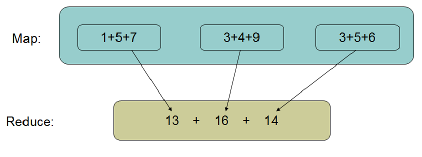
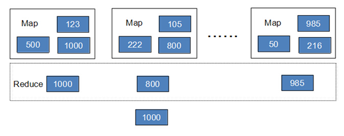
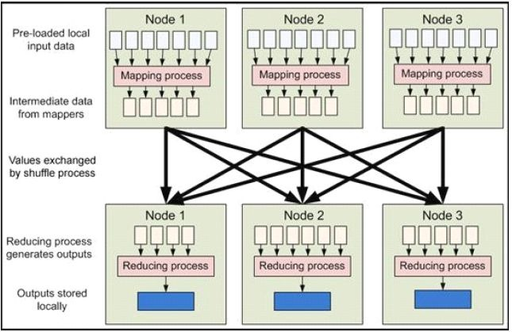
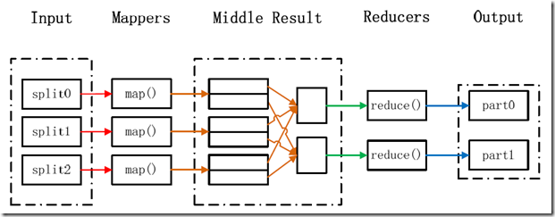

- 学习目标

- 能够理解MapReduce作用

- 能够了解MapReduce工作流程

# 1、MapReduce作用

通过对HDFS分布式文件系统的了解，我们已经可以把海量数据存储在集群中DataNode之上了，但这仅是Hadoop工作的第一步，那么如何从海量的数据中找到我们所需要的数据呢，这就是MapReduce要做的事情了。

下面通过2个例子给予说明：

- **案例1：**

**问题：**

求和：1+5+7+3+4+9+3+5+6=？

**答案**



- **案例2**

**问题**

一个银行有上亿储户，银行希望找到存储金额最高的金额是多少？

**答案**

- 方法1：按照传统的计算方式，我们会这样(java代码)：

```
Long moneys[] ... 
Long max = 0L; 
for(int i=0;i<moneys.length;i++){ 
if(moneys[i]>max){ 
  max = moneys[i]; 
 } 
} 
```

此种方法存在问题：如果数组元素比较少的话，完全可以胜任，但是如果数组中的元素数量是海量的话，那么这个方法就会浪费非常多的时间。

- 方法2：首先数字是分布存储在不同块中的，以某几个块为一个Map，计算出Map中最大的值，然后将每个Map中的最大值做Reduce操作，Reduce再取最大值给用户。



**结论：**

将大的数据分析分成小块逐个分析，最后再将提取出来的数据汇总分析，最终获得我们想要的内容。

通俗说MapReduce是一套从海量源数据提取、分析元素，最后返回结果集的方法。

当然怎么分块分析，怎么做Reduce操作非常复杂，Hadoop已经提供了数据分析的实现，我们只需要编写简单的需求命令即可达成我们想要的数据。

**总结：**

- map 把大数据分成小数据，进行计算 通过洗牌的方式给reduce

- reduce 对map的结果进行汇总

# 2、MapReduce工作流程

MapReduce 框架的核心步骤主要分两部分：Map 和Reduce。

当向MapReduce 框架提交一个计算作业时，它会首先把计算作业拆分成若干个Map 任务，然后分配到不同的节点(DataNode)上去执行，每一个Map 任务处理输入数据中的一部分，当Map 任务完成后，它会生成一些中间文件，这些中间文件将会作为Reduce 任务的输入数据。Reduce 任务的主要目标就是把前面若干个Map 的输出汇总到一起并输出。

从高层抽象来看，MapReduce的数据流图如下图所示：



MapReduce工作流程

