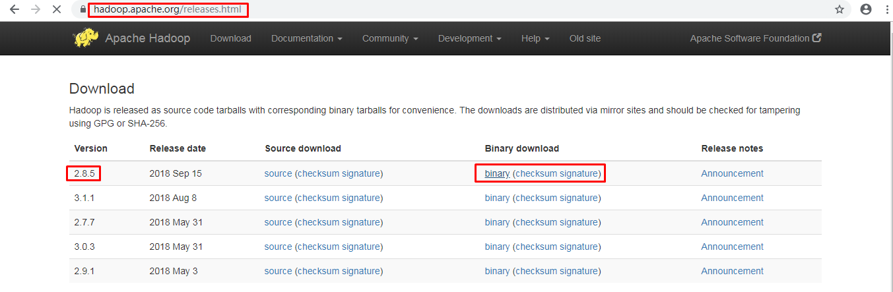

- 学习目标

- 能够了解Hadoop默认部署模式

- 能够掌握Hadoop部署软件包获取

- 能够对部署完成的Hadoop进行测试

# 1、单机部署模式介绍

- 单机(本地模式)是Hadoop的默认部署模式。

- 当配置文件为空时，Hadoop完全运行在本地。

- 不需要与其他节点交互，单机(本地模式)就不使用HDFS，也不加载任何Hadoop的守护进程。

- 该模式主要用于开发调试MapReduce程序的应用逻辑。

# 2、部署软件包获取

## 2.1 获取hadoop软件包



```shell
[root@localhost ~]  wget https://dlcdn.apache.org/hadoop/common/hadoop-3.2.4/hadoop-3.2.4.tar.gz
```

## 2.2 获取JDK软件包 


```
[root@localhost ~]#  chrome https://www.injdk.cn/
```

# 3、部署

## 3.1 jdk部署

```
[root@localhost ~]#tar xf jdk-8u191-linux-x64.tar.gz -C /usr/local
[root@localhost ~]# cd /usr/local
[root@localhost local]# mv jdk1.8.0_191 jdk
```

> **解压到指定目录后，请修改目录名称**


## 3.2 hadoop部署

```
[root@localhost ~]# tar xf hadoop-2.8.5.tar.gz -C /opt
[root@localhost ~]# cd /opt
[root@localhost opt]# mv hadoop-2.8.5 hadoop
```

> **解压至指定目录后，请修改目录名称**


## 3.3 Linux系统环境变量

```
[root@localhost ~]#vim /etc/profile
export JAVA_HOME=/usr/local/jdk
export HADOOP_HOME=/opt/hadoop
export PATH=${JAVA_HOME}/bin:${HADOOP_HOME}/bin:$PATH
```

## 3.4 应用测试

### 3.4.1 加载环境变量

```
[root@localhost ~]#source /etc/profile 
[root@server1 ~]# java -version        #测试jdk是否可用
openjdk version "18.0.2" 2022-07-19
OpenJDK Runtime Environment (build 18.0.2+9-61)
OpenJDK 64-Bit Server VM (build 18.0.2+9-61, mixed mode, sharing)
```

### 3.4.2 测试hadoop可用性

```
[root@localhost ~]# mkdir /home/input
[root@localhost ~]# vim /home/input/test.txt        #编辑一个测试文件
 tom                #这里面的内容是随机的，写啥都行
jim
192.168.1.1
tom
zhangsan
lisi
10.101.10.10
#接下来我们做一个测试，就是利用hadoop去统计test.txt文件中各个词汇出现的次数，也就是词频统计。 
[root@localhost ~]#hadoop jar /opt/hadoop/share/hadoop/mapreduce/hadoop-mapreduce-examples-2.8.5.jar wordcount \
/home/input/ /home/output/        #这个命令，就会那个/home/input/下的文件，都做一个词频统计，统计结果放到/home/output/目录下
[root@localhost ~]# [root@server1 ~]# ll /home/output/    #已经出现了对应的文件夹，
总用量 4
-rw-r--r-- 1 root root 59 11月  7 16:29 part-r-00000    #这个文件中，保存着真正的执行结果
-rw-r--r-- 1 root root  0 11月  7 16:29 _SUCCESS        #出现这个文件，就告诉我们命令执行成功。
[root@server1 ~]# cat /home/output/part-r-00000         #查看统计的结果
10.101.10.10	1            #表示10.101.10.10  总共出现过一次。
192.168.1.1	1
jim	1
lisi	1
tom	2
zhangsan	1
```

> **输出目录中有_SUCCESS文件说明JOB运行成功，part-r-00000是输出结果文件。**


### 3.4.3 词频统计练习

要求：

1. 制作 一个文件，里面包含10-20不同的或部分相同的单词。

1. 使用wordcount方法实现单词出现频率统计。