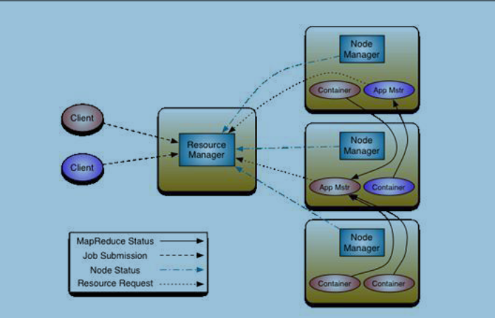
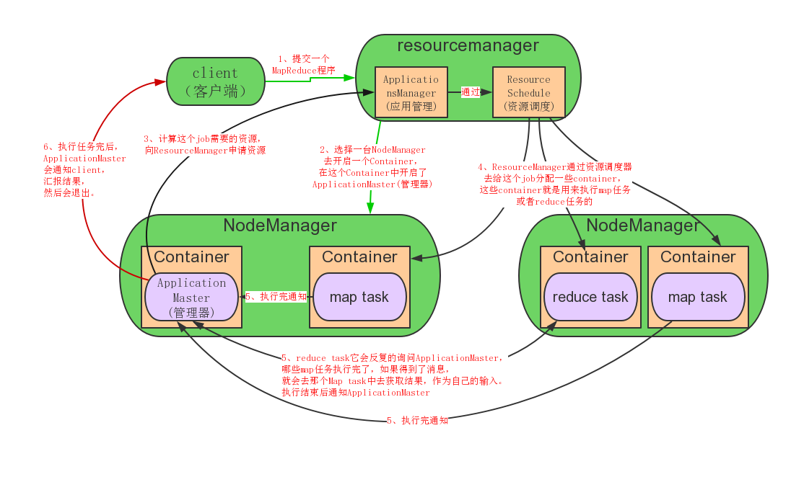

- 学习目标

- 能够了解伪分布式部署模式

- 能够正确修改配置文件

- 能够掌握YARN架构及架构角色功能

- 能够对已部署的Hadoop集群进行应用测试

# 1、伪分布式部署模式介绍

- Hadoop守护进程运行在本地机器上，模拟一个小规模的的集群。

- 该模式在单机模式之上增加了代码调试功能，允许你检查内存使用情况，HDFS输入/输出，以及其他的守护进程交互。

# 2、获取软件包

可参考：[5、单机(本地模式)部署](note://WEB2afeb13cb869253f81fe5781640b10cb)

# 3、修改配置文件

主要涉及的配置文件有：

- hadoop-env.sh

- mapred-env.sh

- yarn-env.sh

- core-site.xml

## 3.1 修改hadoop-env.sh、mapred-env.sh、yarn-env.sh文件中JAVA_HOME参数

```shell
[root@localhost ~]#vim /opt/hadoop/etc/hadoop/hadoop-env.sh 

export JAVA_HOME=/usr/local/jdk        #修改JAVA_HOME
[root@localhost ~]#vim /opt/hadoop/etc/hadoop/mapred-env.sh

export JAVA_HOME=/usr/local/jdk        #修改JAVA_HOME
[root@localhost ~]#vim /opt/hadoop/etc/hadoop/yarn-env.sh

export JAVA_HOME=/usr/local/jdk        #修改JAVA_HOME
```

## 3.2 修改core-site.xml

```shell
[root@localhost ~]#vim /opt/hadoop/etc/hadoop/core-site.xml 
#(1)配置fs.defaultFS
<property>
    <name>fs.defaultFS</name>
    <value>hdfs://hd1:8020</value>        #hd1是主机名，所以需要做本地的hd1的域名解析
</property>
#(2)配置hadoop临时目录
<property>
     <name>hadoop.tmp.dir</name>
     <value>/opt/data/tmp</value>
</property>
[root@server1 hadoop]# vim /etc/hosts        #配置本地的域名解析
192.168.23.20    hd1
```

> **配置临时目录前，请先创建此目录,不创建也可以。**
> **HDFS的NameNode数据默认都存放这个目录下，查看**** *-default.xml ****等默认配置文件，就可以看到很多依赖**
> **${hadoop.tmp.dir} ****的配置。**
> **默认的 hadoop.tmp.dir 是 ****/tmp/hadoop-${user.name}**** ,此时有个问题就是NameNode会将HDFS的元数据存**
> **储在这个****/tmp****目录下，如果操作系统重启了，系统会清空****/tmp****目录下的东西，导致NameNode元数据丢失，**
> **是个非常严重的问题，所有我们应该修改这个路径。**


## 3.3 配置hdfs-site.xml

```
[root@localhost ~]#vim ${HADOOP_HOME}/etc/hadoop/hdfs-site.xml 1
<property>
   <name>dfs.replication</name>
   <value>1</value>
 </property>
```

> **dfs.replication配置的是HDFS存储时的备份数量，因为这里是伪分布式环境只有一个节点，所以这里设置为1.**


## 3.4 格式化hdfs

```
[root@localhost ~]# hdfs namenode –format 
```

> **格式化是对HDFS这个分布式文件系统中的DataNode进行分块，统计所有分块后的初始元数据的存储在NameNode中。**
> **格式化后，查看****core-site.xml****里****hadoop.tmp.dir****（本例是/opt/data目录）指定的目录下是否有了dfs目录，如**
> **果有，说明格式化成功。**


## 3.5 查看hdfs临时目录

```
[root@localhost ~]#ls /opt/data/tmp/dfs/name/current 
```

> **fsimage是NameNode元数据在内存满了后，持久化保存到的文件。**
> **fsimage*.md5 是校验文件，用于校验fsimage的完整性。**
> **seen_txid 是hadoop的版本**
> **vession文件里保存：**
>    ** namespaceID：NameNode的唯一ID。**
> **    clusterID:集群ID，NameNode和DataNode的集群ID应该一致，表明是一个集群。**


# 4、启动角色

> **请把hadoop安装目录中的sbin目录中的命令添加到/etc/profile环境变量中，不然无法使用hadoop-daemon.sh**


## 4.1 启动namenode

```
[root@localhost ~]#hadoop-daemon.sh start namenode 
```

## 4.2 启动datanode

```
[root@localhost ~]#hadoop-daemon.sh start datanode 
```

## 4.3 验证

JPS命令查看是否已经启动成功，有结果就是启动成功了。

```
[root@localhost ~]#jps 
```

# 5、HDFS上测试创建目录、上传、下载文件

## 5.1 创建目录

```
[root@localhost ~]#hdfs dfs -mkdir /test 
```

## 5.2 上传文件

```
[root@localhost ~]#hdfs dfs -put
${HADOOP_HOME}/etc/hadoop/core-site.xml /test
```

## 5.3 读取内容

```
[root@localhost ~]#hdfs dfs -cat /test/core-site.xml 
```

## 5.4 下载文件到本地

```
[root@localhost ~]#hdfs dfs -get /test/core-site.xml 
```

# 6、配置yarn

## 6.1 Yarn介绍

- A framework for job scheduling and cluster resource management.

- 功能：任务调度 和 集群资源管理

- YARN (Yet An other Resouce Negotiator) 另一种资源协调者

- 是 Hadoop 2.0新增加的一个子项目，弥补了Hadoop 1.0(MRv1)扩展性差、可靠性资源利用率低以及无法支持其他计算框架等不足。

- Hadoop的下一代计算框架MRv2将资源管理功能抽象成一个通用系统YARN

- MRv1的 jobtracker和tasktrack也不复存在，计算框架 (MR, storm, spark)同时运行在之上，使得hadoop进入了多计算框架的弹性平台时代。

> **总结：**
> **    yarn是一种资源协调者**
> **    从mapreduce拆分而来**
> **    带来的好处：让hadoop平台性能及扩展性得到更好发挥**


## 6.2 使用Yarn好处

- 在某些时间，有些资源计算框架的集群紧张,而另外一些集群资源空闲。 那么这框架共享使用一个则可以大提高利率些集群资源空闲。

- 维护成本低。

- 数据共享。 避免了集群之间移动数据。

- YARN 主从架构

- ResourceManager 资源管理

- NodeManager 节点管理

- ResourceManager

- 负责对各个NodeManager 上的资源进行统一管理和任务调度。

- NodeManager

- 在各个计算节点运行，用于接收RM中ApplicationsManager 的计算任务、启动/停止任务、和RM中Scheduler 汇报并协商资源、监控并汇报本节点的情况。



## 6.3 配置mapred-site.xml

默认没有mapred-site.xml文件，但是有个mapred-site.xml.template配置模板文件。复制模板生成mapred-site.xml。

```
[root@localhost ~]#cp /opt/hadoop/etc/hadoop/mapred-site.xml.template
 /opt/hadoop/etc/hadoop/mapred-site.xml

 
######
<property>
<name>mapreduce.framework.name</name>
<value>yarn</value>            #指定mapreduce运行在yarn框架上。
</property>
```



## 6.4 配置yarn-site.xml

```shell
<property>
<name>yarn.nodemanager.aux-services</name>
<value>mapreduce_shuffle</value>
</property>
<property>
 <name>yarn.resourcemanager.hostname</name>
 <value>hd1</value>
</property>
#yarn.nodemanager.aux-services配置了yarn的默认混洗方式，选择为mapreduce的默认混洗算法。
#yarn.resourcemanager.hostname指定了Resourcemanager运行在哪个节点上。
```

## 6.5 启动yarn

```
[root@localhost ~]#yarn-daemon.sh start resourcemanager 
[root@localhost ~]#yarn-daemon.sh start nodemanager 
[root@localhost ~]#jps 
```

## 6.6 YARN的Web页面

YARN的Web客户端端口号是8088，通过[http://hd1:8088/](http://hd1:8088/)可以查看。

## 6.7 测试

在Hadoop的share目录里，自带了一些jar包，里面带有一些mapreduce实例小例子，位置在share/hadoop/mapreduce/hadoop-mapreduce-examples-2.8.5.jar，可以运行这些例子体验刚搭建好的Hadoop平台，我们这里来运行最经典的WordCount实例。

### 6.7.1 创建目录

```
[root@localhost ~]#hdfs dfs -mkdir -p /test/input 
```

> **创建原始文件:**
> **在本地/opt/data目录创建一个文件wc.input,内容如下:**
> **   tom jime**
> **   hadoop hive**
> **   hbase hadoop tom**


### 6.7.2 上传文件

将wc.input文件上传到HDFS的/test/input目录中:

```
[root@localhost ~]#hdfs dfs -put /opt/data/wc.input /test/input 
```

### 6.7.3 运行实例

```
[root@localhost ~]#yarn jar share/hadoop/mapreduce/hadoop-mapreduce-examples-
2.8.5.jar wordcount /test/input /test/output
```

### 6.7.4 查看输出结果

```
[root@localhost ~]#hdfs dfs -ls /test/output
```

> **output目录中有两个文件，_SUCCESS文件是空文件，有这个文件说明Job执行成功。**
> **part-r-00000文件是结果文件，其中-r-说明这个文件是Reduce阶段产生的结果，mapreduce程序执行时，可**
> **以没有reduce阶段，但是肯定会有map阶段，如果没有reduce阶段这个地方有是-m-。**
> **一个reduce会产生一个part-r-开头的文件。**


# 7、停止hadoop

```
[root@localhost ~]#hadoop-daemon.sh stop namenode
[root@localhost ~]#hadoop-daemon.sh stop datanode
[root@localhost ~]#yarn-daemon.sh stop resourcemanager
[root@localhost ~]#yarn-daemon.sh stop nodemanager
```

# 8、开启历史服务及查看

Hadoop开启历史服务可以在web页面上查看Yarn上执行job情况的详细信息。可以通过历史服务器查看已经运行完的Mapreduce作业记录，比如用了多少个Map、用了多少个Reduce、作业提交时间、作业启动时间、作业完成时间等信息。

开启后，可以通过Web页面查看历史服务器：、

```
[root@localhost ~]#mr-jobhistory-daemon.sh start historyserver 
```

> **开启后，可以通过Web页面查看历史服务器：**
> 


# 9、开启日志聚集

MapReduce是在各个机器上运行的，在运行过程中产生的日志存在于各个机器上，为了能够统一查看各个机器的运行日志，将日志集中存放在HDFS上，这个过程就是日志聚集。

Hadoop默认是不启用日志聚集的。在yarn-site.xml文件里配置启用日志聚集。

```
<property>
 <name>yarn.log-aggregation-enable</name>
 <value>true</value>
</property>
<property>
 <name>yarn.log-aggregation.retain-seconds</name>
 <value>106800</value>
</property>
```

> **yarn.log-aggregation-enable:是否启用日志聚集功能。**
> **yarn.log-aggregation.retain-seconds：设置日志保留时间，单位是秒。**
> **以上内容要复制给集群所有主机**


## 9.1 重启yarn

```
[root@localhost ~]#stop-yarn.sh
[root@localhost ~]#start-yarn.sh
```

## 9.2 重启历史服务

```
[root@localhost ~]#mr-jobhistory-daemon.sh stop historyserver
[root@localhost ~]#mr-jobhistory-daemon.sh start historyserver
```