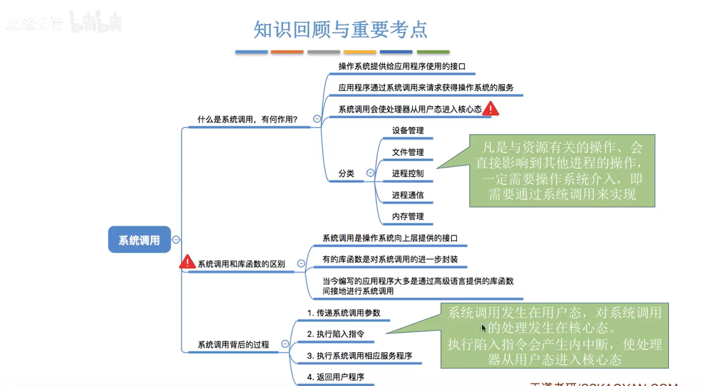

# **1、操作系统的概念、功能和目标**

## **总结**

# **2、操作系统的特征**

## **1）并发**

## **2）共享**

## **3）并发和共享的关系**

## **4）虚拟**

## **5）异步**

## **6）总结**

# **3、操作系统的发展与分类**

## **1）知识总览**

## **2）手工操作**

## **3）单道批处理系统（操作系统的雏形）**

## **4）多道批处理系统**

## **5）分时操作系统**

## **6）实时操作系统**

## **7）其他操作系统**

## **8）总结**

# **4、操作系统的运行机制与体系结构**

## **1）知识总览**

## **2）什么是指令、两种指令，两种处理状态，两种程序**

### **小节**

## **3）操作系统内核**

## **4）操作系统的体系结构**

## **5）总结**

# **5、中断和异常**

## **1）知识总览**

## **2）中断机制的诞生**

## **3）中断的概念和作用（用户态和和心态是如何切换的）**

## **4）中断的分类**

## **5）中断的处理过程**

## **6）总结**

# **6、系统的调用**

## **1）知识总览**

## **2）什么是系统调用，有何作用？**

## **3）系统调用与库函数的区别**

## **4）系统调用背后的过程**

## **5）总结**

