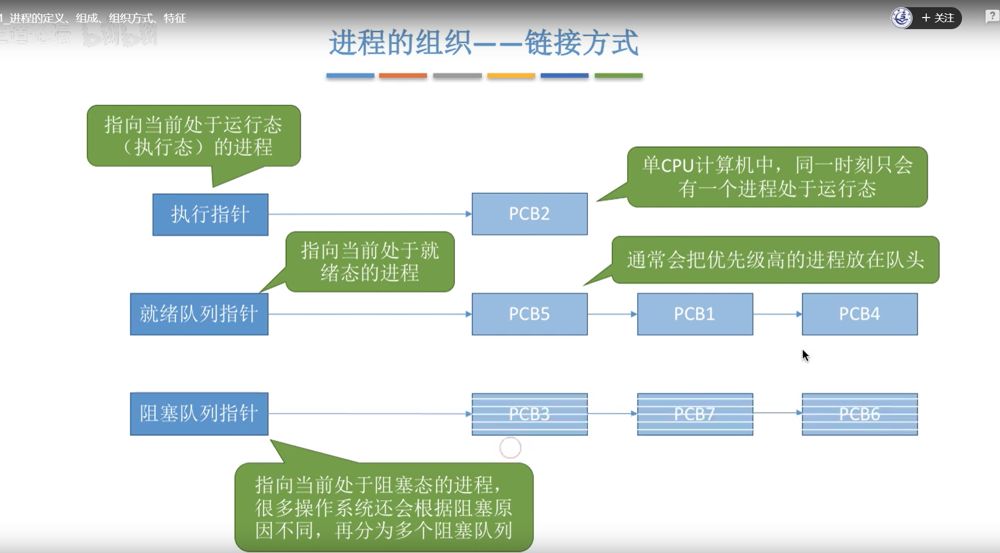
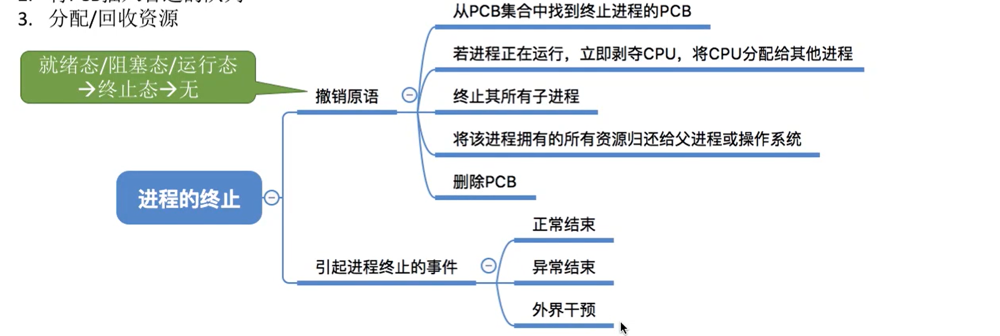
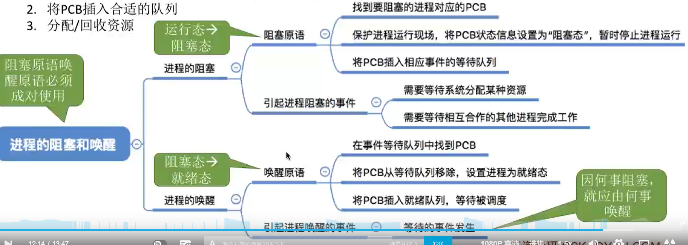
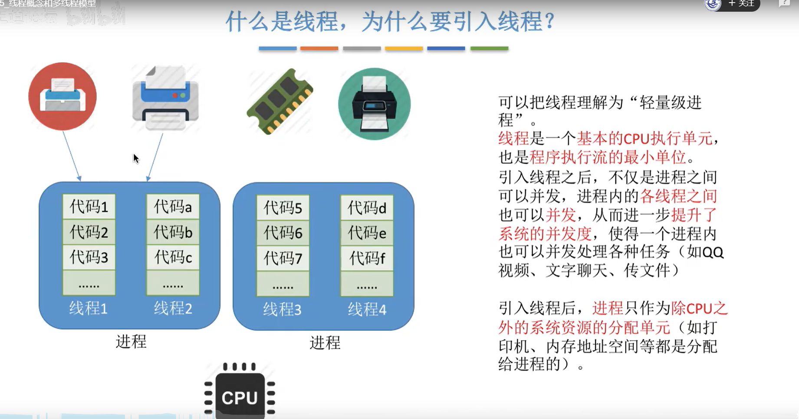
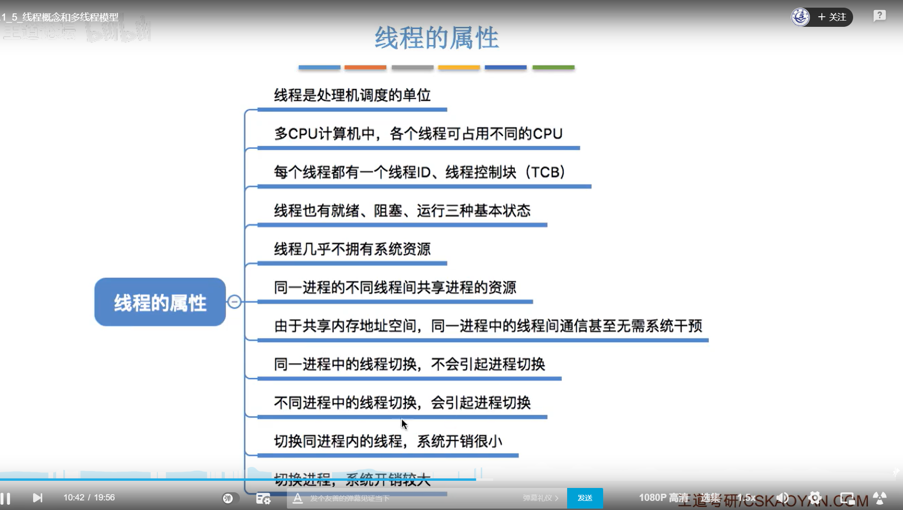

# **1、进程的定义、组成、组织方式、特征**

## **1）知识总览**

## **2）进程的定义**

## **3）进程的组成**

## **4）进程的组织**

## **5）进程的特征**

## **6）总结**

# **2、进程的状态与转换**

## **1）知识总览**

## **2）进程的三种基本状态**

## **3）进程另外两种状态**

**4）进程状态的转换**

## **5）总结**

# **3、进程控制**

## **1）知识总览**

## **2）什么是进程控制**

## **3）如何实现进程控制**

## **4）进程控制相关的原语**

## **5）总结**

# **4、进程通信**

## **1）知识总览**

## **2）什么是进程通信**

### **1）共享存储**

### **2）管道通信**

### **3）消息传递**

## **3）总结**

# **5、线程概念和线程多模型**

## **1）知识总览**

## **2）什么是线程，为什么要引入线程**

## **3）线程的属性**

## **4）线程的实现方式**

### **1、用户级线程**

### **2、内核级线程**

### **3、二者组合**

## **2）多线程模型**

### **1、多对一模型**

### **2、一对一模型**

### **3、多对多模型**

## **3）总结**

