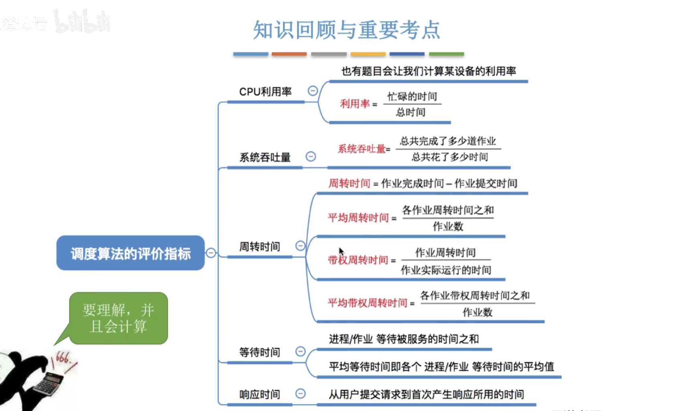
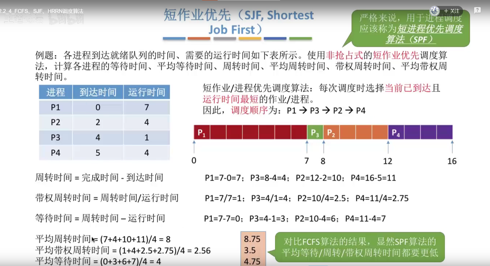

# **1、处理机调度的概念、层次**

## **1）知识预览**

## **2）调度的基本概念**

## **3）调度的三个层次**

### **1、高级调度（作业调度）**

### **2、中级调度（内存调度）**

### **3、补充知识：进程的挂起状态与七状态模型**

### **4、低级调度（进程调度）**

## **4）三层调度的联系、对比**

## **5）总结**

# **2、进程调度的时机、切换与过程、方式**

## **1）知识预览**

## **2）进程调度的时机**

## **3）进程调度的方式**

## **4）进程的切换与过程**

## **5）总结**

# **3、调度算法的评价指标**

## **1）知识预览**

## **2）CPU利用率**

## **3）系统吞吐量**

## **4）周转时间**

## **5）等待时间**

## **6）响应时间**

## **7）总结**

# **4、FCFS（先来先服务）、SJF（短作业优先）、HRRN（高响应比优先）调度算法**

## **1）知识预览**

## **2）先来先服务（FCFS,First Come First Server）**

## **3)短作业优先（SJF，Shortest Job First)**

### **1、抢占式短作业优先**

### **2、注意几个细节**

## **4）对FCFS和SJF两种算法的思考**

## **5）高响应比优先（HRRN，Highest Response Ratio Next)**

## **6)知识回顾**

# **5、调度算法：时间片轮转、优先级、多级反馈队列**

## **1）知识预览**

## **2）时间片轮转（RR，Round-Robin）**

## **3）优先级调度算法**

### **1、非抢占式**

### **2、抢占式**

### **3、补充**

### **4、思考**

## **4）多级反馈队列调度算法**

## **5）总结**

