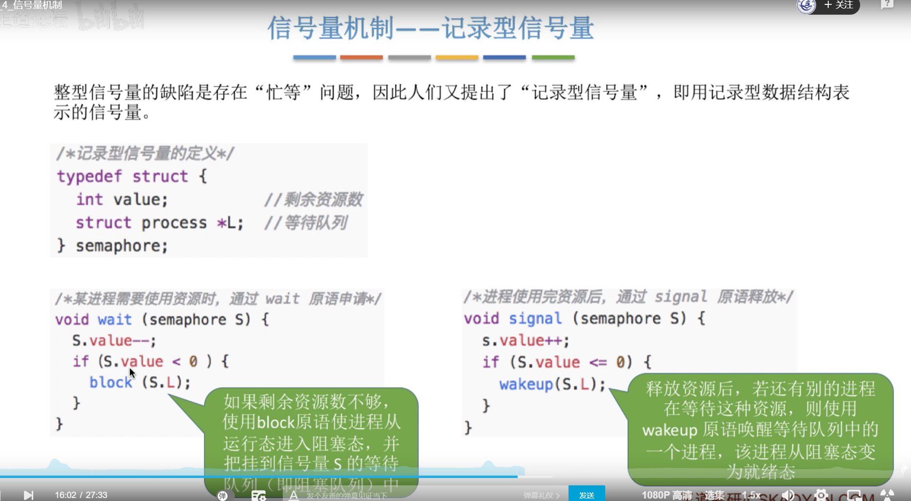

# **1、进程同步、进程互斥**

## **1）什么是进程同步**

## **2）进程同步**

## **3）什么是进程互斥**

## **4）总结**

# **2、进程互斥的软件实现方法**

## **1）知识预览**

## **2）单标志法**

## **3）双标志先检查法**

## **4）双标志后检查法**

## **5）Peterson算法**

## **6）总结**

# **3、进程互斥的硬件实现方法**

## **1）知识预览**

## **2）中断屏蔽方法**

## **3）TestAndSet指令**

## **4）Swap指令**

## **5）总结**

# **4、信号量机制**

## **1）知识预览**

## **2）信号量机制（P、V操作）**

### **1、信号量机制--整型信号量**

### **2、信号量机制--记录型信号量**

## **3）总结**

# **5、用信号量实现进程互斥、同步、前驱关系**

## **1）信号量机制实现进程互斥**

## **2）信号量机制实现进程同步**

## **3）信号量机制实现前驱关系**

## **4）总结**

# **P、V操作可以看成是开门关门问题**

把临界区（也就是共享资源）看成是一个房子，为了保准房子只准一个进程访问，所以设定这个房子一开始时门就是开着的，谁先进去，设就可以进行P操作，P操作是关门，并且进行反锁，即是使用V操作也开不了门（并且只有人在房子里面，才关得了门），然后出来的时候进行V操作也就是开门。然后其他程序才可以进入房子。但是V操作即可以从里面开门，也可以从外面开门，如果有人V操作无效。

**以上问题可以看成是进程互斥问题，并且关键点在于房子门一开始就是开着的**

**那么怎么实现进程同步呢？**

**1、进程互斥的时候，一个进程具有两个权利，就是它既可以进行P，操作也可以进行V操作。**

**2、实现进程同步：**

**假设有P1和P2，且规定P1进入房子之后，P2才可以进入房子。**

**那么只需要规定，房子一开始的时候的门就是关着的，并且P1只可以进行V操作，P2只可以进程P操作，**

**所以只有P1先开门，p2才可以有机会进入房子。**

**此问题的关键点就在于一开始就设定房子的门是关着的**