# **1、生产者-消费者问题**

## **1）问题描述**

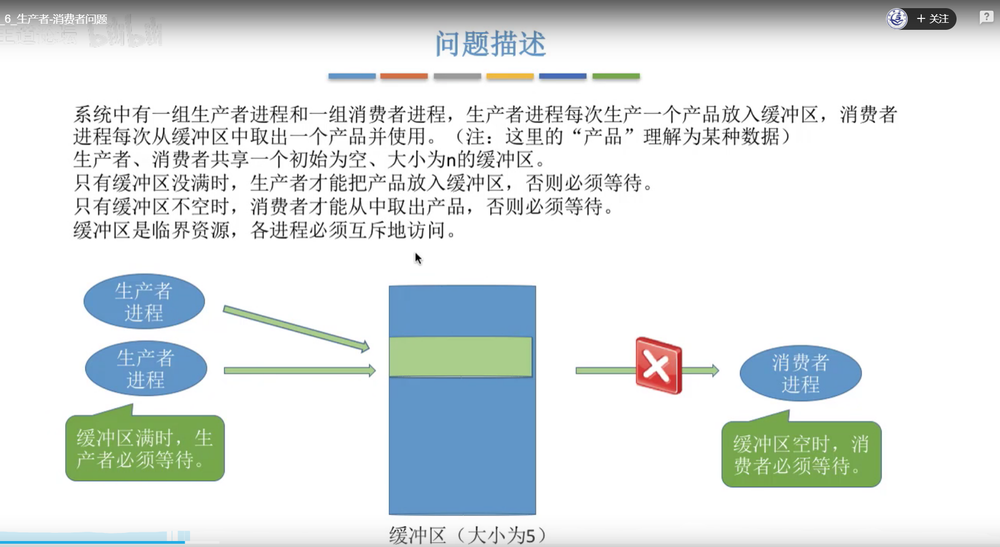

## **2）问题分析**

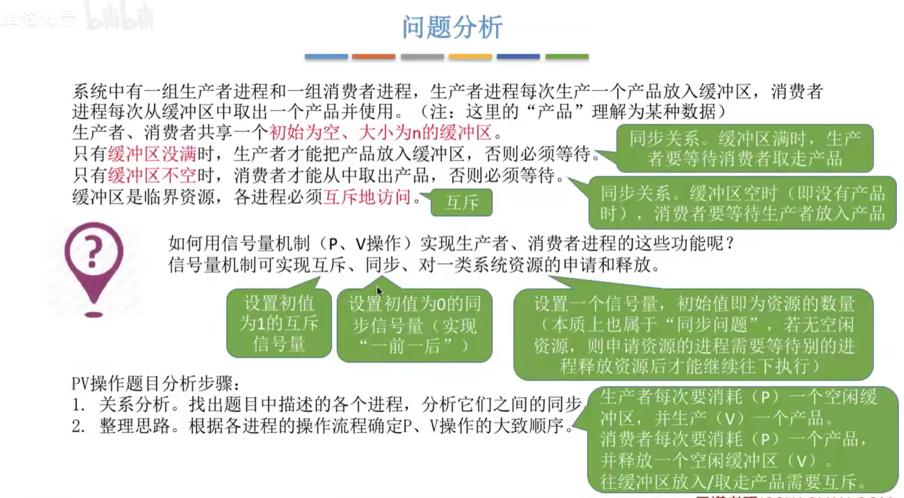

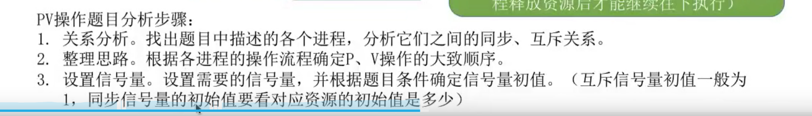

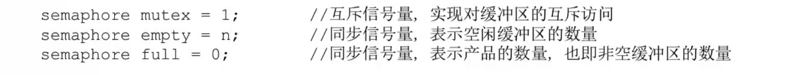

## **3）具体实现**

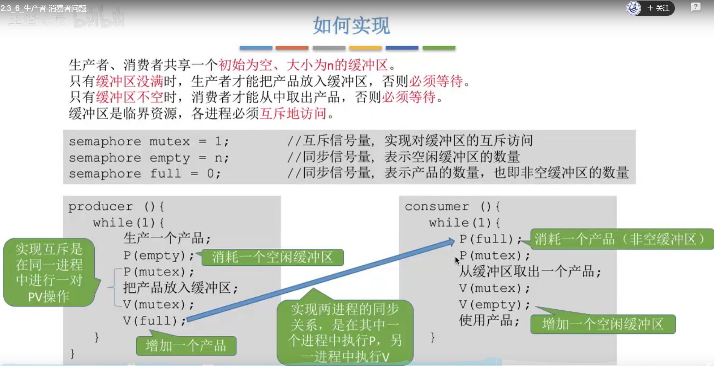

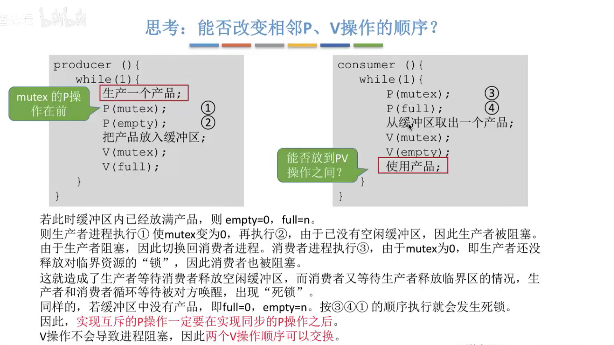

## **4）总结**

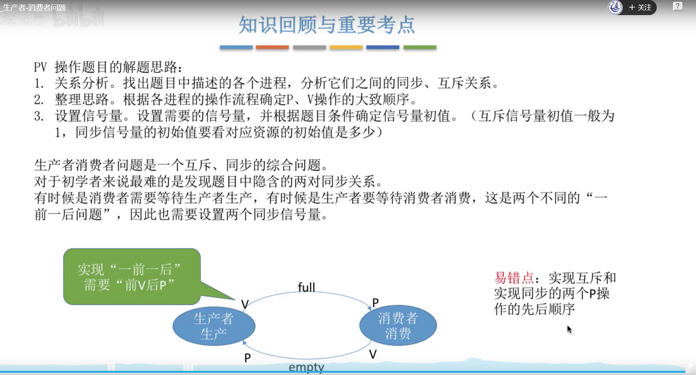

# **2、多生产者-多消费者问题**

## **1）问题描述**

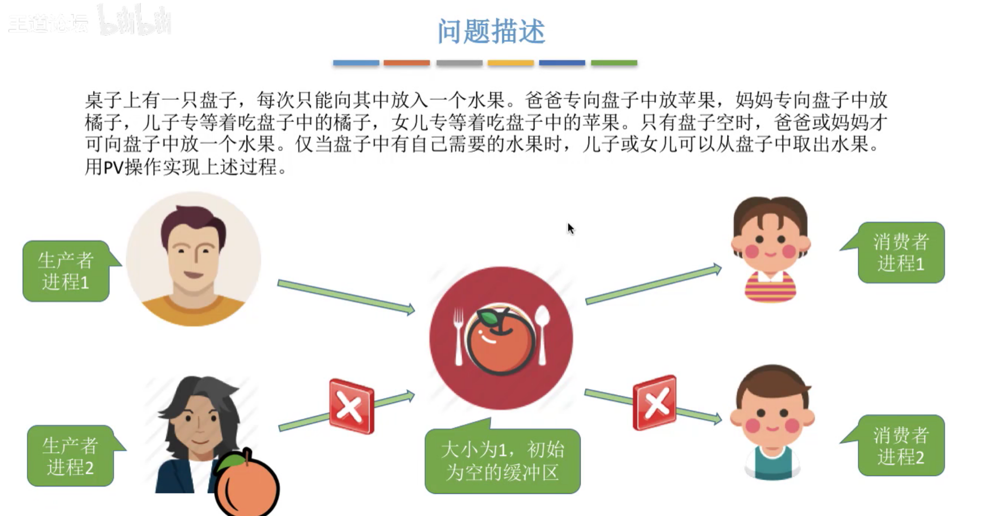

## **2）问题分析**

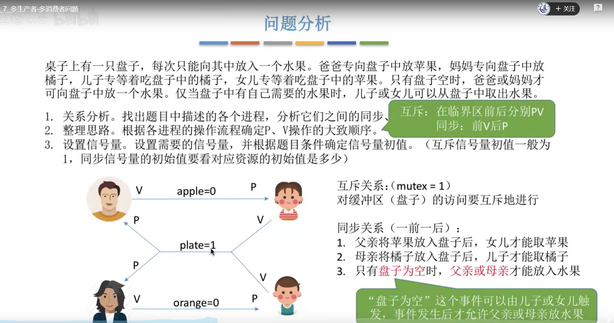

## **3）具体实现**

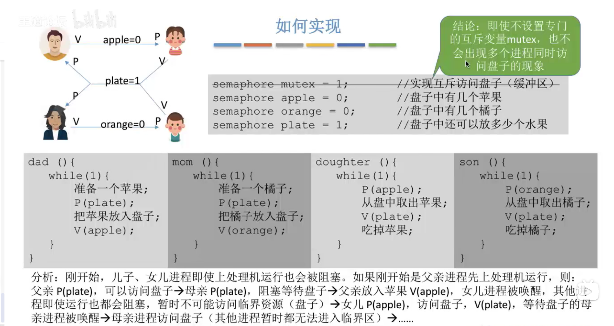

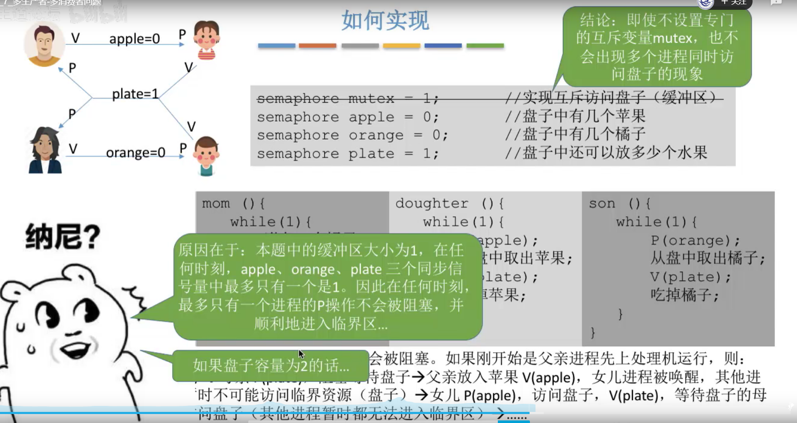

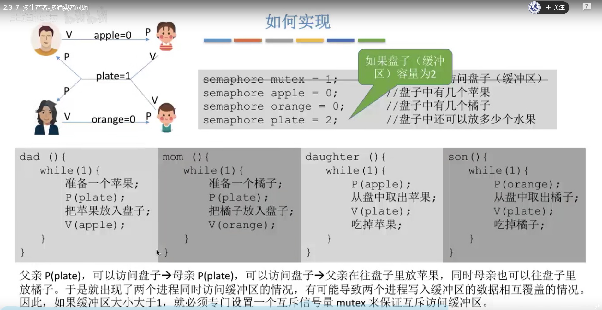

## **4）总结**

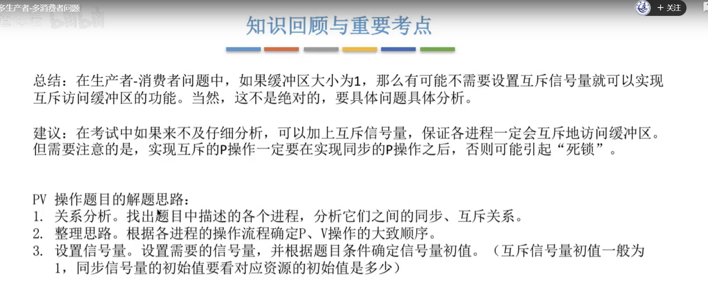

# **3、吸烟者问题**

# **4、读者-写者问题**

# **5、哲学家进餐问题**

# **6、管理**