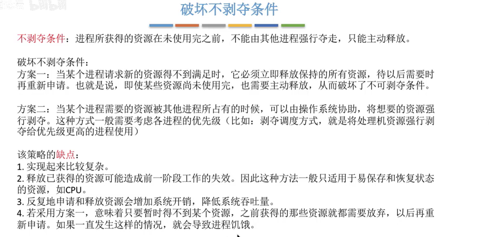
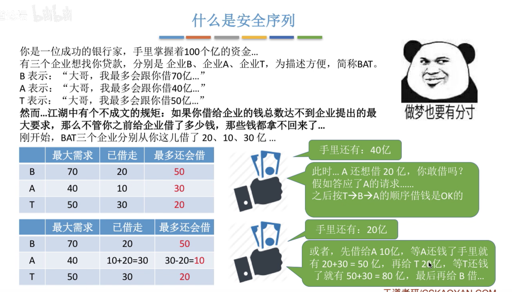

# **1、死锁的概念**

## **1）知识预览**

## **2）什么是死锁**

## **3）死锁、饥饿、死循环的区别**

## **4）死锁产生的必要条件**

## **5）什么时候会发生死锁**

## **6）死锁的处理策略**

## **7）总结**

# **2、预防死锁**

## **1）知识预览**

## **2）破坏互斥条件**

## **3）破坏不剥夺条件**

## **4）破坏请求和保持条件**

## **5）破坏循环等待条件**

## **6）总结**

# **3、避免死锁**

## **1）知识预览**

## **2）什么是安全序列**

## **3）安全序列、不安全状态、死锁的联系**

## **4）银行家算法**

## **1、安全性算法（寻找安全序列）**

### **例2**

### **例3**

## **2、代码实现**

P0发生了改变

## **3、总结**

# **4、检测和接触**

## **1）知识预览**

## **2）死锁的检测**