# **1、连续分配管理方式	**

## **1）知识预览**

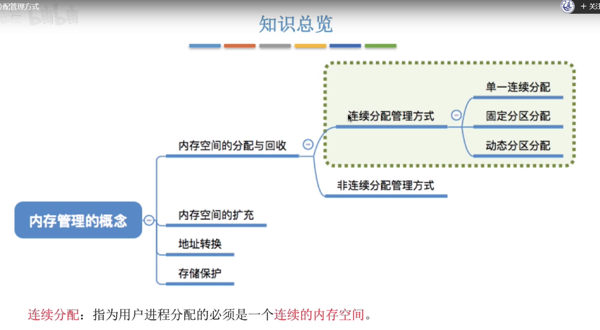

## **2）单一连续分配**

，

## **3）固定分区分配**

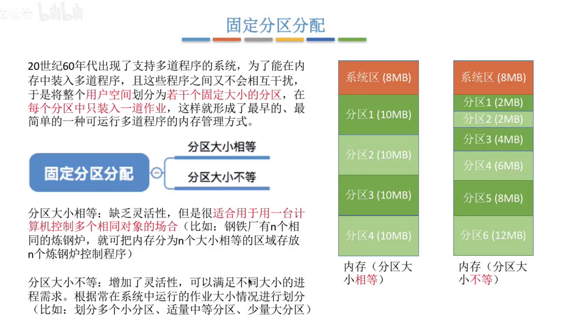

### **1、分区说明表**

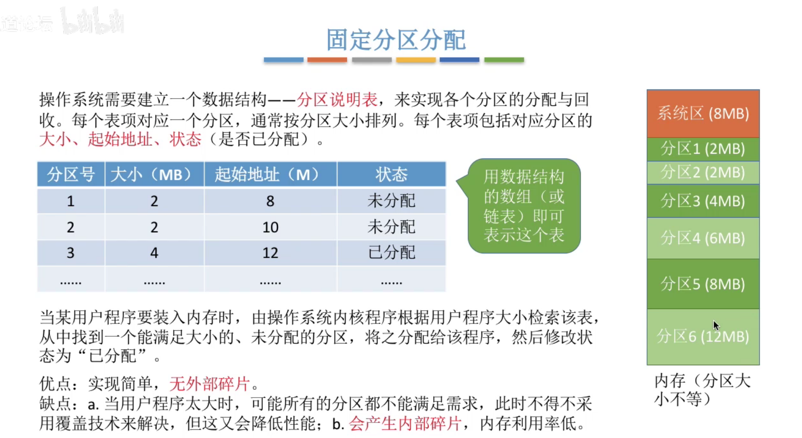

## **4）动态分区分配**

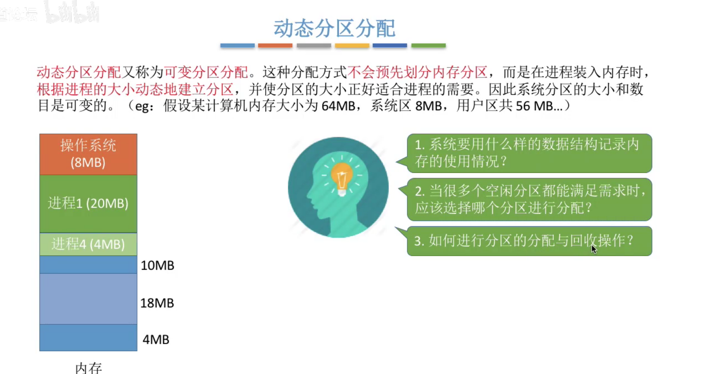

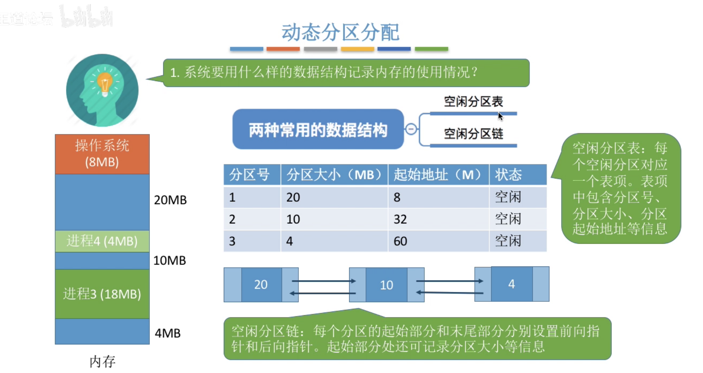

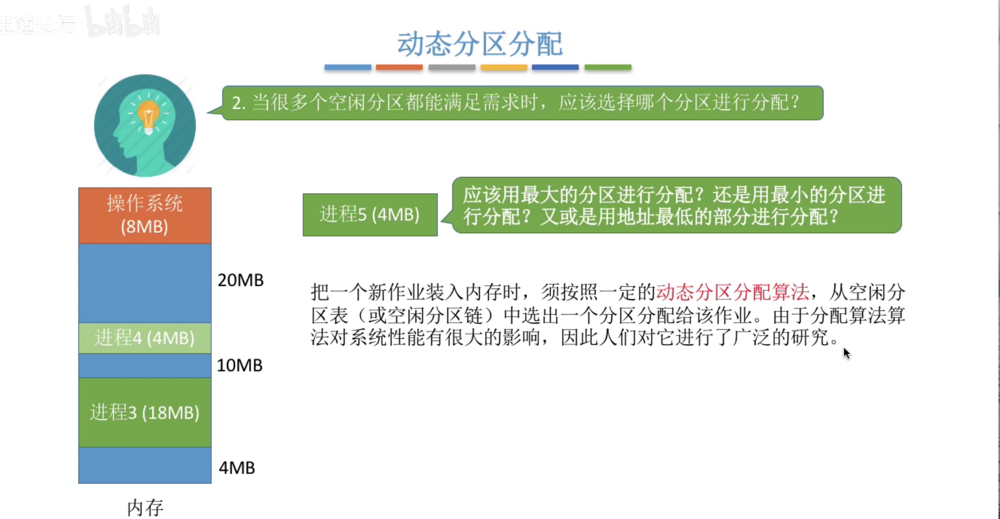

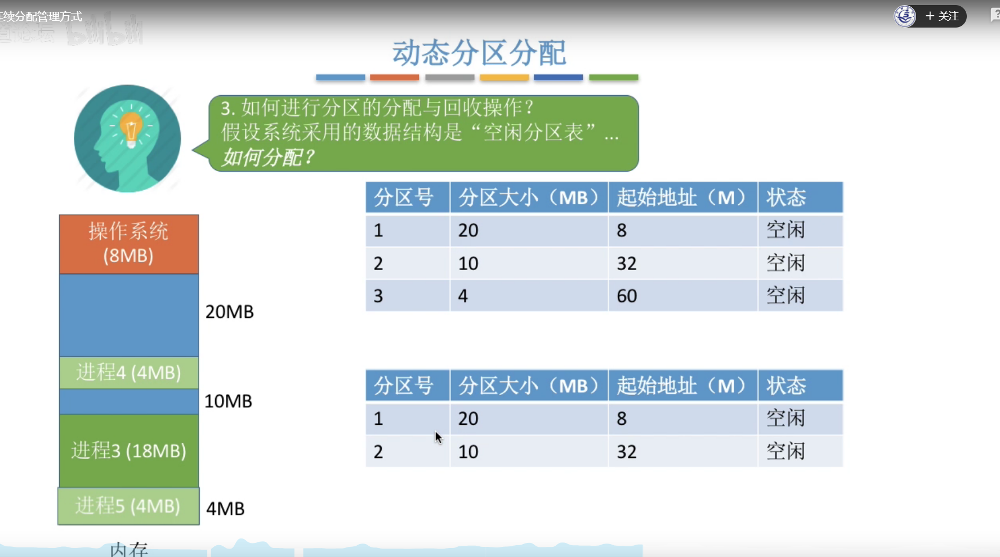

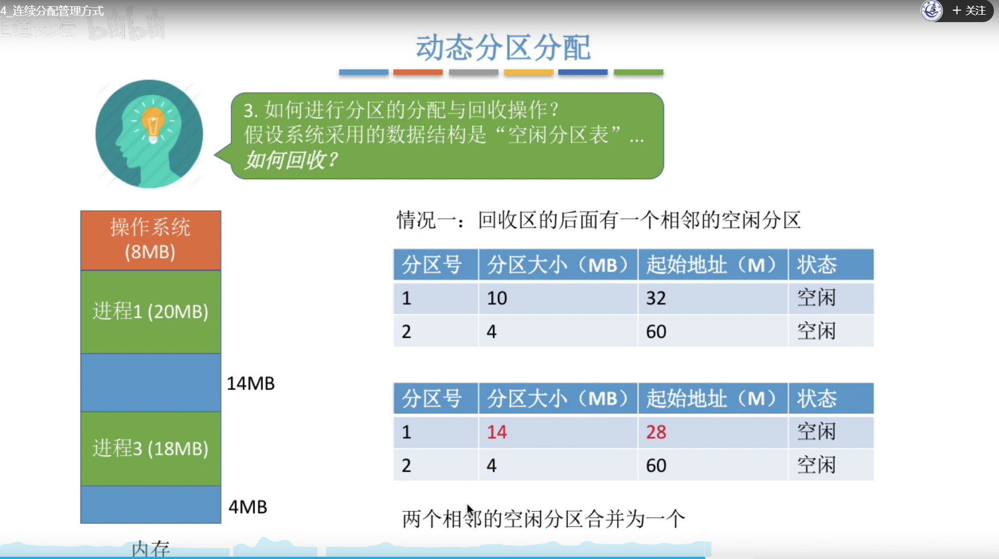

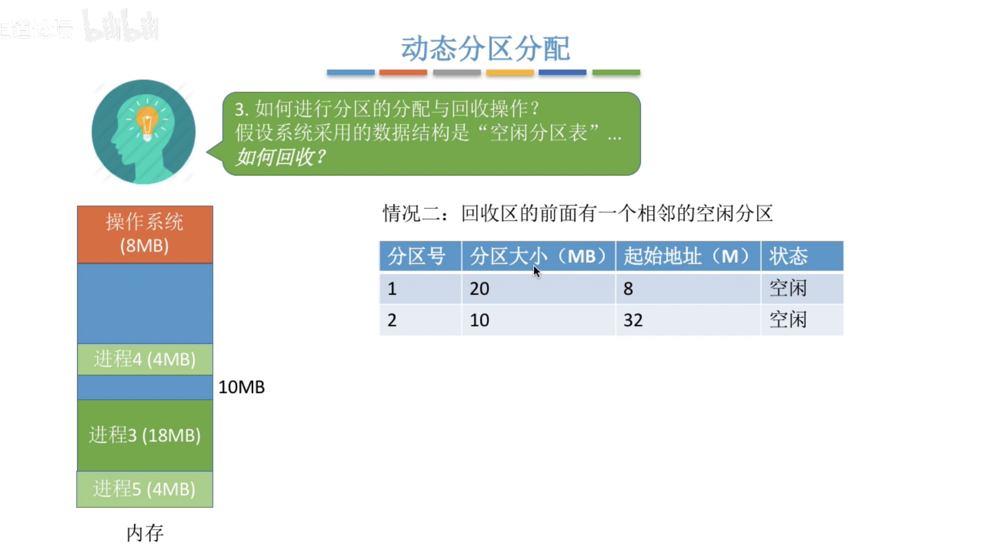

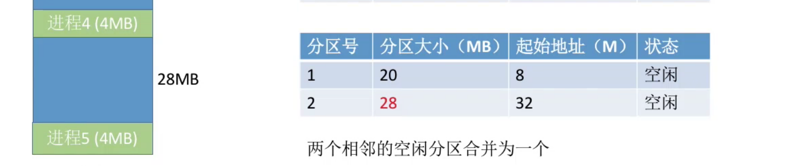

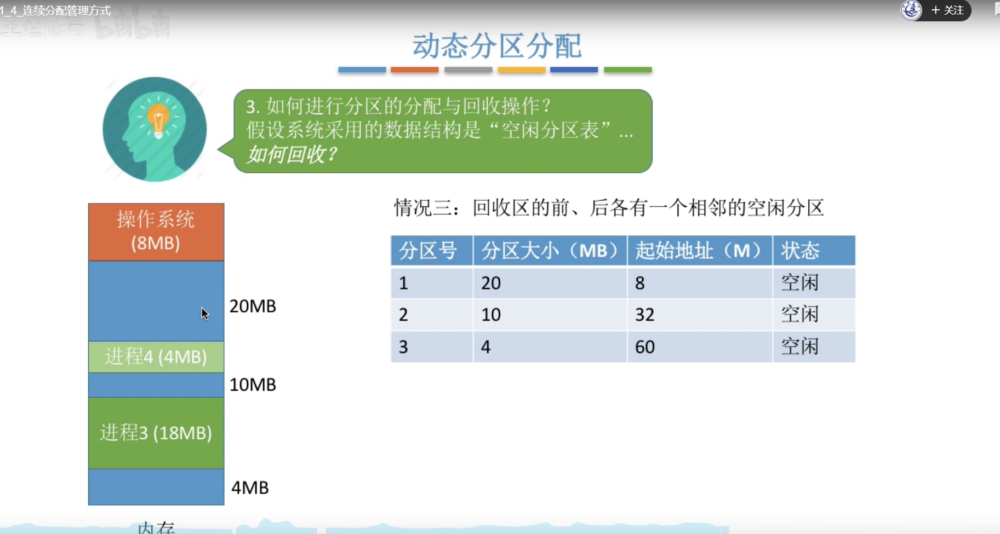

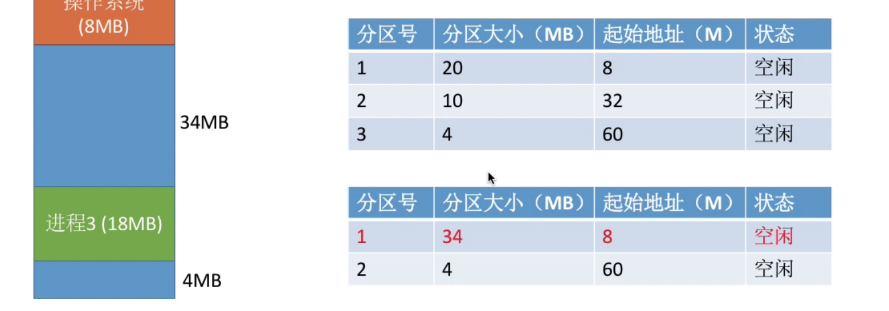

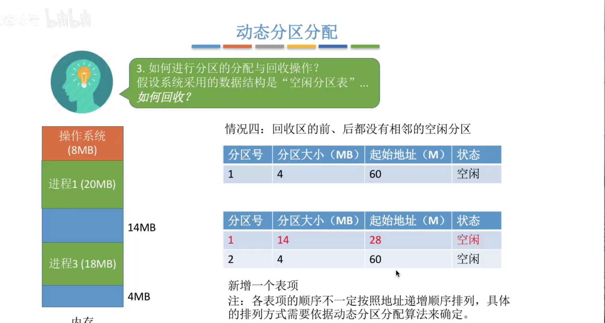

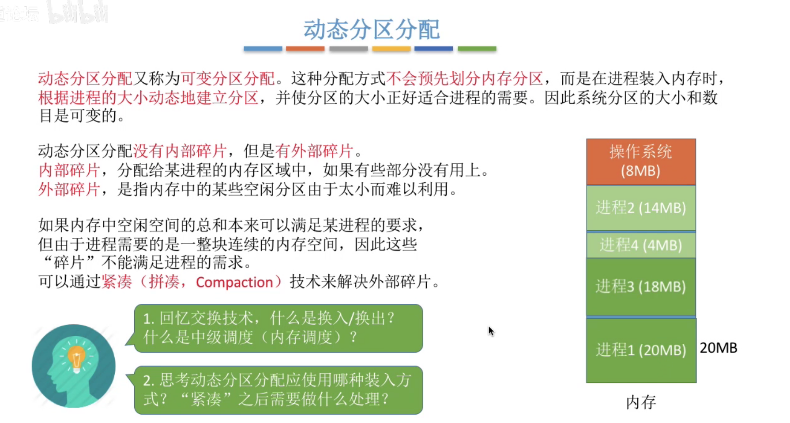

## **5）总结**

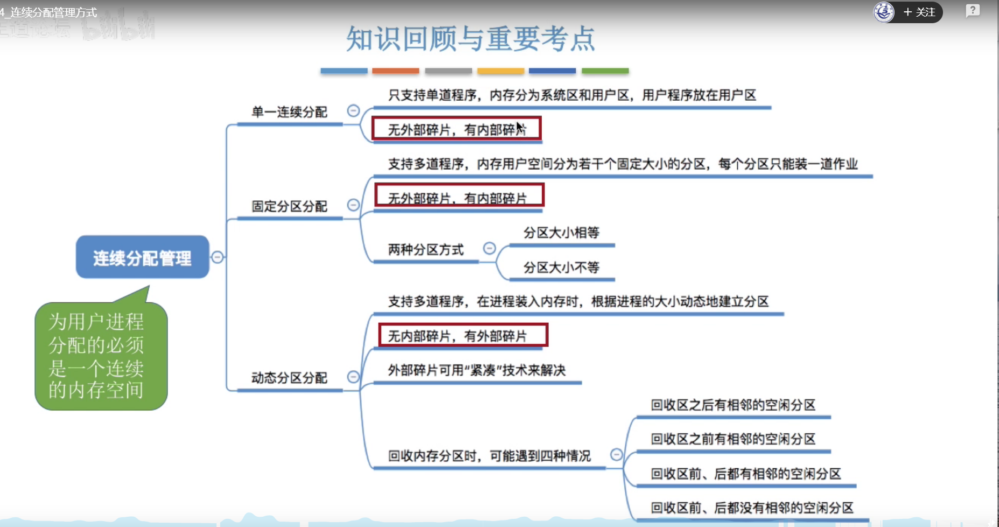

# **2、动态分区分配分配算法**

## **1）知识预览**

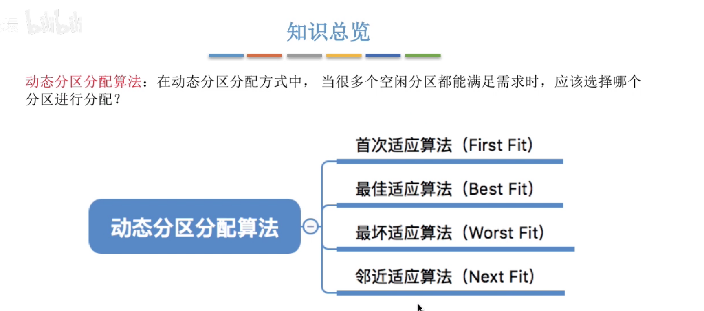

## **2）首次适应算法**