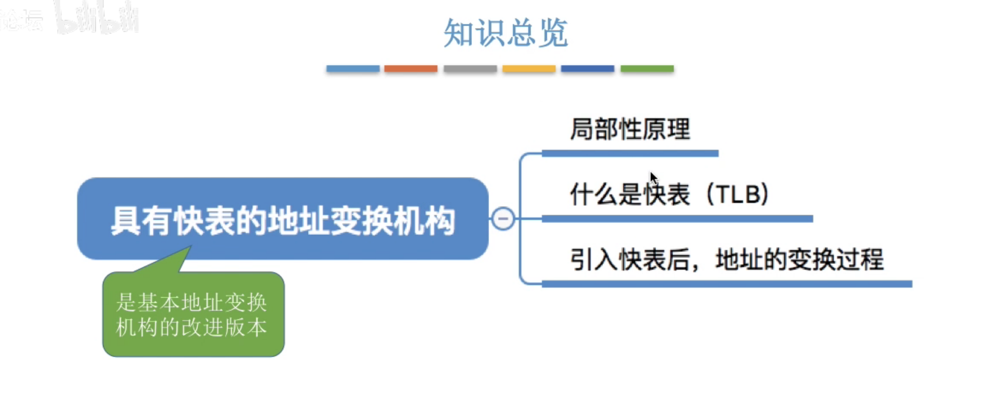

# **1、基本分页存储管理的基本概念**

## **1）思考连续分配方式的缺点**

## **2）知识预览**

## **3）把固定分区分配改造为“非连续分配版本”**

## **4）分页存储管理的基本概念**

### **1、思考，如何实现地址的转换**

### **2、页表**

## **5）总结**

# **2、基本地址变换机构**

## **1）知识预览**

## **2）基本地址变换机构**

### **1、例题1**

### **2、对页表项大小的进一步探讨**

## **3）总结**

# **3、具有快表的地址变换机构**

## **1）知识预览**

## **2）局部性原理**

# **4、两级页表**

## **1）知识总览**

# **5、基本分段存储管理方式**

## **1）知识预览**

## **2）分段**

## **3）地址变换**

## **4）分段、分页对比**

## **5）总结**

# **6、段页式管理方式**

# **7、虚拟内存的基本概念**

## **1）知识预览**

## **2）传统存储管理方式的特征、缺点**

## **3）局部性原理**

## **4）虚拟内存的定义和特征**

## **5）如何实现虚拟内存技术**

## **6）总结**

# **8、请求分页管理方式**

## **1）知识预览**

## **2）页表机制**

## **3）缺页中断机构**

## **4）地址变换机构**

## **5）总结**

# **9、页面置换算法**

## **1）知识预览**

## **2）最佳置换算法（OPT）**

## **3）先进先出置换算法（FIFO）**

## **4）最近最久未使用置换算法（LRU)**

## **5）时钟置换算法（CLOCK）**

# **10、页面分配策略**

## **1）知识预览**

## **2）主**