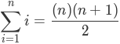

## 2.2.什么是算法分析

一些普遍的现象是，刚接触计算机科学的学生会将自己的程序和其他人的相比较。你可能还注意到，这些计算机程序看起来很相似，尤其是简单的程序。经常出现一个有趣的问题。当两个程序解决同样的问题，但看起来不同，哪一个更好呢？

为了回答这个问题，我们需要记住，程序和程序代表的底层算法之间有一个重要的区别。正如我们在第 1 章中所说，一种算法是一个通用的，一步一步解决某种问题的指令列表。它是用于解决一种问题的任何实例的方法，给定特定输入，产生期望的结果。另一方面，程序是使用某种编程语言编码的算法。根据程序员和他们所使用的编程语言的不同，可能存在描述相同算法的许多不同的程序。

要进一步探讨这种差异，请参考 

```python
def sumOfN(n):
    theSum = 0
    for i in range(1,n+1):
        theSum = theSum + i
    return theSum
print(sumOfN(10))
```

**ActiveCode 1**

现在看看 

```python
def foo(tom):
    fred = 0
    for bill in range(1,tom+1):
        barney = bill
        fred = fred + barney
    return fred
print(foo(10))
```

**ActiveCode 2**

先前我们提出一个问题是哪个函数更好，答案取决于你的标准。如果你关注可读性，函数 

算法分析是基于每种算法使用的计算资源量来比较算法。我们比较两个算法，说一个比另一个算法好的原因在于它在使用资源方面更有效率，或者仅仅使用的资源更少。从这个角度来看，上面两个函数看起来很相似。它们都使用基本相同的算法来解决求和问题。

在这点上，重要的是要更多地考虑我们真正意义上的计算资源。有两种方法，一种是考虑算法解决问题所需的空间或者内存。解决方案所需的空间通常由问题本身决定。但是，有时候有的算法会有一些特殊的空间需求，这种情况下我们需要非常仔细地解释这些变动。

作为空间需求的一种替代方法，我们可以基于算法执行所需的时间来分析和比较算法。这种测量方式有时被称为算法的“执行时间”或“运行时间”。我们可以通过基准分析（

**Listing 1**

```python
import time
def sumOfN2(n):
    start = time.time()
    theSum = 0
    for i in range(1,n+1):
        theSum = theSum + i
    end = time.time()
    return theSum, end-start
```

Listing 1 嵌入了时间函数，函数返回一个包含了执行结果和执行消耗时间的元组（

```shell
>>>for i in range(5):
       print("Sum is %d required %10.7f seconds"%sumOfN(10000))
Sum is 50005000 required  0.0018950 seconds
Sum is 50005000 required  0.0018620 seconds
Sum is 50005000 required  0.0019171 seconds
Sum is 50005000 required  0.0019162 seconds
Sum is 50005000 required  0.0019360 seconds
```

我们发现时间是相当一致的，执行这段代码平均需要0.0019秒。如果我们运行计算前 100,000 个整数的和的函数呢？

```shell
>>>for i in range(5):
       print("Sum is %d required %10.7f seconds"%sumOfN(100000))
Sum is 5000050000 required  0.0199420 seconds
Sum is 5000050000 required  0.0180972 seconds
Sum is 5000050000 required  0.0194821 seconds
Sum is 5000050000 required  0.0178988 seconds
Sum is 5000050000 required  0.0188949 seconds
>>>
```

再次的，尽管时间更长，但每次运行所需的时间也是非常一致的，平均大约多10倍。 对于 n 等于 1,000,000，我们得到：

```shell
>>>for i in range(5):
       print("Sum is %d required %10.7f seconds"%sumOfN(1000000))
Sum is 500000500000 required  0.1948988 seconds
Sum is 500000500000 required  0.1850290 seconds
Sum is 500000500000 required  0.1809771 seconds
Sum is 500000500000 required  0.1729250 seconds
Sum is 500000500000 required  0.1646299 seconds
>>>
```

在这种情况下，平均值也大约是前一次的10倍。现在考虑 [封闭方程](https://en.wikipedia.org/wiki/1_%2B_2_%2B_3_%2B_4_%2B_%E2%8B%AF)而不是迭代来计算前n个整数的和。



```python
def sumOfN3(n):
   return (n*(n+1))/2
print(sumOfN3(10))
```

**ActiveCode 3**

如果我们对 

```python
Sum is 50005000 required 0.00000095 seconds
Sum is 5000050000 required 0.00000191 seconds
Sum is 500000500000 required 0.00000095 seconds
Sum is 50000005000000 required 0.00000095 seconds
Sum is 5000000050000000 required 0.00000119 seconds
```

在这个输出中有两件事需要重点关注，首先上面记录的执行时间比之前任何例子都短，另外他们的执行时间和 n 无关，看起来 

但是这个基准测试能告诉我们什么？我们可以很直观地看到使用了迭代的解决方案需要做更多的工作，因为一些程序步骤被重复执行。这可能是它需要更长时间的原因。此外，迭代方案执行所需时间随着 

我们需要一个更好的方法来描述这些算法的执行时间。基准测试计算的是程序执行的实际时间。它并不真正地提供给我们一个有用的度量（

当前内容版权归 [face](https://github.com/facert/python-data-structure-cn)