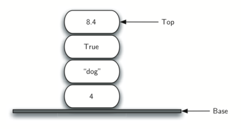
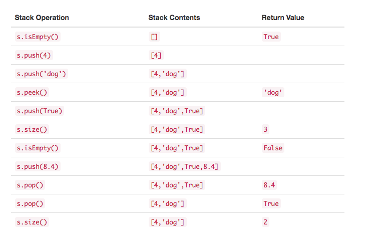

## 1.目标

- 理解抽象数据类型的栈，队列，deque 和列表。

- 能够使用 Python 列表实现 ADT 堆栈，队列和 deque。

- 了解基本线性数据结构实现的性能。

- 了解前缀，中缀和后缀表达式格式。

- 使用栈来实现后缀表达式。

- 使用栈将表达式从中缀转换为后缀。

- 使用队列进行基本时序仿真。

- 能够识别问题中栈，队列和 deques 数据结构的适当使用。

- 能够使用节点和引用将抽象数据类型列表实现为链表。

- 能够比较我们的链表实现与 Python 的列表实现的性能。

## 2.什么是线性数据结构

我们从四个简单但重要的概念开始研究数据结构。栈，队列，deques, 列表是一类数据的容器，它们数据项之间的顺序由添加或删除的顺序决定。一旦一个数据项被添加，它相对于前后元素一直保持该位置不变。诸如此类的数据结构被称为线性数据结构。

线性数据结构有两端，有时被称为左右，某些情况被称为前后。你也可以称为顶部和底部，名字都不重要。将两个线性数据结构区分开的方法是添加和移除项的方式，特别是添加和移除项的位置。例如一些结构允许从一端添加项，另一些允许从另一端移除项。

这些变种的形式产生了计算机科学最有用的数据结构。他们出现在各种算法中，并可以用于解决很多重要的问题。

## 3.什么是栈

栈（有时称为“后进先出栈”）是一个项的有序集合，其中添加移除新项总发生在同一端。这一端通常称为“顶部”。与顶部对应的端称为“底部”。

栈的底部很重要，因为在栈中靠近底部的项是存储时间最长的。最近添加的项是最先会被移除的。这种排序原则有时被称为 LIFO，后进先出。它基于在集合内的时间长度做排序。较新的项靠近顶部，较旧的项靠近底部。

栈的例子很常见。几乎所有的自助餐厅都有一堆托盘或盘子，你从顶部拿一个，就会有一个新的托盘给下一个客人。想象桌上有一堆书(Figure 1), 只有顶部的那本书封面可见，要看到其他书的封面，只有先移除他们上面的书。Figure 2 展示了另一个栈，包含了很多 Python 对象。

**Figure 1**

**Figure 2**

和栈相关的最有用的想法之一来自对它的观察。假设从一个干净的桌面开始，现在把书一本本叠起来，你在构造一个栈。考虑下移除一本书会发生什么。移除的顺序跟刚刚被放置的顺序相反。栈之所以重要是因为它能反转项的顺序。插入跟删除顺序相反，Figure 3 展示了 Python 数据对象创建和删除的过程，注意观察他们的顺序。

**Figure 3**

想想这种反转的属性，你可以想到使用计算机的时候所碰到的例子。例如，每个 web 浏览器都有一个返回按钮。当你浏览网页时，这些网页被放置在一个栈中（实际是网页的网址）。你现在查看的网页在顶部，你第一个查看的网页在底部。如果按‘返回’按钮，将按相反的顺序浏览刚才的页面。

## 4.栈的抽象数据类型

栈的抽象数据类型由以下结构和操作定义。如上所述，栈被构造为项的有序集合，其中项被添加和从末端移除的位置称为“顶部”。栈是有序的 LIFO 。栈操作如下。

- Stack() 创建一个空的新栈。 它不需要参数，并返回一个空栈。

- push(item)将一个新项添加到栈的顶部。它需要 item 做参数并不返回任何内容。

- pop() 从栈中删除顶部项。它不需要参数并返回 item 。栈被修改。

- peek() 从栈返回顶部项，但不会删除它。不需要参数。 不修改栈。

- isEmpty() 测试栈是否为空。不需要参数，并返回布尔值。

- size() 返回栈中的 item 数量。不需要参数，并返回一个整数。例如，s 是已经创建的空栈，Table1 展示了栈操作序列的结果。栈中，顶部项列在最右边。

