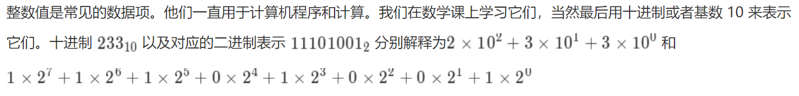
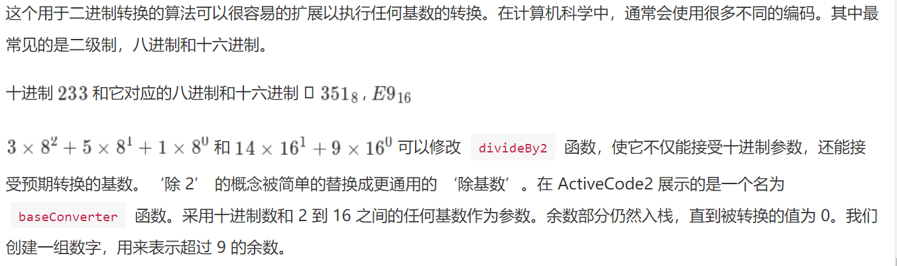

# 1、十进制转换成二进制

在你学习计算机的过程中，你可能已经接触了二进制。二进制在计算机科学中是很重要的，因为存储在计算机内的所有值都是以 0 和 1 存储的。如果没有能力在二进制数和普通字符串之间转换，我们与计算机之间的交互非常棘手。



但是我们如何能够容易地将整数值转换为二进制呢？答案是“除 2”算法，它用栈来跟踪二进制结果的数字。

“除 2” 算法假定我们从大于 0 的整数开始。不断迭代的将十进制除以 2，并跟踪余数。第一个除以 2 的余数说明了这个值是偶数还是奇数。偶数有 0 的余数，记为 0。奇数有余数 1，记为 1.我们将得到的二进制构建为数字序列，第一个余数实际上是序列中的最后一个数字。见 Figure 5 , 我们再次看到了反转的属性，表示栈可能是解决这个问题的数据结构。

Activecode 1 中的 Python 代码实现了 “除 2” 算法，函数 divideBy2 传入了一个十进制的参数，并重复除以 2。第 7 行使用内置的模运算符 % 来提取余数，第 8 行将余数压到栈上。当除到 0 后，11-13 行构造了一个二进制字符串。

- Activecode 1 

```python
# coding=utf-8
from pythonds.basic.stack import Stack
def divideBy2(decNumber):
    remstack = Stack()
    while decNumber > 0:
        rem = decNumber % 2
        remstack.push(rem)
        decNumber = decNumber // 2
    binString = ""
    while not remstack.isEmpty():
        binString = binString + str(remstack.pop())
    return binString
print(divideBy2(42))
#
101010
```

# 2、 多进制转换



- Activecode 2

```python
# coding=utf-8
from pythonds.basic.stack import Stack
def baseConverter(decNumber, base):
    digits = "0123456789ABCDEF"
    remstack = Stack()
    while decNumber > 0:
        rem = decNumber % base
        remstack.push(rem)
        decNumber = decNumber // base
    newString = ""
    while not remstack.isEmpty():
        newString = newString + digits[remstack.pop()]
    return newString
print(baseConverter(25, 2))
print(baseConverter(25, 16))
#
11001
19
```